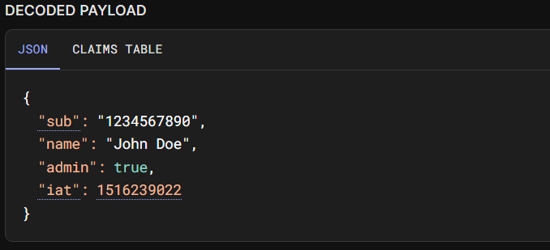
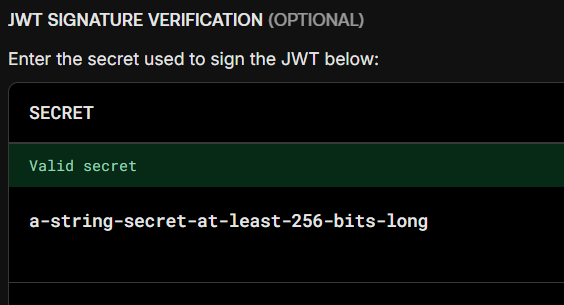

# [JWT - JSON Web Token](https://portswigger.net/web-security/jwt)

About JWT:






Causes and Conditions: 

- Weak or guessable signing secrets (e.g., using "123456").
- Use of none algorithm (if supported) to bypass signature verification.

- Algorithm confusion attacks (e.g., changing alg from RS256 to HS256).

- Token expiration not properly enforced.


Impact: 

- Unauthorized access to protected resources.

- User impersonation or privilege escalation.

- Data leakage or account takeover.


Categories: 

- 

Prevention:  

- Always use strong, unpredictable secrets.
- Never accept unsigned (alg: none) tokens.
- Validate tokens using the correct algorithm.
- Enforce token expiration (exp claim) and proper access control checks.
- Use libraries that strictly follow JWT specifications.

Common Payloads through Labs Completion:

## - Apprentice

### [Lab 1: JWT authentication bypass via unverified signature](https://portswigger.net/web-security/jwt/lab-jwt-authentication-bypass-via-unverified-signature)


=> Session cookie: a JWT

Decode base-64 JWT in BSp:

```json
{
 "kid":"6cfbf2df-5d02-4cb3-998b-720e97a57811",
 "alg":"RS256"
}
```

```json
{
"iss":"portswigger",
"exp":1748064823,
"sub":"wiener
}
```

- send request to repeater tab, change the `sub` field into `administrator`:


- send req GET again with `/admin` path with the `sub` field changed


- find the URL for deleting `carlos` (`/admin/delete?username=carlos`)


Edit the req, send and get the result of the lab!

## - Practitioner

