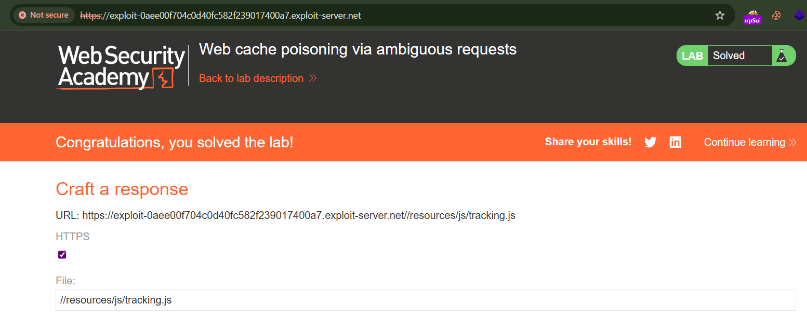
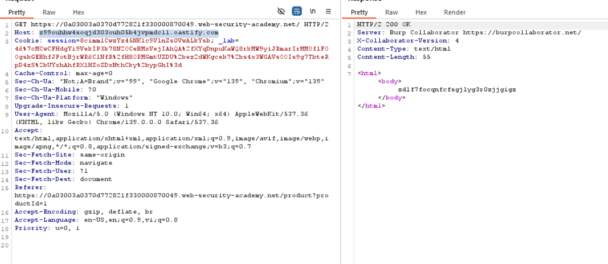

# HTTP Host Header Attacks

## **Định nghĩa:** 

- **Host header** là một phần bắt buộc trong HTTP/1.1, dùng để chỉ rõ tên miền mà trình duyệt yêu cầu tới, giúp server xác định route đến đúng ứng dụng trên cùng IP (virtual hosting) 

  Ví dụ khi bạn truy cập `https://example.com`, header sẽ là:

  ```
  Host: example.com
  ```

- Lỗ hổng HTTP Host header là gì?

  - Khi ứng dụng **tin tưởng tuyệt đối** giá trị của Host header mà **không kiểm tra hoặc lọc**, kẻ tấn công có thể **chèn nội dung độc hại** vào header.

  - Tùy theo cách sử dụng Host header, có thể dẫn đến nhiều tác hại như:
    - Xây dựng đường dẫn (URL) không an toàn,
      - Thực thi hành vi lưu cache sai (cache poisoning),
      - Tái sử dụng trong reset mật khẩu (password reset poisoning),
      - SSRF, bypass access control, v.v.

## **Các loại tấn công qua host header** 

### a) Password Reset Poisoning (Đầu độc link đổi mật khẩu)

Ứng dụng dùng Host header để tạo link reset password:

```
$reset_url = "https://" . $_SERVER['HTTP_HOST'] . "/reset.php?token=…";
```

Kẻ tấn công gửi request sửa Host thành `attacker.com`, khiến link trong email của nạn nhân trỏ đến domain do attacker kiểm soát → đánh cắp token

**Ví dụ thực tế:** Lỗ hổng CVE-2022-29933 trong Craft CMS do sử dụng `X-Forwarded-Host` để xây dựng link reset, dẫn đến reset poisoning 

------

### b) Web Cache Poisoning (Đầu độc cache)

Nếu ứng dụng hoặc CDN lưu cache dựa trên Host header, attacker có thể gây cache nội dung độc hại dưới một hostname tấn công. Khi người dùng truy cập, họ sẽ nhận nội dung bị thay đổi — có thể là mã độc, redirect giả mạo... 

------

### c) SSRF – Server Side Request Forgery

Trong môi trường dùng Host header để định tuyến nội bộ (routing), attacker có thể thực hiện SSRF bằng cách đặt Host header tới các hệ thống nội bộ không an toàn (ví dụ metadata server). Nếu không validate, server có thể truy cập nguồn nội bộ theo yêu cầu attacker

------

### d) Bypass xác thực & truy cập nội bộ

Các ứng dụng dùng Host header để xác định tenant hoặc access control, nếu không kiểm soát, attacker có thể truy cập các host nội bộ hoặc admin page thông qua host giả mạo

------

### e) XSS, SQL Injection, Redirect vượt tường

- Host header bị phản chiếu (reflect) trong nội dung HTML hoặc script mà không xử lý tốt có thể dẫn đến XSS hoặc HTML injection.
- Dùng làm tham số cho redirect, SQL/OS command... nếu không validate đầu vào sẽ gây lỗ hổng tương ứng

## Ví dụ minh hoạ

**Password Reset Poisoning**

Giả sử mail reset được tạo bằng PHP như sau:

```
$reset_url = "https://" . $_SERVER['HTTP_HOST'] . "/reset?token=" . $token;
send_mail($user_email, $reset_url);
```

**Tấn công:**

- Kẻ tấn công gửi request:

  ```
  POST /forgot-password HTTP/1.1
  Host: attacker.com
  ...
  email=victim@example.com
  ```

- Link trong email nạn nhân đi kèm token, nhưng trỏ đến `attacker.com` thay vì site chính thức → attacker dễ dàng đánh cắp token khi victim bấm vào.


## **Cách phòng tránh:** 

- Không sử dụng giá trị `Host` header trực tiếp trong mã ứng dụng.
- Whitelist các host hợp lệ: chỉ chấp nhận Host header khớp danh sách domain chính thức
- Sử dụng cấu hình server để validate Host, từ chối request không hợp lệ (ví dụ kiểm tra trong Nginx/Apache).
- Không chuyển dữ liệu từ `X-Forwarded-Host` hoặc các header tương đương nếu không cần thiết.
- Với cache, đảm bảo cache key dựa trên giá trị hợp lệ, không biến động theo Host header attacker

## Case thực tế: 

- 


## Ref: 

- [Invicti](https://www.invicti.com/learn/host-header-attacks/?)
- [OWASP](https://owasp.org/www-project-web-security-testing-guide/latest/4-Web_Application_Security_Testing/07-Input_Validation_Testing/17-Testing_for_Host_Header_Injection?)
- [PortSwigger](https://portswigger.net/web-security/host-header/exploiting?)
- [Fastly](https://www.fastly.com/learning/security/what-are-http-host-header-attacks?)

## Labs: 

### Apprentice: (2 labs)

#### Lab: Basic password reset poisoning

**Lab des:**

Ứng dụng có chức năng reset password nhưng tin tưởng Host header trong request gửi đi để sinh URL trong email reset.
 Khai thác: gửi request reset password với Host giả → link trong email sẽ trỏ về domain attacker → token của victim bị lộ.

Mục tiêu: chiếm tài khoản **carlos**.

**Steps:** 

**1. Kiểm tra chức năng reset password**

- Đăng nhập bằng `wiener:peter`.

- Vào trang Forgot password → gửi reset cho chính `wiener`.

- Vào exploit server → mở email client.

- Thấy link:

  ```
  https://0ad100fe031aeddc839d233400270016.web-security-academy.net/forgot-password?temp-forgot-password-token=w84qv0ok93kwev24wdw5mc9upkzx21on
  ```

**2. Thử sửa Host header**

- Gửi req sang Repeater:


- Sửa `Host` thành bất kỳ (ví dụ `evil.com`) rồi gửi lại.

  

- Quay lại email trên exploit server → link reset đổi thành:

  => ứng dụng không xác thực Host header.

**3. Tấn công với user carlos**

- Trong Repeater, gửi request, với host là exploit server, username `carlos`:


**4. Thu thập token**

- Vào exploit server → access log.

- thấy dòng log:

  

- Đây là token reset password của carlos `nz7l3h1j0lb4z4do6n7bca79344o6ex9`

**5. Dùng token chiếm tài khoản**

- Lấy link reset password ban đầu:

  ```
  https://0ad100fe031aeddc839d233400270016.web-security-academy.net/forgot-password?temp-forgot-password-token=097l5mcw5hojwzqw8hc2re7mlwguc9o9
  ```

- Thay bằng token của carlos:

  ```
  https://0ad100fe031aeddc839d233400270016.web-security-academy.net/forgot-password?temp-forgot-password-token=nz7l3h1j0lb4z4do6n7bca79344o6ex9
  ```

- Truy cập link và nhập mật khẩu mới cho carlos:


**6. Đăng nhập carlos**


### Lab: Host header authentication bypass

#### Lab description

Ứng dụng sử dụng **Host header** để xác định quyền truy cập. Nếu Host = `localhost`, hệ thống cho rằng request đến từ local user → được vào admin panel.
 Khai thác: sửa Host header thành `localhost` để bypass xác thực và xóa user carlos.

#### Steps

##### 1. Kiểm tra Host header

- Gửi request `GET /` sang Burp Repeater.
- Thay Host bằng giá trị bất kỳ (vd: `evil.com`) vẫn thấy trả về home page bình thường.
- Kết luận: server không kiểm tra Host → có thể bị lợi dụng.

##### 2. Tìm admin panel

- Truy cập `/robots.txt` → thấy đường dẫn `/admin`.
- Thử vào `/admin` trực tiếp → bị chặn, báo chỉ cho phép local user.

##### 3. Bypass bằng Host header

- Gửi request `/admin` sang Repeater.
- Sửa Host thành `localhost`.
- Gửi lại → thành công truy cập admin panel.

##### 4. Xóa tài khoản carlos

- Trong Repeater, chỉnh request thành:

  ```
  GET /admin/delete?username=carlos HTTP/1.1
  Host: localhost
  ```

- Gửi request.

- Tài khoản carlos bị xóa → lab hoàn thành.

## Practice: (4 labs)

### Lab: Web cache poisoning via ambiguous requests

#### Lab des

Ứng dụng có **web cache** và dễ bị tấn công **cache poisoning** khi gặp request mơ hồ (ambiguous request).
 Khai thác bằng cách: chèn **Host header thứ 2** → backend phản hồi nội dung có script URL chứa domain attacker → nội dung đó bị cache lại → victim truy cập home page sẽ load script độc hại (`alert(document.cookie)`).

#### Steps

##### 1. Phân tích hành vi cache

- Mở Burp → gửi `GET /` sang Repeater.
- Thấy header cache (vd: `Age`, `X-Cache`) → chứng tỏ có caching.
- Nếu thêm query param mới (vd: `/?cb=123`) → luôn nhận response mới (cache buster).

##### 2. Thử chèn Host header thứ 2

- Request dạng:

  ```
  GET /?cb=123 HTTP/1.1
  Host: 0a8a007104eed424c5f6f326005800c8.web-security-academy.net
  Host: evil.com
  ```

- Response: URL của script `/resources/js/tracking.js` bỗng đổi sang host `evil.com`.

- Kết luận: Backend lấy giá trị **Host thứ 2** để build URL → có thể kiểm soát.

##### 3. Tạo file JS độc hại

- Truy cập exploit server.

- Upload file `/resources/js/tracking.js` với nội dung:

  ```
  alert(document.cookie)
  ```


##### 4. Poison cache với Host độc hại

- Gửi request trong Burp Repeater:

  ```
  GET / HTTP/1.1
  Host: 0a8a007104eed424c5f6f326005800c8.h1-web-security-academy.net
  Host: exploit-0aee00f704c0d40fc582f239017400a7.exploit-server.net
  ```

- Lặp lại vài lần cho đến khi response từ cache chứa URL script độc hại (tức là cache đã bị poison).

  

##### 5. Kiểm tra với victim view

- Mở browser, vào `https://0a8a007104eed424c5f6f326005800c8.h1-web-security-academy.net/?cb=123`
- Script từ exploit server được load → thấy popup `alert(document.cookie)`.

##### 6. Xóa cache buster và re-poison toàn trang

- Gửi request **không có query param** nhưng vẫn giữ Host header thứ 2 (exploit server).

- Replay nhiều lần cho đến khi cached home page bị poison.

  

- Khi victim truy cập home page, script độc hại chạy → lab hoàn thành.

  

### Lab: Routing-based SSRF

#### Lab description

- Ứng dụng tồn tại lỗ hổng **routing-based SSRF qua Host header**.
- Kẻ tấn công có thể thay đổi giá trị Host để ép middleware/backend route request đến hệ thống nội bộ.
- Mục tiêu: truy cập admin panel chạy trên mạng nội bộ `192.168.0.0/24` và xoá user `carlos`.

------

#### Steps

1. **Xác nhận SSRF**

   - Gửi request `GET /` bằng Burp Repeater.

   - Đổi Host thành domain Burp Collaborator → thấy có outbound request → chứng tỏ Host header được server sử dụng để gửi request ra ngoài.

     

     

2. **Bruteforce IP nội bộ**

   - Dùng Burp Intruder, cấu hình:

     ```
     Host: 192.168.0.§0§
     ```

     Payload: từ 0 → 255.

   - Phát hiện IP trả về **302 redirect /admin** → đây là admin panel nội bộ

     

3. **Truy cập admin panel**

   - Gửi request:

     ```
     GET /admin
     Host: 192.168.0.107
     ```

   - Response hiển thị form xoá user, có CSRF token và cần session cookie

     

4. **Khai thác xoá user**

   - Copy `csrf` token và `session` cookie từ response.

   - Tạo request:

     ```
     POST /admin/delete?csrf=xxx&username=carlos HTTP/1.1
     Host: 192.168.0.107
     Cookie: session=...
     Content-Type: application/x-www-form-urlencoded
     ```

     

   - Gửi request → user `carlos` bị xoá → lab solved.

     

##### Defense

- **Không tin tưởng Host header**:
  - Nếu cần, nên whitelist domain hợp lệ thay vì lấy Host trực tiếp từ request.
- **Tách routing logic**:
  - Không dùng Host header để xác định backend route.
- **Kiểm soát SSRF**:
  - Chặn truy cập IP private (`10.0.0.0/8`, `172.16.0.0/12`, `192.168.0.0/16`, `127.0.0.1`).
  - Dùng DNS pinning để tránh bypass qua DNS rebinding.
- **Thêm xác thực nội bộ**:
  - Admin panel không nên chỉ dựa vào truy cập “nội bộ” để bảo vệ, cần auth riêng (username/password, VPN, token).


### Lab: SSRF via flawed request parsing

#### Lab description

Lab này có thể bị tấn công SSRF dạng *routing-based* do lỗi trong việc phân tích host của request. Kẻ tấn công có thể lợi dụng để truy cập vào một trang quản trị nội bộ (admin panel) chạy trong dải địa chỉ IP nội bộ.
 Mục tiêu: Truy cập được admin panel tại dải `192.168.0.0/24` và xóa user **carlos**.

------

#### Steps

1. Gửi request `GET /` (đã nhận 200 OK) sang Burp Repeater để phân tích hành vi. website có kiểm tra giá trị của Host header và chặn mọi request khi Host header bị thay đổi.

   

2. Kiểm tra thấy có thể truy cập trang chủ bằng cách sử dụng URL tuyệt đối trong request line:

   

   Lúc này, nếu thay đổi Host header thì request không còn bị chặn, mà thay vào đó trả về lỗi timeout. Điều này cho thấy website thực hiện kiểm tra dựa trên URL tuyệt đối thay vì Host header.

   

3. Sử dụng Burp Collaborator để xác nhận rằng có thể ép middleware của website gửi request ra bên ngoài

   

   

4. Gửi request có URL tuyệt đối sang Burp Intruder, sau đó tắt tùy chọn *Update Host header to match target*.

5. Sử dụng Intruder quét dải `192.168.0.0/24` bằng cách thay đổi Host header để tìm IP của giao diện quản trị. Gửi request này sang Burp Repeater.

   

6. Trong Burp Repeater, thêm `/admin` vào cuối URL tuyệt đối và gửi request

   

7. Thay đổi URL tuyệt đối để trỏ đến `/admin/delete`. Lấy **CSRF token** từ response hiển thị, rồi thêm nó làm tham số query. Đồng thời thêm tham số `username=carlos`. Ví dụ:

   ```
   GET https://0a03003a0370d772821f330000870049.web-security-academy.net/admin/delete?csrf=uU6Fa3XvxVWbeuySKVuwcTKHcBF6v0H6&username=carlos
   ```

   

   => xóa user `carlos` và hoàn thành lab

   

------

#### Defense

- Không nên tin tưởng giá trị trong Host header hoặc URL tuyệt đối trong request line để quyết định định tuyến.
- Áp dụng danh sách cho phép (allowlist) nghiêm ngặt cho các host upstream.
- Ngăn chặn truy cập tới các dải IP nội bộ như `127.0.0.1`, `192.168.x.x`, `10.x.x.x`, `169.254.x.x`…
- Cách ly dịch vụ nội bộ khỏi web server public-facing.


### Lab: Host validation bypass via connection state attack

#### Lab description

Lab này có thể bị tấn công SSRF dạng *routing-based* thông qua **Host header**. Mặc dù front-end server có vẻ kiểm tra Host header rất chặt, nhưng nó lại **dựa vào request đầu tiên của một kết nối để đưa ra giả định cho tất cả các request sau đó**. Điều này có thể bị khai thác để truy cập admin panel nội bộ tại `192.168.0.1/admin` và xóa user **carlos**.

------

#### Steps

1. Gửi request `GET /` sang **Burp Repeater**.

2. Chỉnh sửa request này:

   - Path thành `/admin`.
   - Host header thành `192.168.0.1`.
      → Kết quả: bị redirect về trang chủ.

3. Duplicate tab request này, sau đó cho cả 2 tab vào **một group** trong Burp Repeater.

4. Ở tab thứ nhất, chỉnh lại:

   - Path = `/`.
   - Host header = `YOUR-LAB-ID.h1-web-security-academy.net`.
   - Header `Connection: keep-alive`.

5. Chọn chế độ gửi là **Send group in sequence (single connection)**.

6. Gửi chuỗi request. Quan sát: request thứ hai đã truy cập thành công vào **admin panel**

   

7. Trong response của admin panel có form xóa user, ghi chú:

   - action = `/admin/delete`
   - input name = `username`
   - csrf token = giá trị CSRF token trong response.

8. Ở tab thứ hai trong group, tạo request mô phỏng việc submit form:

   ```
   POST /admin/delete HTTP/1.1
   Host: 192.168.0.1
   Cookie: _lab=YOUR-LAB-COOKIE; session=YOUR-SESSION-COOKIE
   Content-Type: application/x-www-form-urlencoded
   Content-Length: CORRECT
   
   csrf=YOUR-CSRF-TOKEN&username=carlos
   ```

9. Tiếp tục gửi chuỗi request (send sequence) trên một kết nối duy nhất

   

10. User `carlos` sẽ bị xóa, lab hoàn thành

------

#### Defense

- Không nên dựa vào request đầu tiên của một connection để xác thực cho toàn bộ các request sau đó.
- Kiểm tra chặt chẽ Host header cho từng request.
- Áp dụng allowlist domain hợp lệ thay vì chặn theo blacklist.
- Cô lập dịch vụ quản trị nội bộ, không để lộ qua cùng kênh với traffic bên ngoài.
