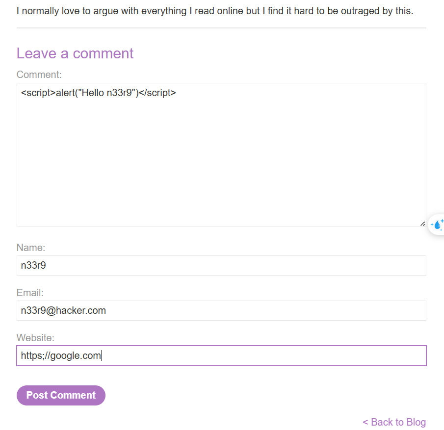
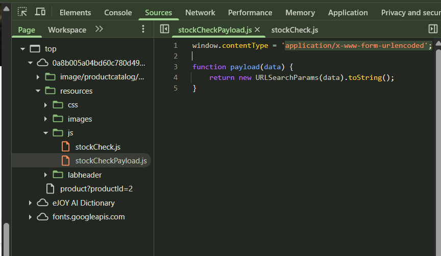
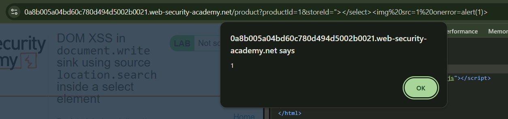

# [XSS](https://portswigger.net/web-security/cross-site-scripting)

Causes: 

- Unsanitized user input rendered in HTML, JavaScript, or attributes.
- Lack of proper input validation or output encoding.
- Unsafe use of document.write, innerHTML, or similar DOM sinks.

Impact: 

- Theft of session cookies, credentials, or sensitive data.

- Execution of arbitrary JavaScript in the victim’s browser.

- Full control over user interactions and content rendering.

Categories: 

- [Reflected XSS](https://portswigger.net/web-security/cross-site-scripting#reflected-cross-site-scripting): the **malicious script** comes from the **current HTTP request**.
- [Stored XSS](https://portswigger.net/web-security/cross-site-scripting#stored-cross-site-scripting): the **malicious script** comes from the **website's database**.
- [DOM-based XSS](https://portswigger.net/web-security/cross-site-scripting#dom-based-cross-site-scripting), where the vulnerability exists in client-side code rather than server-side code.

Prevention:  

- Use context-aware output encoding (e.g., HTML, JS, URL encoding).

- Sanitize and validate all user inputs.

- Use secure JavaScript APIs and avoid dangerous sinks like innerHTML.

- Implement Content Security Policy (CSP) to restrict script execution.

- Common Payloads through Labs Completion:

## - Apprentice

### [Lab 1: Lab: Reflected XSS into HTML context with nothing encoded](https://portswigger.net/web-security/cross-site-scripting/reflected/lab-html-context-nothing-encoded)


### [Lab 2: Stored XSS into HTML context with nothing encoded](https://portswigger.net/web-security/cross-site-scripting/stored/lab-html-context-nothing-encoded)

- Malicious scripts saved in database




### [Lab 3: DOM XSS in `document.write` sink using source `location.search`](https://portswigger.net/web-security/cross-site-scripting/dom-based/lab-document-write-sink)

- Inspect the search query:
- 

``

- Break the img src tag, using query search: `"><svg onload=alert(1)>`


### [Lab 4: DOM XSS in `innerHTML` sink using source `location.search`](https://portswigger.net/web-security/cross-site-scripting/dom-based/lab-innerhtml-sink)

**Lab des**: Lỗ hổng DOM-based XSS xảy ra do ứng dụng chèn dữ liệu từ URL vào DOM thông qua thuộc tính `innerHTML` mà không kiểm soát hoặc lọc nội dung. Điều này cho phép kẻ tấn công chèn và thực thi mã JavaScript độc hại.

Steps:

- Nhập vào ô `SEARCH` thẻ HTML: 

```html

```


### [Lab 5: DOM XSS in jQuery anchor `href` attribute sink using `location.search` source](https://portswigger.net/web-security/cross-site-scripting/dom-based/lab-jquery-href-attribute-sink)

lab des: Lab này chứa một lỗ hổng DOM-based Cross-Site Scripting (XSS) trên trang **submit feedback**. Ứng dụng sử dụng hàm `$` (selector function) của thư viện jQuery để tìm phần tử anchor (thẻ `<a>`), và thay đổi thuộc tính `href` của nó bằng dữ liệu lấy từ `location.search` (tức là phần query string trên URL).

Khai thác lỗ hổng để khiến liên kết “back” thực hiện lệnh `alert(document.cookie)` – tức là hiển thị cookie hiện tại của người dùng trong một hộp thoại alert.

steps: 

- Trên trang Submit feedback, thay đổi tham số truy vấn `returnPath` thành `/` kèm theo một chuỗi chữ và số ngẫu nhiên.
  Nhấp chuột phải và chọn Inspect (Kiểm tra phần tử), quan sát thấy chuỗi ngẫu nhiên vừa nhập được chèn vào bên trong thuộc tính `href` của thẻ `<a>`.

  https://0a5800f804ae12e48049c6ab005600ad.web-security-academy.net/feedback?returnPath=n33r9

  

- Đổi ReturnPath thành: `javascript:alert(document.cookie)`


### [Lab 6: DOM XSS in jQuery selector sink using a hashchange event](https://portswigger.net/web-security/cross-site-scripting/dom-based/lab-jquery-selector-hash-change-event)

Lab des: lab này chứa một lỗ hổng DOM-based Cross-Site Scripting (XSS) trên trang chủ. Ứng dụng sử dụng hàm `$()` của thư viện jQuery để tự động cuộn tới một bài đăng, dựa trên tiêu đề được truyền qua thuộc tính `location.hash`.

Để hoàn thành lab, cần gửi một đoạn mã khai thác (exploit) đến victim sao cho trình duyệt của họ sẽ gọi hàm `print()`.

Steps: 

- Đoạn script có lỗi: 


`window.location.hash.slice(1)` lấy **phần sau dấu #** trong URL.

`decodeURIComponent(...)` giải mã phần đó.

Chuỗi kết quả được **chèn trực tiếp vào bộ chọn jQuery `h2:contains(...)`** mà **không kiểm tra hoặc lọc** dữ liệu đầu vào.

Vì được đưa vào jQuery selector, ta có thể **chèn HTML hoặc JavaScript** vào DOM.

- craft payload, lưu vào exploit server: 

```html
<iframe src="https://0a3500f4040778b8829eabe6006100c5.web-security-academy.net/#" onload="this.src+=''"></iframe>

------------------------------------------------------------------
<iframe src=".../#">: tạo một iframe tải trang chính với location.hash ban đầu trống (#).
onload="this.src+=''":

Khi iframe load xong, dòng này sẽ thêm đoạn # vào URL (hash).

Điều này kích hoạt sự kiện hashchange, và đoạn JavaScript ở ảnh thực thi.

Trong DOM, đoạn  được giải mã, chèn vào selector h2:contains(...), gây lỗi → trigger onerror → thực thi print().
```


### [Lab 7: Reflected XSS into attribute with angle brackets HTML-encoded](https://portswigger.net/web-security/cross-site-scripting/contexts/lab-attribute-angle-brackets-html-encoded)

Lab des: Lab chứa lỗ hổng reflected XSS ở chức năng `Search`, các dấu `<>` đều bị encode HTML.

Steps: 

- Tìm kiếm một chuỗi bất kì, quan sát thấy chuỗi này được đặt trong cặp dấu `" "`


- Thay chuỗi tìm kiếm bằng: `"onmouseover="alert(1)` để escape `" "`


### [Lab 8: Stored XSS into anchor `href` attribute with double quotes HTML-encoded](https://portswigger.net/web-security/cross-site-scripting/contexts/lab-href-attribute-double-quotes-html-encoded)

Lab des: Lỗi stored XSS ở chức năng `comment`

Steps: 

- Comment vào 1 blog bất kì
- Load lại blog đó, và quan sát response trả về: phần text ở ô "Website" đượcđặt trong thẻ `href`


- Thay nội dung của mục "Website" = `javascript:alert(1)`


### [Lab 9: Reflected XSS into a JavaScript string with angle brackets HTML encoded](https://portswigger.net/web-security/cross-site-scripting/contexts/lab-javascript-string-angle-brackets-html-encoded)

Lab des:  lab này chứa một lỗ hổng XSS (cross-site scripting) dạng reflected trong chức năng theo dõi truy vấn tìm kiếm, trong đó các dấu ngoặc nhọn (`<` và `>`) đã được mã hóa. Phản hồi (reflection) xảy ra bên trong một chuỗi JavaScript.

Để hoàn thành lab, hãy thực hiện một cuộc tấn công XSS bằng cách thoát ra khỏi chuỗi JavaScript đó và gọi hàm `alert`.

=> Reflected XSS bên trong một **JavaScript string context**.

**Dấu `<`, `>` đã bị encode** → không thể dùng thẻ `<script>` hay các tag HTML thông thường.

**Chuỗi phản hồi** nằm **trong đoạn mã JavaScript** như:

```js
var searchTerm = 'user_input_here';
```

Cần phải **break out khỏi chuỗi `'...'`** → dùng payload như:

```js
';alert(1);// 
```

hoặc encode:

```js
%27%3Balert(1)%3B//
```

Payload chèn vào URL (query string) → sau khi load, mã độc được thực thi ngay khi đoạn JavaScript chứa nó được chạy.

Steps: 

- nhập chuỗi bất kì vào ô `search`


```js

                        var searchTerms = 'n33r9';
                        document.write('');
                    
```

=> chuỗi được đặt trong đoạn mã js

- Thay chuổi search bằng `'-alert(1)-'` để phá vỡ `' '` js string và chèn đoạn js `alert(1)` vào


## - Practitioner

### [Lab 1: DOM XSS in `document.write` sink using source `location.search` inside a select element](https://portswigger.net/web-security/cross-site-scripting/dom-based/lab-document-write-sink-inside-select-element)




- add query `storeId` into the URL:


- Add xss payload to the URL:




### [Lab 2: DOM XSS in AngularJS expression with angle brackets and double quotes HTML-encoded](https://portswigger.net/web-security/cross-site-scripting/dom-based/lab-angularjs-expression)

Lab des: Khai thác lỗ hổng DOM-based XSS do ứng dụng sử dụng AngularJS không an toàn, cho phép chèn biểu thức AngularJS vào nội dung trang.

- Ứng dụng có trang tìm kiếm dùng AngularJS.
- Dữ liệu từ URL (query string) được đưa trực tiếp vào HTML với cú pháp `{{...}}` — đặc trưng của AngularJS binding, dẫn đến việc thực thi các **biểu thức AngularJS (AngularJS expressions)** không được lọc.

Steps: 

- Nhập chuỗi bất kì vào ô tìm kiếm, quan sát kết quả:

 Quan sát thấy chuỗi vừa nhập được hiển thị **bên trong phần có khai báo `ng-app`**, tức ứng dụng đang dùng AngularJS.

- Thử chèn biểu thức khai thác XSS vào ô tìm kiếm:

  ```js
  {{$on.constructor('alert(1)')()}}
  ```

  - một cách **bypass** để gọi `eval()` gián tiếp thông qua `constructor`.
  - `$on` là một thuộc tính có sẵn trong scope của AngularJS.

- Nhấn nút tìm kiếm:
   => Nếu payload được xử lý mà không bị lọc, `alert(1)` sẽ được thực thi.
   => Popup `alert(1)` hiển thị → tấn công DOM-based XSS thành công → hoàn thành lab.


### [Lab 3: Reflected DOM XSS](https://portswigger.net/web-security/cross-site-scripting/dom-based/lab-dom-xss-reflected)

Lab des: lỗ hổng reflected DOM-based XSS.
Ứng dụng reflect trực tiếp giá trị đầu vào từ `location.search` vào DOM mà không thực hiện lọc/encode dữ liệu người dùng nhập.

Steps: 

- Search 1 chuỗi bất kì:


Kết quả chuỗi search được reflected trong 1 json response: `search-results`

script xử lí json response này là `searchResults.js`, có hàm eval()


Trong quá trình test, 

Dấu ngoặc kép (`"`) đã được escape → `\"`

**Backslash (`\`) không được escape** → đây là điểm yếu có thể tận dụng.

craft payload: `\"-alert(1)}//`

Cơ chế hoạt động của payload:

1. `\"` → đóng chuỗi trước thời điểm mong muốn (escape `"`)
2. `-alert(1)` → thực thi `alert(1)` như một biểu thức độc lập (sử dụng toán tử `-`)
3. `}` → đóng object JSON sớm
4. `//` → comment phần còn lại của mã JS để tránh lỗi cú pháp


Đoạn json response thu được: 

```json
{"searchTerm":"\\"-alert(1)}//", "results":[]}
```

Khi được eval(), đoạn mã tương đương: 

```json
{
  searchTerm: "\"-alert(1)}//",
  results: []
}

```


- Gửi chuỗi search: `\"-alert(1)}//`


### [Lab 4: Stored DOM XSS](https://portswigger.net/web-security/cross-site-scripting/dom-based/lab-dom-xss-stored)

Lab des: 

