Causes: 

Impact:

Categories: 

Prevention: 

Common Payload:

# Path Traversal (6 labs)

Causes: 

Impact:

Categories: 

Prevention: 

Common Payload:

## Apprentice 

### [Lab 1: File path traversal, simple case](https://portswigger.net/web-security/file-path-traversal/lab-simple)

Lab des: 

Khai thác lỗ hổng **Path Traversal** để đọc file **`/etc/passwd`** từ máy chủ.

Ứng dụng có chức năng hiển thị hình ảnh sản phẩm qua URL dạng:

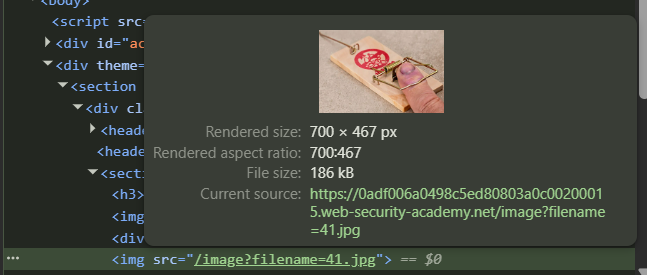

Nếu tham số `filename` không được xử lí đúng cách, có thể lợi dụng **`../` (directory traversal)** để truy cập file ngoài thư mục gốc (root directory của web app).

Steps: 

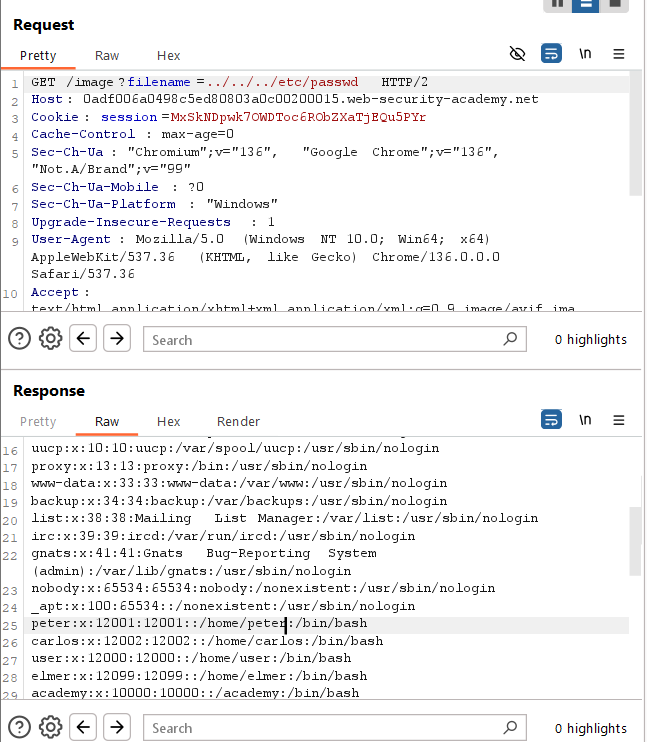

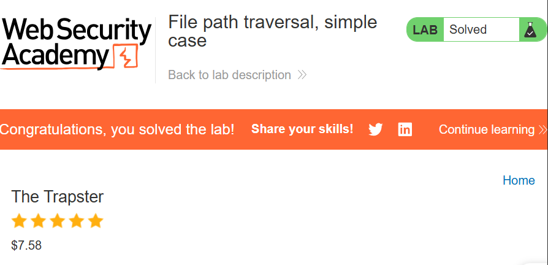


## Practitioner

### [Lab 1: File path traversal, traversal sequences blocked with absolute path bypass](https://portswigger.net/web-security/file-path-traversal/lab-absolute-path-bypass)

Lab des: 

- Ứng dụng có chức năng hiển thị ảnh sản phẩm.

- Ứng dụng **chặn các chuỗi traversal** như `../`, nhưng **cho phép cung cấp đường dẫn tuyệt đối**.

- File ảnh được truy cập qua endpoint như:

```
GET /image?filename=26.jpg
```

Steps: 

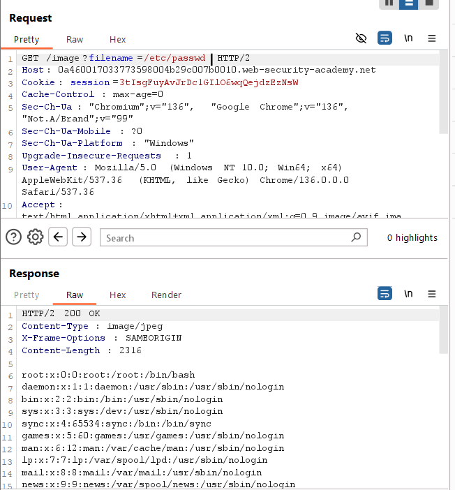

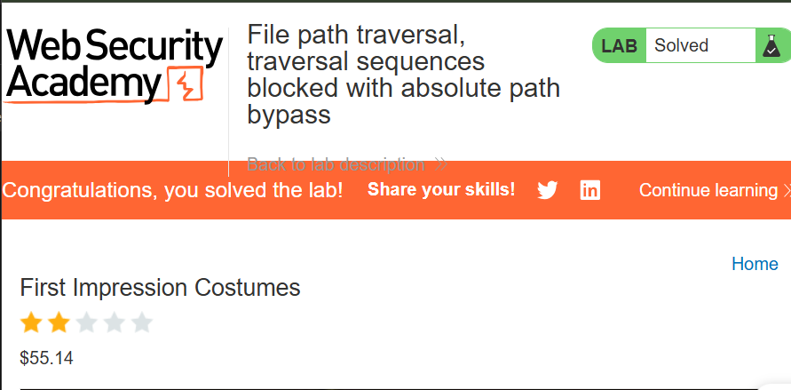


### [Lab 2: File path traversal, traversal sequences stripped non-recursively](https://portswigger.net/web-security/file-path-traversal/lab-sequences-stripped-non-recursively)

Lab des: 

Ứng dụng loại bỏ các chuỗi traversal như `../`, nhưng xử lý không kỹ.

Thử test với 2 payload của 2 bài lab trước: 

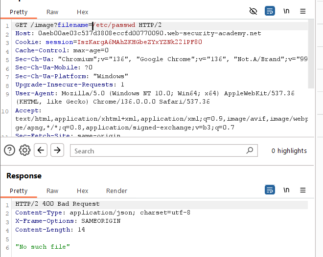

=> No such file

Steps: 

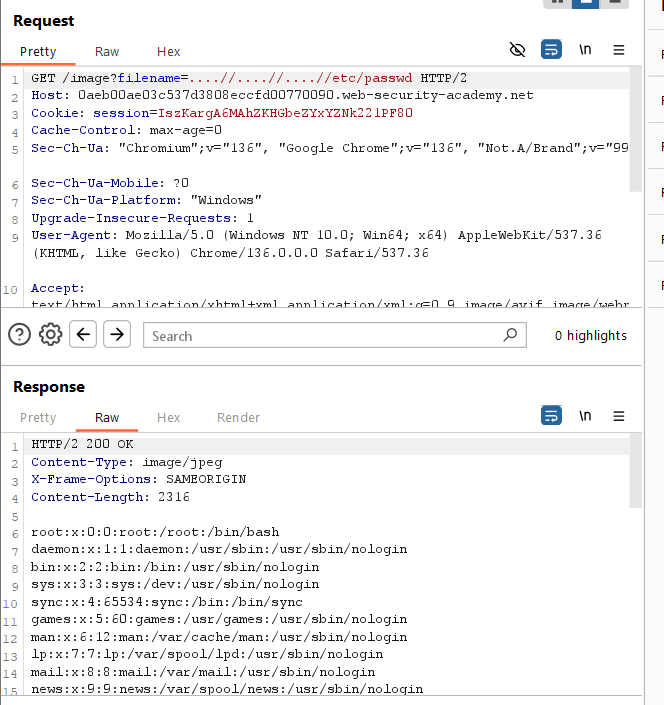

Có thể thuật toán strip là: Gặp `../` => auto strip = sau khi strip xong thì ta có đường dẫn tương đối  `../../../etc/paswd`

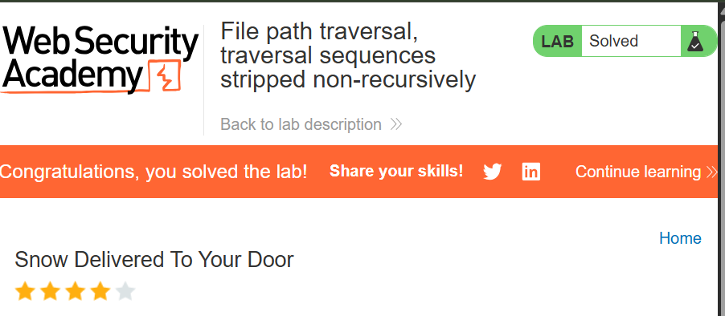


### [Lab 3: File path traversal, traversal sequences stripped with superfluous URL-decode](https://portswigger.net/web-security/file-path-traversal/lab-superfluous-url-decode)

Lab des: 

Ứng dụng chặn các req có chứa chuỗi path traversal => decode url => gửi response

Steps: 

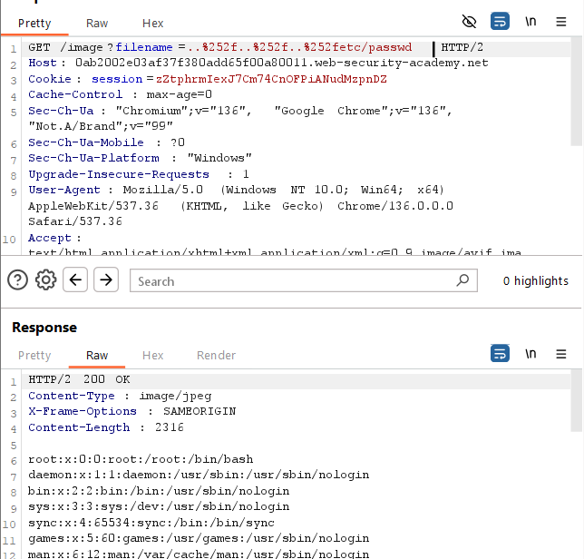

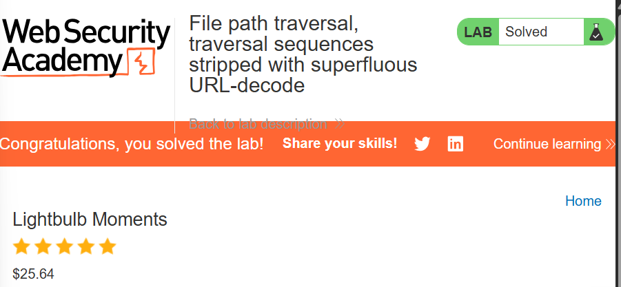


### [Lab 4: File path traversal, validation of start of path](https://portswigger.net/web-security/file-path-traversal/lab-validate-start-of-path)

Lab des: 

- Ứng dụng yêu cầu client **truyền full path** qua tham số `filename`.

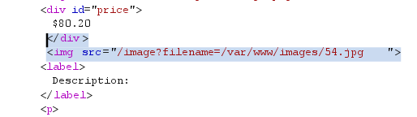

- Server chỉ **kiểm tra xem đường dẫn có bắt đầu bằng `/var/www/images/`** không.

- Sau đó, **không kiểm tra gì thêm** và thực hiện truy cập file.

Steps: 

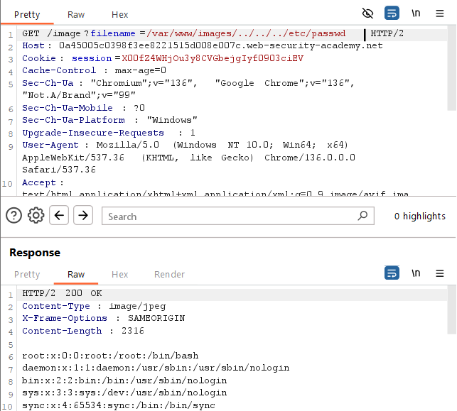

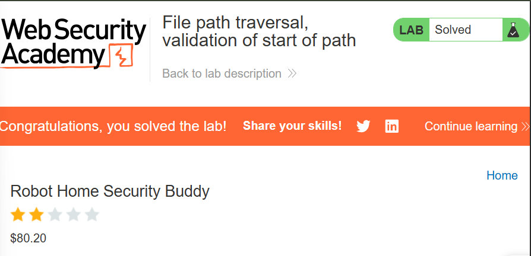


### [Lab 5: File path traversal, validation of file extension with null byte bypass](https://portswigger.net/web-security/file-path-traversal/lab-validate-file-extension-null-byte-bypass)

Lab des:

- Ứng dụng chỉ kiểm tra xem file ảnh có kết thúc bằng extensions mong muốn không (jpg || png)

Steps: 

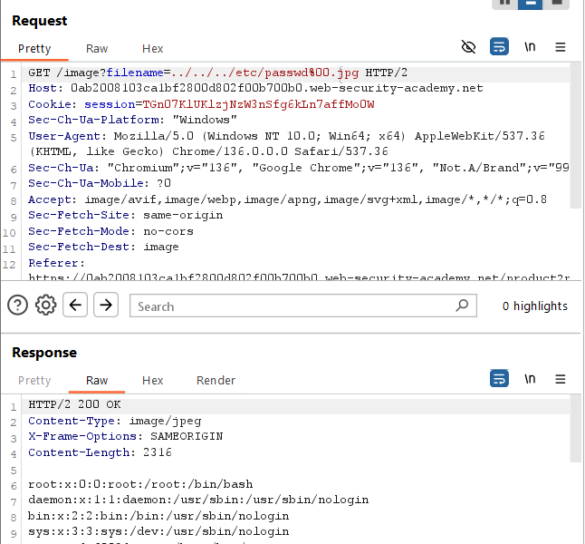

=> sau khi check extension xong, đến đoạn traverse file path, các hàm xử lí chuỗi sẽ cắt chuỗi khi gặp null byte

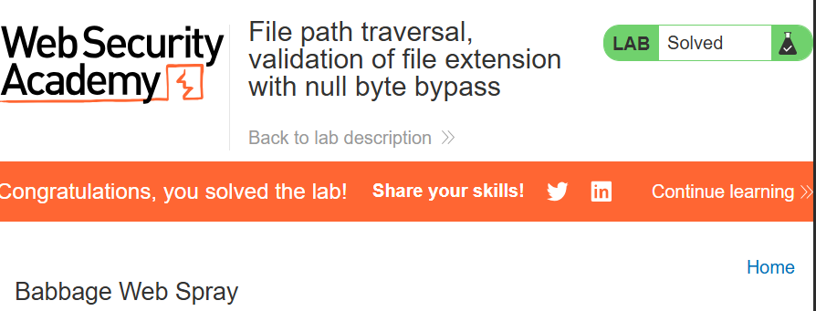

