# Race conditions

## **Định nghĩa:** 

**Race condition** (điều kiện tranh chấp) là một lỗ hổng xảy ra khi nhiều yêu cầu hoặc tiến trình cùng truy cập và thay đổi một tài nguyên chung mà không có cơ chế đồng bộ thích hợp.
 Kẻ tấn công khai thác thời điểm xử lý để thực hiện hành động không mong muốn, thường dẫn đến bypass kiểm tra, khai thác logic ứng dụng hoặc gian lận.

## **Nguyên nhân:**

- **Xử lý song song (concurrency)**: Ứng dụng xử lý nhiều yêu cầu đồng thời mà không khóa tài nguyên đúng cách.
- **Thiếu atomicity**: Một hành động yêu cầu nhiều bước kiểm tra và cập nhật, nhưng lại có khoảng trống thời gian giữa các bước.
- **Không sử dụng cơ chế khóa (locking/mutex)** khi truy cập dữ liệu nhạy cảm.
- **Hệ thống phân tán**: Các server khác nhau không đồng bộ hóa trạng thái nhanh chóng.
- **Caching**: Lưu trữ tạm thời dữ liệu dẫn đến kiểm tra dựa trên thông tin cũ.

## **Tác động:**

- **Bypass hạn chế logic**: Vượt qua giới hạn số lần đổi quà, số tiền giảm giá, số lượt rút tiền.
- **Chiếm đoạt tài nguyên**: Mua sản phẩm với giá thấp hơn, rút tiền vượt số dư.
- **Lừa đảo tài chính**: Thực hiện giao dịch ngân hàng nhiều lần với cùng một mã xác thực.
- **Tấn công leo quyền**: Thay đổi trạng thái của tài khoản hoặc quyền truy cập trái phép.

## **Các kỹ thuật tấn công:** 

### Tech 1. **Race condition qua song song hóa yêu cầu (Parallel Requests)**

Gửi nhiều yêu cầu đồng thời để tận dụng khoảng trống thời gian giữa kiểm tra và cập nhật dữ liệu.

- **Ví dụ**:
  - Website cho phép đổi voucher "1 lần duy nhất".
  - Khi nhấn “Redeem”, server kiểm tra và ghi nhận trạng thái. Nếu gửi nhiều request gần như cùng lúc, cả hai có thể được xử lý trước khi trạng thái cập nhật, dẫn đến đổi voucher nhiều lần.

### Tech 2. **Subtle race conditions (Race phức tạp)**

Khai thác khi ứng dụng dựa trên **một chuỗi hành động**. Tấn công yêu cầu hiểu rõ logic và thời gian xử lý.

- **Ví dụ**:
  - Một API thanh toán trước kiểm tra số dư, sau đó xử lý trừ tiền. Nếu gửi 2 yêu cầu thanh toán song song, cả hai đều qua bước kiểm tra trước khi số dư bị trừ.

### Tech 3. **Single endpoint vs Multiple endpoint**

- **Single endpoint**: Tấn công qua nhiều request tới **cùng một URL**.
- **Multiple endpoint**: Tấn công qua các API khác nhau nhưng cùng thay đổi một tài nguyên.

## VD minh hoạ

#### 1. Ví dụ kinh điển: Double spending

Trang web bán hàng giảm giá giới hạn 1 lần mua/người.
 Quy trình xử lý:

1. Người dùng click “Thanh toán” → server kiểm tra số lượng còn.
2. Nếu còn hàng → trừ số lượng và xác nhận đơn.

Kẻ tấn công dùng script gửi **2 request POST /purchase** gần như đồng thời.
 Cả hai request đều vượt qua bước kiểm tra trước khi server kịp cập nhật số lượng, dẫn đến:

- Mua được 2 sản phẩm dù giới hạn 1.
- Có thể trừ tiền một lần nhưng giao hàng nhiều lần.

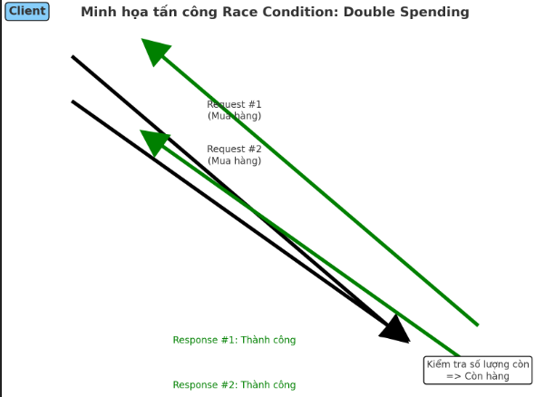

------

#### **2. Ví dụ thực tế: Gift card race**

Một trang thương mại cho phép đổi gift card trị giá 100$.

- Request đổi quà: `/redeem?code=ABC123`
- Server không khóa code sau khi đổi → nếu gửi nhiều request cùng lúc, mỗi request đều đổi được 100$.
   Kết quả: kẻ tấn công tạo ra hàng nghìn $ giá trị từ một gift card.

#### 3. **VD kèm minh hoạ tấn công**: Một trang thương mại điện tử cho phép áp mã giảm giá 50% **một lần cho mỗi tài khoản**.

**Quy trình tấn công:**

1. Đăng nhập tài khoản.
2. Sử dụng Burp Suite hoặc script Python gửi **20 request POST** áp mã giảm giá **gần như đồng thời**.
3. Nếu server không khóa tài nguyên đúng cách, tất cả yêu cầu được áp dụng → sản phẩm giảm 50% nhiều lần, dẫn đến giá trị âm hoặc giá gần như 0.

**Payload mẫu Python (sử dụng threading)**:

```python
import requests
import threading

url = "https://victim.com/apply-coupon"
data = {"coupon": "SALE50"}
cookies = {"session": "abc123"}

def send_request():
    requests.post(url, data=data, cookies=cookies)

threads = []
for i in range(20):
    t = threading.Thread(target=send_request)
    threads.append(t)
    t.start()

for t in threads:
    t.join()
```

------

## **6. Đánh giá**

Race condition **không phụ thuộc vào lỗi code truyền thống như SQLi hay XSS**, mà đến từ **lỗi thiết kế logic và đồng bộ**.

**Ưu điểm cho attacker**:

- Không cần khai thác lỗ hổng code injection.
- Có thể thực hiện từ client thông thường hoặc script đơn giản.

**Khó khăn**:

- Yêu cầu timing chính xác.
- Ứng dụng có thể triển khai rate-limiting hoặc transaction lock.

**Rủi ro cao**:

- Liên quan trực tiếp tới tài chính và dữ liệu nhạy cảm.
- Dễ bị khai thác trên hệ thống tải cao (high traffic) vì timing xử lý không đồng bộ.

## **Cách phòng tránh:** 

1. **Sử dụng locking/mutex**: Đảm bảo mỗi tài nguyên chỉ được xử lý một lần tại một thời điểm.
2. **Atomic operations**: Thực hiện kiểm tra và cập nhật dữ liệu trong một transaction không thể chia nhỏ.
3. **Rate limiting**: Giới hạn số lượng request cùng lúc hoặc trong một khoảng thời gian ngắn.
4. **Idempotent design**: Thiết kế API sao cho cùng một request lặp lại sẽ không thay đổi trạng thái ngoài lần đầu.
5. **Centralized state validation**: Luôn xác thực dữ liệu ở backend thay vì chỉ dựa vào frontend.

## Case thực tế: 

- https://ncsgroup.vn/mot-truong-hop-thuc-te-ve-lo-hong-race-condition-de-rce/
- https://viblo.asia/p/phan-tich-lo-hong-uploadfile-tren-apache-ofbiz-cve-2021-37608-bypass-3P0lP6aoKox

## Labs: 

### Apprentice: (1 lab)

#### Lab 1: Limit overrun race conditions

**Limit overrun** là một dạng race condition, thường xảy ra khi hệ thống áp dụng giới hạn (như số lần dùng coupon, số tiền thanh toán tối thiểu, số lượng hàng mua) nhưng không khóa tài nguyên hoặc không xử lý yêu cầu theo cơ chế nguyên tử (atomic operation).

##### **Lab des:** 

Website có chức năng giỏ hàng.

Người dùng có thể:

- Thêm sản phẩm vào giỏ (`POST /cart`).
- Áp dụng mã giảm giá (`POST /cart/coupon`).

Mã giảm giá chỉ **được áp dụng một lần** trên giỏ hàng.

Hệ thống lưu trạng thái giỏ hàng **server-side** dựa trên **session ID**.

Nguyên nhân:

**1) “Kiểm tra rồi mới thực hiện” nhưng tách thành hai bước không nguyên tử**

 (“Check-then-act” split into two non-atomic steps)

Logic điển hình (dễ bị lỗi):

```
// Trình xử lý request: áp dụng coupon vào giỏ hàng
cart = loadCart(sessionId)                 // đọc trạng thái hiện tại
if (!cart.hasApplied(couponId)) {          // KIỂM TRA
    cart.applyDiscount(20%)                // THỰC HIỆN #1
    cart.markApplied(couponId)             // THỰC HIỆN #2
    saveCart(cart)                         // ghi lại
    return "Coupon đã áp dụng"
} else {
    return "Coupon đã được áp dụng"
}
```

Hai yêu cầu đồng thời (A và B) có thể xen kẽ như sau:

| Thời điểm | Request A                         | Request B                         |
| --------- | --------------------------------- | --------------------------------- |
| t0        | loadCart() → hasApplied = false   |                                   |
| t1        |                                   | loadCart() → hasApplied = false   |
| t2        | applyDiscount(20%), markApplied() |                                   |
| t3        | saveCart()                        |                                   |
| t4        |                                   | applyDiscount(20%), markApplied() |
| t5        |                                   | saveCart()                        |

Cả A và B đều vượt qua bước **KIỂM TRA** trước khi **THỰC HIỆN** cập nhật trạng thái.
 Kết quả: giảm giá được áp dụng **hai lần**.

------

**2) Không có cơ chế loại trừ lẫn nhau (mutual exclusion) đối với trạng thái dùng chung**

- “Trạng thái dùng chung” ở đây là giỏ hàng gắn với phiên hoặc người dùng (thường lưu trên server trong DB, Redis hoặc session store).
- Máy chủ web vẫn xử lý song song nhiều yêu cầu cho cùng một phiên (do mở nhiều tab, retry, công cụ khai thác race condition, hoặc Burp’s parallel sender).
- Không có khoá tự động cho mỗi giỏ hàng/phiên trừ khi tự triển khai.

------

**3) Cơ sở dữ liệu hoặc session store không tự đảm bảo tính duy nhất**

- Mức cách ly mặc định của DB (ví dụ: **READ COMMITTED**) cho phép các thao tác xen kẽ như trên.
- Nếu “coupon đã áp dụng” chỉ là một cờ boolean trong dữ liệu giỏ hàng, thì không có ràng buộc duy nhất nào chặn lần áp dụng thứ hai trước khi giao dịch đầu tiên được commit.
- Nếu có thêm cache (Redis/Memcached) trước DB, thì tính nhất quán cuối cùng (eventual consistency) hoặc cơ chế “ghi đè theo lần ghi cuối” có thể khiến cả hai luồng đọc cùng một giá trị cũ và mỗi luồng ghi lại tổng tiền đã giảm riêng.

------

**4) Thiếu tính idempotent (bất biến khi gọi lại)**

- API “áp dụng coupon” có hiệu ứng cộng dồn (20% + 20% …) thay vì là **idempotent** (nghĩa là sau khi thực hiện thành công, gọi lại API đó sẽ trả về trạng thái giỏ hàng như cũ mà không có thay đổi thêm).

##### **Steps:**

**Bước thăm dò**

- Thêm sản phẩm rẻ nhất vào giỏ hàng.
- Áp dụng mã giảm giá và quan sát:
  - Yêu cầu đầu tiên: "Coupon applied".
  - Yêu cầu thứ hai: "Coupon already applied".
- Suy luận: hệ thống kiểm tra trước khi update dữ liệu vào DB, có thể gây race condition.

**Bước tấn công**

- Xóa mã giảm giá và sản phẩm thử nghiệm khỏi giỏ.

- Thêm sản phẩm đắt tiền (Lightweight L33t Leather Jacket).

- Gửi **nhiều yêu cầu `POST /cart/coupon` song song** trong **race window**.

  (Link template bamdas: https://github.com/PortSwigger/bambdas/blob/main/CustomAction/ProbeForRaceCondition.bambda)

- Kết quả: Mã giảm giá áp dụng nhiều lần → giá sản phẩm giảm sâu.

**Bước hoàn tất**

- Khi tổng giá < số dư trong tài khoản → mua hàng thành công với giá thấp hơn dự kiến.
- 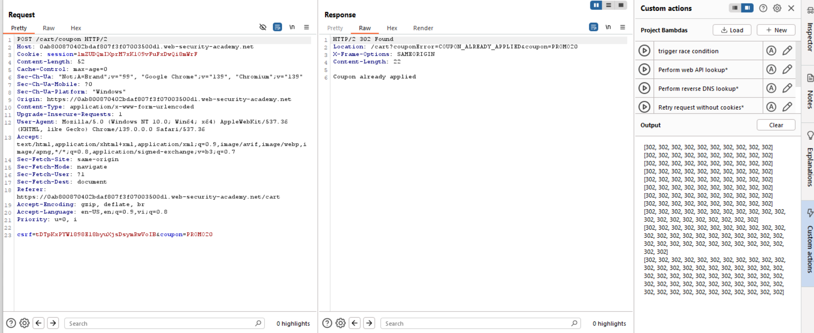

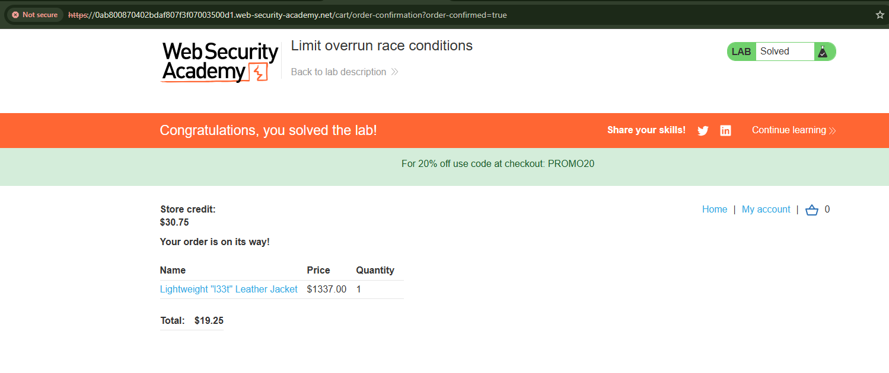

## Practice: (4 labs)

### Lab1 : Bypassing rate limits via race conditions

**Rate limit** là cơ chế hạn chế số lần người dùng có thể thực hiện một hành động nào đó trong một khoảng thời gian.

Ví dụ: đăng nhập sai 3 lần thì tạm thời khóa tài khoản, hoặc chỉ cho phép gửi 5 request mỗi giây.

Mục đích: ngăn chặn brute-force, spam, tấn công DoS.

**Bypass rate limits**: Bình thường server cho phép nhập sai tối đa 3 lần.

Nhưng nếu gửi song song nhiều request (gần như cùng thời điểm), thì có thể:

- Server xử lý 10 request cùng lúc, nhưng chưa kịp khóa tài khoản.
- Kết quả: thay vì chỉ đoán được 3 mật khẩu, ta đoán được 10 hoặc nhiều hơn trong một lần thử.

**Lab des:** 

Cơ chế đăng nhập có **rate limiting**: mỗi username chỉ được sai 3 lần rồi sẽ bị tạm khóa.

Lỗ hổng: **race condition** → có thể gửi nhiều request song song để vượt qua giới hạn.

Nhiệm vụ:

1. Brute-force mật khẩu của user **carlos**.
2. Đăng nhập thành công.
3. Vào admin panel.
4. Xóa user carlos.

Steps: 

1. **Kiểm tra cơ chế bảo vệ**

- Đăng nhập tài khoản
- Thử nhập sai mật khẩu 3 lần → bị chặn
- Thử username khác → vẫn hiện lỗi bình thường → **rate limit được tính theo username**.

2. **Xác định race window**

- Gửi nhiều request sai mật khẩu **cùng lúc** bằng Burp Repeater.

- Kết quả: có nhiều request trả về “Invalid username/password” trước khi server kịp khóa → chứng minh có **race condition**.

  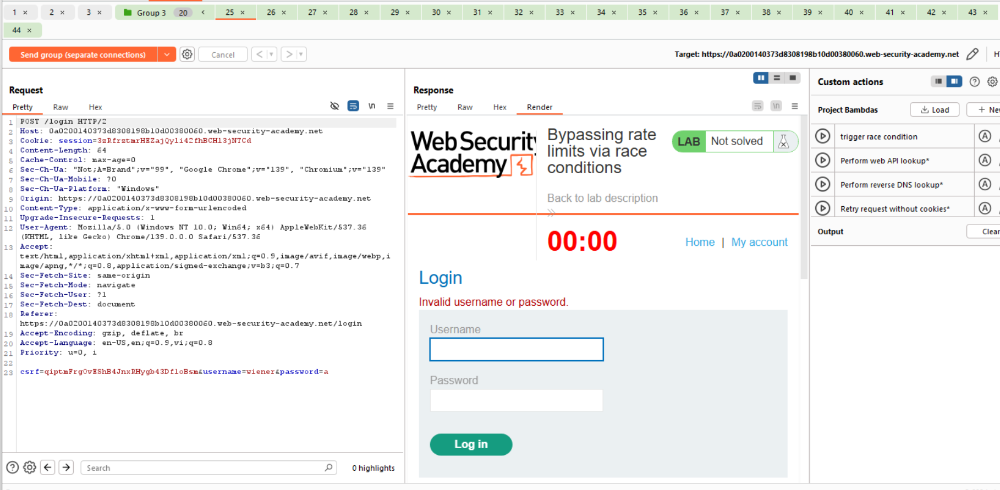

  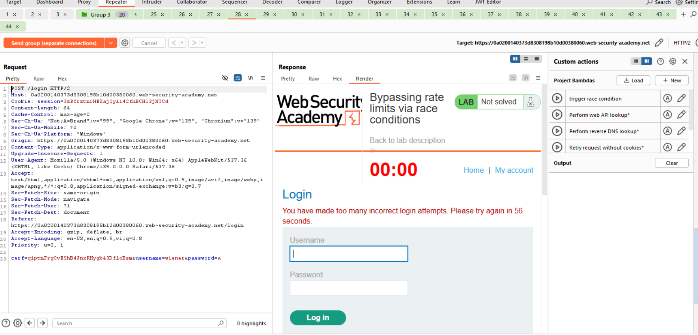

3. **Chuẩn bị tấn công bằng Turbo Intruder**

- Lấy request đăng nhập (POST /login) trong Proxy → gửi sang Turbo Intruder.
- Sửa `username=carlos`.
- Đặt `%s` vào chỗ giá trị của `password`.

Script Turbo Intruder (dùng template `race-single-packet-attack.py`):

```
def queueRequests(target, wordlists):
    engine = RequestEngine(endpoint=target.endpoint,
                           concurrentConnections=1,
                           engine=Engine.BURP2
                           )

    # lấy danh sách mật khẩu từ clipboard
    passwords = wordlists.clipboard

    # xếp request đăng nhập cho từng mật khẩu
    for password in passwords:
        engine.queue(target.req, password, gate='1')

    # mở "cổng" để bắn tất cả request cùng lúc
    engine.openGate('1')


def handleResponse(req, interesting):
    if req.status == 302:  # login thành công sẽ redirect
        table.add(req)
```

- Copy danh sách mật khẩu vào clipboard.
- Chạy Turbo Intruder → gửi toàn bộ request cùng lúc.

4. **Tìm mật khẩu đúng**

- Xem kết quả.

- Request nào trả về **302 Found** chính là mật khẩu đúng

  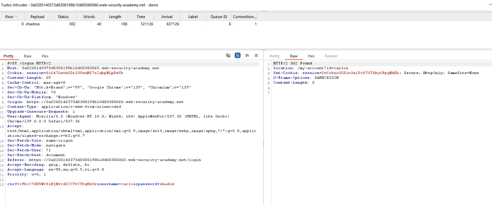

- pass = shadow

**5. Đăng nhập & xóa carlos**

- Đăng nhập với `carlos:shadow`.

- Truy cập `/admin`.

- Xóa user **carlos** 

  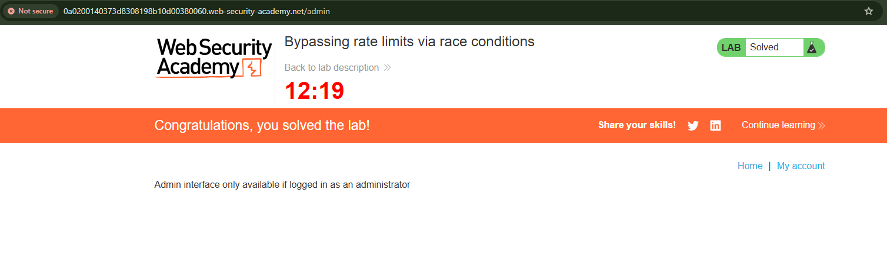

------

**Cách phòng thủ:**

- **Khoá đồng bộ (atomic update)**: cập nhật bộ đếm trước khi xử lý đăng nhập.

- **Rate limit theo IP/session**, không chỉ theo username.

- Thêm **captcha / MFA** để chặn brute-force.

  

### Lab2: Multi-endpoint race conditions

**Lab des:** 

Trang web có chức năng mua hàng (cart + checkout).

Có **race condition** trong luồng đặt hàng → có thể mua một món đắt tiền mà không đủ tiền trong tài khoản.

Mục tiêu: mua được **Lightweight L33t Leather Jacket**.

**Steps:** 

#### 1. Cách thức hoạt động giỏ hàng

- Đăng nhập với `wiener:peter`.
- Mua thử **gift card** (rẻ) để quan sát luồng request.
- Trong Burp Proxy, bạn thấy các endpoint chính:
  - `POST /cart` → thêm sản phẩm vào giỏ.
  - `POST /cart/checkout` → tiến hành thanh toán.
  - `GET /cart` → xem giỏ hàng.

Kết luận: trạng thái giỏ hàng lưu trên server, gắn với **session ID**.

#### 2. Dự đoán race condition

- Bình thường khi checkout, server sẽ:
  1. Kiểm tra có đủ credit không.
  2. Nếu đủ → xác nhận đơn.
  3. Nếu thiếu → từ chối.
- **Lỗ hổng**: Nếu gửi song song:
  - `POST /cart` (thêm jacket vào giỏ)
  - `POST /cart/checkout` (thanh toán)
     → Có khả năng checkout chạy **sau khi giỏ đã được validate credit nhưng trước khi confirm**, nên jacket được “thêm ké” vào đơn hàng mà không bị tính tiền.

------

#### 3. Benchmark hành vi

- Trong Repeater, nhóm 2 request:
  - `POST /cart` (thêm gift card hoặc jacket).
  - `POST /cart/checkout`.
- Gửi **tuần tự** vài lần → thấy request đầu (cart) chậm hơn checkout.
- Điều này cho thấy có một **cửa sổ thời gian (race window)** có thể khai thác.

------

#### 4. Thử khai thác (proof of concept)

- Đảm bảo giỏ hàng chỉ có **gift card** (bạn đủ tiền để thanh toán).

- Trong Repeater:
  - Tab 1: `POST /cart` với `productId=1` (jacket).
  - Tab 2: `POST /cart/checkout`.
  
- Chạy **song song** (Send in parallel).

  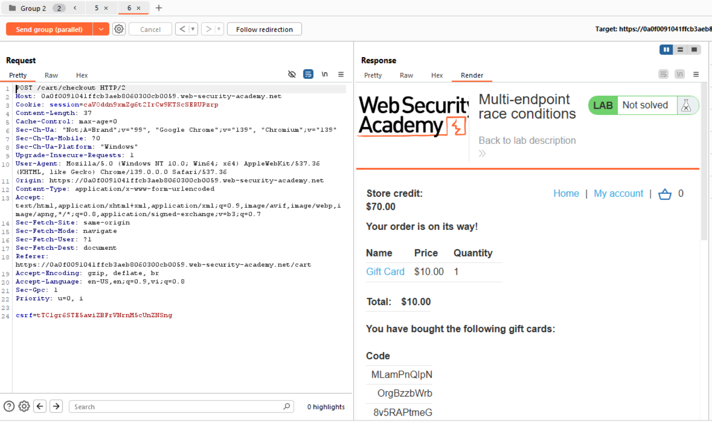

  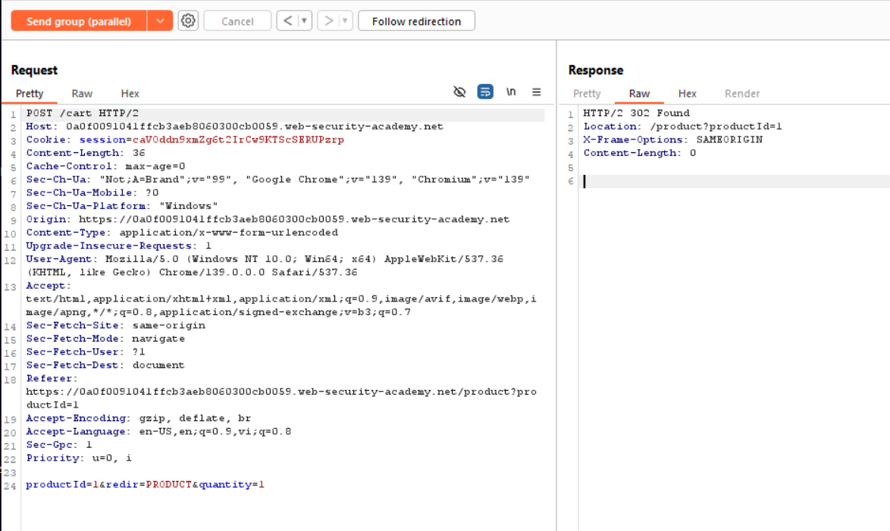

------

#### 5. Kết quả

- Mặc dù thấy `200 OK` cho checkout → nhma vẫn chưa mua thành công jacket ;()
- **Thử lại vài lần mà vẫn chưa race thành công huhu...**

------

#### Phòng thủ (defense)

- **Transaction atomicity**: gộp kiểm tra credit và xác nhận đơn hàng trong cùng một giao dịch, không cho chen ngang.
- **Lock session/cart**: khóa giỏ hàng trong lúc thanh toán.
- **Idempotent checkout**: chỉ cho phép một request checkout tại một thời điểm.


### Lab 3: Single-endpoint race conditions

#### Lab des

- Chức năng đổi email có **race condition** → cho phép chiếm email của người khác.
- Có một email **carlos@ginandjuice.shop** đã được mời làm admin nhưng chưa tạo account.
- Nếu mình claim được email này → tài khoản sẽ tự động có quyền admin.
- Nhiệm vụ:
  1. Claim email `carlos@ginandjuice.shop`.
  2. Vào admin panel.
  3. Xóa user carlos.

------

#### Steps

##### 1. Kiểm tra tính năng đổi email

- Đăng nhập với `wiener:peter`.
- Gửi yêu cầu đổi email → ví dụ: `abc@exploit-<id>.exploit-server.net`.
- Server gửi mail xác nhận với link chứa token.
- Nhấp link → đổi email thành công.

Lưu ý: nếu gửi tiếp một email khác, token cũ **hết hiệu lực** → chứng tỏ server chỉ lưu **một pending email** trong DB. Điều này mở ra khả năng race condition.

------

##### 2. Benchmark hành vi

- Trong Burp Repeater:
  - Gửi request `POST /my-account/change-email`.
  - Nhân bản 20 tab.
  - Mỗi tab dùng email khác nhau: `test1@exploit-<id>`, `test2@...`, …
- Gửi **tuần tự** → sẽ nhận đúng từng email tương ứng.
- Gửi **song song** (parallel) → có hiện tượng email gửi ra nhưng body không khớp với địa chỉ nhận → chứng minh tồn tại race condition.

------

##### 3. Thử khai thác

- Trong Repeater, tạo một nhóm gồm 2 request:

  1. `POST /my-account/change-email` với `email=abc@exploit-<id>.exploit-server.net`
  2. `POST /my-account/change-email` với `email=carlos@ginandjuice.shop`

- Gửi **song song**.

  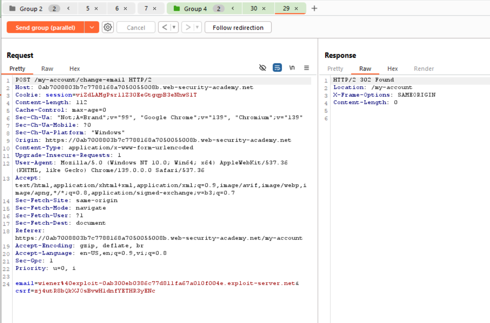

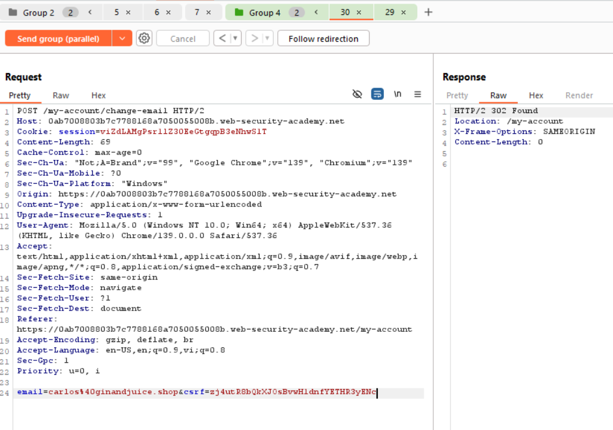

##### 4. Kiểm tra inbox

- Vào mail client của exploit server.

- Nếu thấy mail xác nhận trong đó **nội dung body** lại hiển thị email `carlos@ginandjuice.shop` → đã thành công (tui phải gửi mấy lần mới được hiuhiu)

  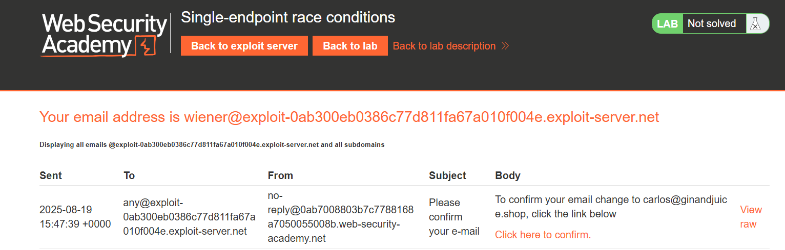

- Nhấp link xác nhận trong email.

Kết quả: Email tài khoản trở thành `carlos@ginandjuice.shop`.

------

##### 5. Truy cập admin & xóa carlos

- Quay lại **/my-account** → thấy có link admin panel.

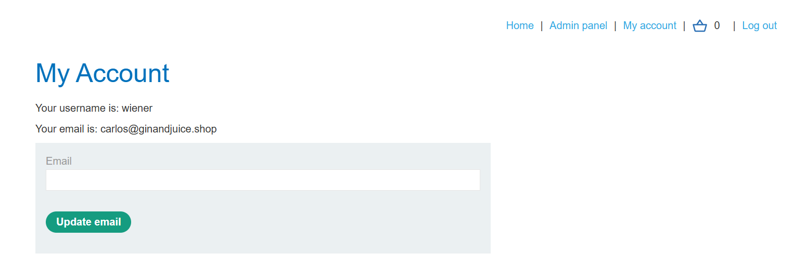

- Vào admin panel → xóa user `carlos` → lab solved.

  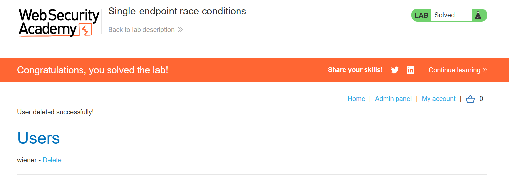

#### Phòng thủ

- Atomic transaction: khi gửi mail xác nhận phải gắn với email cụ thể lúc tạo, không phụ thuộc giá trị trong DB (vì có thể bị đổi giữa chừng).

- Token binding: gắn token xác nhận với email gốc để không bị mismatch.

- Lock request: chỉ cho phép một thay đổi email pending tại một thời điểm, không cho song song.

  

### Lab 4: Exploiting time-sensitive vulnerabilities

##### **Lab des:** 

Lab này nằm trong nhóm time-sensitive vulnerabilities, không phải race condition “thuần” (kiểu gửi 100 request vượt limit) mà lợi dụng cách sinh token reset password dựa vào timestamp.

##### Phân tích cơ chế sinh token

1. Khi gửi request `POST /forgot-password` với username, server sinh ra 1 token rồi gửi link reset qua email.
    Ví dụ:

   ```
   https://example.com/reset?username=wiener&token=abc123xyz
   ```

2. Token có độ dài cố định → có thể là hash của dữ liệu nào đó (ví dụ: timestamp + secret + …).

3. Mỗi lần gửi request cho một user sẽ ra token khác nhau → tức là input của hash có yếu tố thời gian.

------

##### Ý tưởng khai thác

- Nếu 2 request `forgot-password` được xử lý trong cùng 1 thời điểm (ví dụ cùng timestamp giây), thì token sinh ra sẽ giống hệt nhau.
- Vấn đề là server lock theo session (PHP session) → bình thường các request nối tiếp, không thể chạy đồng thời.
   ⇒ Giải pháp: dùng 2 session khác nhau để gửi request song song.

##### Steps: 

1. ###### **Quan sát token của mình**

   - Gửi `forgot-password` cho user *wiener*.

     => Mỗi lần gửi, token khác nhau nhưng có pattern ổn định.

2. ###### **Tạo 2 session khác nhau**

   - Gửi 1 request `GET /forgot-password` để server cấp session cookie + CSRF mới.
   - Copy session đó cho một request.
   - Giữ session ban đầu cho request còn lại.
      → Giờ bạn có 2 request `POST /forgot-password` chạy từ 2 session khác nhau.

3. ###### **Gửi song song 2 request**

   - Dùng Burp Repeater → Group Tabs → “Send in parallel”.

   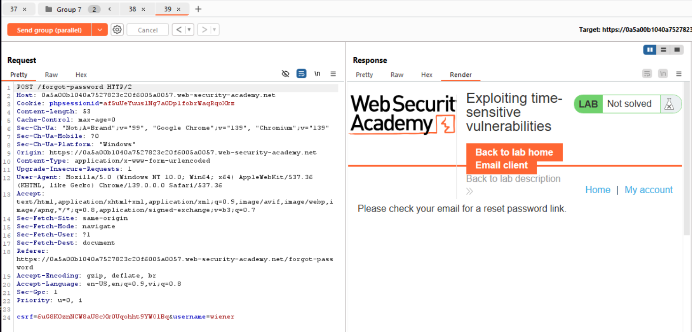

   - Nếu timing khớp, server sinh **cùng 1 token** cho cả 2 user.

   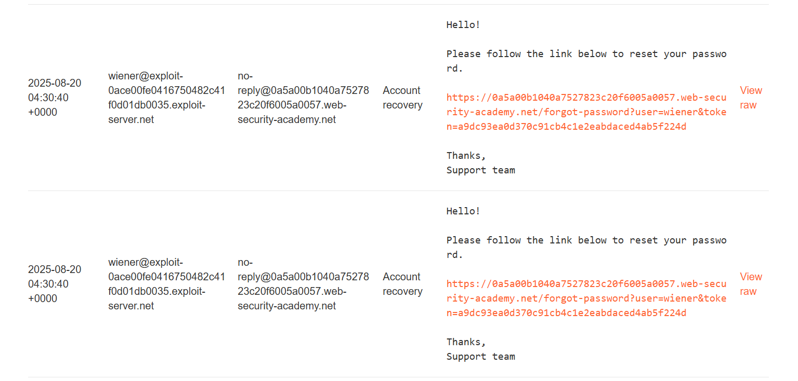

4. ###### **Đổi 1 request sang user carlos**

   - Trong 2 request song song, đổi username ở một cái thành `carlos`.

   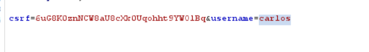

   - Kết quả: server gửi 2 email, một cho bạn (wiener), một cho carlos, **chung 1 token**.

5. ###### **Lợi dụng token chung**

   - Nhận email token (của wiener).

   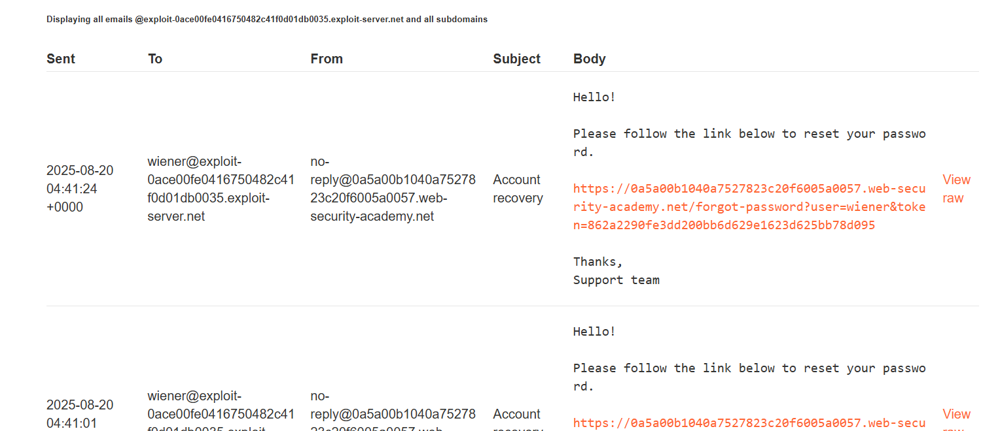

   - Thay username trong link từ `wiener` → `carlos`.

     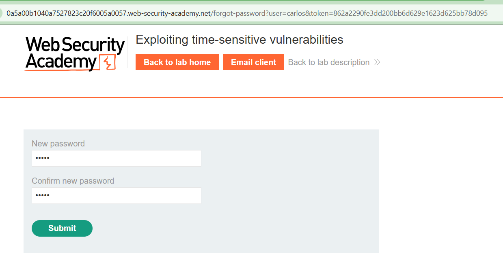

   - Dùng token đó reset password của carlos thành công.

6. ###### **Đăng nhập và xoá user carlos**

   - Đăng nhập bằng `carlos:newpassword`.
   - Vào admin panel → Xoá user carlos → Hoàn thành lab.

   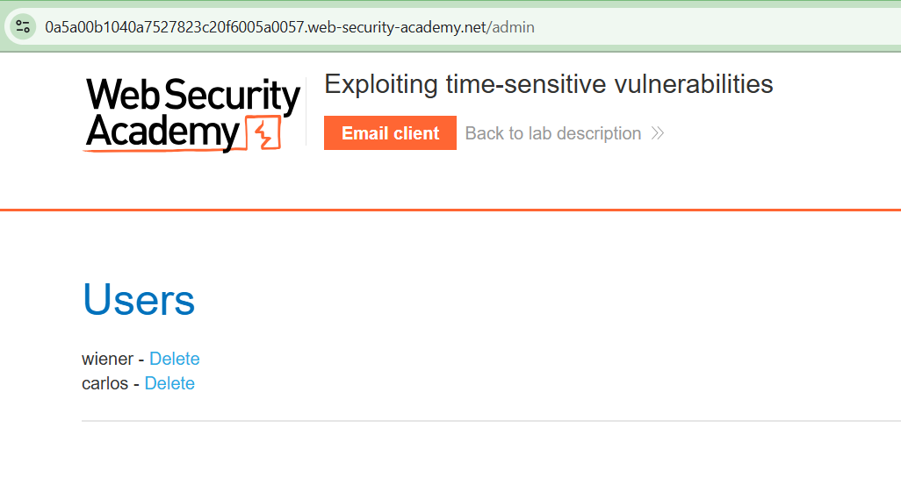

------

##### Bản chất lỗ hổng

- Token reset password = hash(timestamp + secret).
- Timestamp chỉ chính xác đến giây → nếu 2 request chạy cùng giây, token trùng nhau.
- Do server không đưa username vào hash, token có thể dùng chéo giữa 2 user.
- Vậy là kẻ tấn công reset được mật khẩu của nạn nhân.
