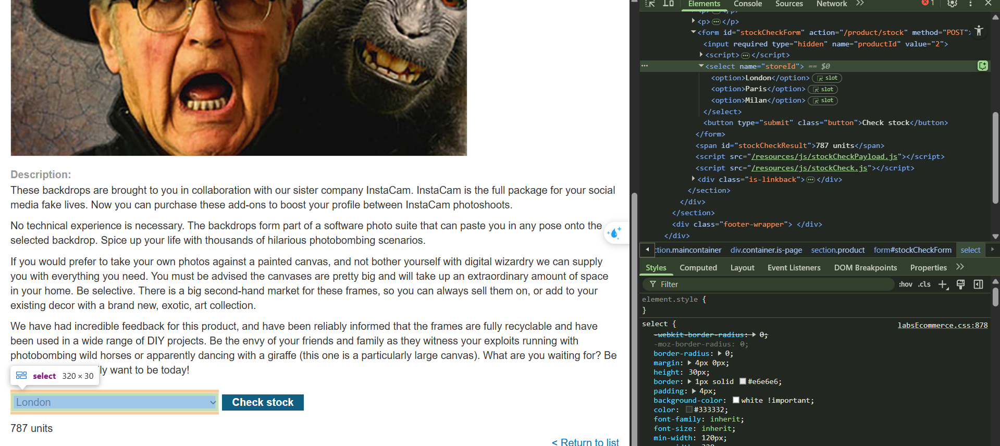

# [XSS](https://portswigger.net/web-security/cross-site-scripting)

Causes: 

- Unsanitized user input rendered in HTML, JavaScript, or attributes.
- Lack of proper input validation or output encoding.
- Unsafe use of document.write, innerHTML, or similar DOM sinks.

Impact: 

- Theft of session cookies, credentials, or sensitive data.

- Execution of arbitrary JavaScript in the victim’s browser.

- Full control over user interactions and content rendering.

Categories: 

- [Reflected XSS](https://portswigger.net/web-security/cross-site-scripting#reflected-cross-site-scripting): the **malicious script** comes from the **current HTTP request**.
- [Stored XSS](https://portswigger.net/web-security/cross-site-scripting#stored-cross-site-scripting): the **malicious script** comes from the **website's database**.
- [DOM-based XSS](https://portswigger.net/web-security/cross-site-scripting#dom-based-cross-site-scripting), where the vulnerability exists in client-side code rather than server-side code.

Prevention:  

- Use context-aware output encoding (e.g., HTML, JS, URL encoding).

- Sanitize and validate all user inputs.

- Use secure JavaScript APIs and avoid dangerous sinks like innerHTML.

- Implement Content Security Policy (CSP) to restrict script execution.

- Common Payloads through Labs Completion:

## - Apprentice

### [Lab 1: Lab: Reflected XSS into HTML context with nothing encoded](https://portswigger.net/web-security/cross-site-scripting/reflected/lab-html-context-nothing-encoded)

### [Lab 2: Stored XSS into HTML context with nothing encoded](https://portswigger.net/web-security/cross-site-scripting/stored/lab-html-context-nothing-encoded)

- Malicious scripts saved in database

### [Lab 3: DOM XSS in `document.write` sink using source `location.search`](https://portswigger.net/web-security/cross-site-scripting/dom-based/lab-document-write-sink)

- Inspect the search query:
- 

``

- Break the img src tag, using query search: `"><svg onload=alert(1)>`

## - Practitioner

### [Lab 1: DOM XSS in `document.write` sink using source `location.search` inside a select element](https://portswigger.net/web-security/cross-site-scripting/dom-based/lab-document-write-sink-inside-select-element)

- add query `storeId` into the URL:

- Add xss payload to the URL:

